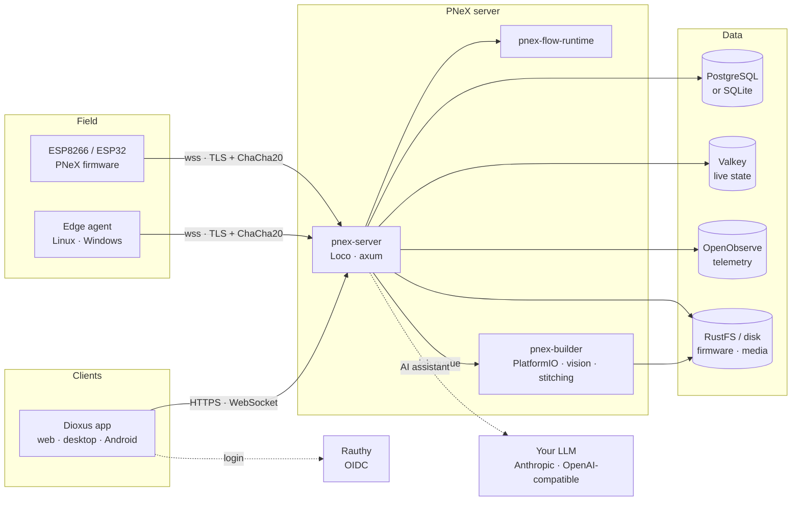

<p align="center">
  <a href="https://pnex.io">
    <picture>
      <source media="(prefers-color-scheme: dark)" srcset="https://pnex.io/logo-light.png">
      
    </picture>
  </a>
</p>

<h3 align="center">Your boards. Your server. Your data.</h3>

<p align="center">
  Open-source industrial IoT &amp; SCADA platform, written in Rust end to end.<br>
  Flash a board from your browser, automate with drag &amp; drop or code, monitor and get alerted —
  from home to the factory floor, self-hosted down to a Raspberry Pi.
</p>

<p align="center">
  <a href="https://github.com/Pnex/pnex-rs/actions/workflows/ci.yml?query=branch%3Amain"></a>
  <a href="https://github.com/Pnex/pnex-rs/actions/workflows/firmware.yml?query=branch%3Amain"></a>
  <a href="https://github.com/Pnex/pnex-rs/actions/workflows/images.yml"></a>
  <a href="https://hub.docker.com/r/shanisma/pnex-server-rs"></a>
</p>
<p align="center">
  
  <a href="https://dioxuslabs.com"></a>
  <a href="https://platformio.org"></a>
  
  
  <a href="LICENSE"></a>
</p>

<p align="center">
  <a href="https://pnex.io"><b>Website</b></a> ·
  <a href="https://pnex.io/docs/quickstart"><b>Quickstart</b></a> ·
  <a href="https://pnex.io/docs"><b>Documentation</b></a> ·
  <a href="https://pnex.io/roadmap"><b>Roadmap</b></a> ·
  <a href="https://pnex.io/manifesto"><b>Manifesto</b></a>
</p>

---

> [!WARNING]
> **Early beta (0.1.0).** Most features are maintainer-tested on a real bench, none are
> community-validated yet. Great for testing and contributing — don't run a critical process
> on it yet. The [roadmap](https://pnex.io/roadmap) shows the real state of each feature.

## What is PNeX?

PNeX (**Platform Nexus**) is the crossroads of tools industrial teams already know — the
device management of ThingsBoard, the firmware experience of ESPHome, the visual flow
programming of Node-RED — rebuilt as a single, coherent, memory-frugal product with an
integrated AI assistant.

- **One platform, one language.** Server, web app, flow runtime, firmware tooling and the
  thermophysics engine are all Rust, in a single workspace.
- **Self-hosted, two tiers.** A single SQLite file for a workshop, or PostgreSQL with
  S3-compatible object storage for a plant.
- **Connected today, autonomous next.** Flows drive devices through the server today;
  devices that keep regulating through outages and a device-to-device mesh are on the
  [roadmap](https://pnex.io/roadmap).
- **AI built in, not bolted on.** An assistant reads your telemetry, drafts flows and helps
  write functions — with the LLM you bring.

<p align="center">
  
  
</p>

## Features

| | |
|---|---|
| **[Visual flows](https://pnex.io/docs/flows)** | Drag & drop editor, a full-Rust Node-RED-style runtime, live debugging, JS / Starlark functions, anomaly detection and forecasting as nodes. |
| **[Devices & pinout](https://pnex.io/docs/devices)** | Catalog, board profiles, interactive SVG pinout editor, per-device ChaCha20 keys. |
| **[Firmware & OTA](https://pnex.io/docs/firmware)** | Server-side builds for ESP8266 / ESP32 / C3 / S3, flashing from the browser, over-the-air updates. |
| **[Telemetry](https://pnex.io/docs/telemetry)** | Encrypted ingestion, per-organization OpenObserve, Valkey live cache, instant charts. |
| **[SCADA dashboards](https://pnex.io/docs/dashboards)** | Free canvas, threshold gauges, sparklines, LEDs, SVG connectors, instant publishing. |
| **[Map & POIs](https://pnex.io/docs/map)** | POI-first map on MapLibre, backend clustering, live GPS layer, attachments. |
| **[Cameras & vision](https://pnex.io/docs/cameras)** | Live ESP32-CAM streams, recordings, on-server object detection (ONNX). |
| **[Notifications](https://pnex.io/docs/notifications)** | Email, webhook, Slack, Discord, Telegram, ntfy and Gotify channels, templated, sent from flows. |
| **[AI assistant](https://pnex.io/docs/ai-assistant)** | Multi-tool chat inside the app, on your own LLM provider (Anthropic or OpenAI-compatible). |
| **[Thermodynamics](https://pnex.io/docs/thermo)** | CoolProp in-process, custom mixtures, p-h / T-s / psychrometric diagrams. |
| **[Security](https://pnex.io/docs/security)** | TLS everywhere with an automatic local CA, encrypted secrets vault, least privilege, sandboxed user code. |

## Install

One command installs a complete, TLS-everywhere PNeX server on a Raspberry Pi 4/5 (64-bit) or
any Debian / Ubuntu machine (amd64 or arm64):

```bash
curl -fsSL https://raw.githubusercontent.com/Pnex/pnex-deploy/main/install.sh \
  | sudo bash -s -- --admin-user admin@acme.io --admin-password 'choose-a-strong-one'
```

Then open `https://<hostname>.local/`. All options (domain, Let's Encrypt, S3 storage, SMTP,
image pinning) are documented in [Pnex/pnex-deploy](https://github.com/Pnex/pnex-deploy) and
in the [self-hosting guide](https://pnex.io/docs/self-hosting).

Images are published on every green `main`: `shanisma/pnex-server-rs` and
`shanisma/pnex-builder-rs` (`linux/amd64`, `linux/arm64`), tagged `main-<sha>`, `main` and
`latest`.

## Architecture



Read more in the [architecture docs](https://pnex.io/docs/architecture) and in
[`docs/architecture/`](docs/architecture) (design records, in French).

## Repository layout

| Path | Content |
|---|---|
| `crates/pnex-backend` | HTTP / WebSocket server (Loco + axum, SeaORM), workers, migrations |
| `crates/pnex-frontend` | Dioxus 0.7 app — web (wasm), desktop and Android |
| `crates/pnex-core`, `pnex-api-contract` | Shared domain types and API DTOs (native + wasm) |
| `crates/pnex-flow-runtime`, `pnex-node-*` | Flow engine (on the vendored EdgeLinkd fork) and its nodes |
| `crates/pnex-firmware-builder` | PlatformIO / esptool build pipeline |
| `crates/pnex-edge-agent` | Edge agent: local HTTP ingestion API, durable disk queue, encrypted uplink |
| `crates/pnex-notify`, `pnex-vision`, `pnex-stitcher`, `pnex-coolprop*` | Notifications, ONNX vision, 360° stitching, CoolProp bindings |
| `firmware/` | Device firmware (PlatformIO): generic ESP8266 / ESP32 / C3 / S3 / CAM, the `pnex` library |
| `deploy/` | Dockerfile, TLS edge, edge agent distribution |
| `docs/architecture/` | Architecture and decision records |

## Development

Requirements: Rust (stable, MSRV 1.88) with the `wasm32-unknown-unknown` target,
[dioxus-cli](https://dioxuslabs.com) 0.7, [bun](https://bun.sh), Docker, and
[Task](https://taskfile.dev). Firmware work also needs PlatformIO
(`uv tool install platformio esptool`).

```bash
git clone https://github.com/Pnex/pnex-rs.git && cd pnex-rs
git submodule update --init   # vendor/edgelinkd (not recursive)
task db:up        # PostgreSQL, Rauthy, OpenObserve, Valkey, RustFS, mailcrab
task db:migrate   # schema
task db:seed      # catalog fixtures
task dev          # front build + server on http://localhost:5150
```

| Task | What it does |
|---|---|
| `task check` | `cargo check` native + wasm32 |
| `task test` | Workspace tests (PostgreSQL required) |
| `task lint` | clippy, warnings as errors |
| `task db:reset` | Drop, migrate and seed the dev database |
| `task fw:flash` | Build and flash a firmware on a USB-connected board |
| `task docker:build` | Build the `server` and `builder` images locally |

Schema changes follow [`docs/architecture/migrations.md`](docs/architecture/migrations.md):
additive first, written for both PostgreSQL and SQLite (a parity test enforces it).

## Contributing

Issues and pull requests are welcome. Code and code comments are in English; every
user-facing string goes through the `fr-FR` / `en-US` Fluent locales
(`crates/pnex-frontend/locales`), kept in parity by the test suite. Please run
`cargo fmt --all`, `task check`, `task test` and `task lint` before opening a pull request.

## License

PNeX is free software under the [MIT license](LICENSE).
