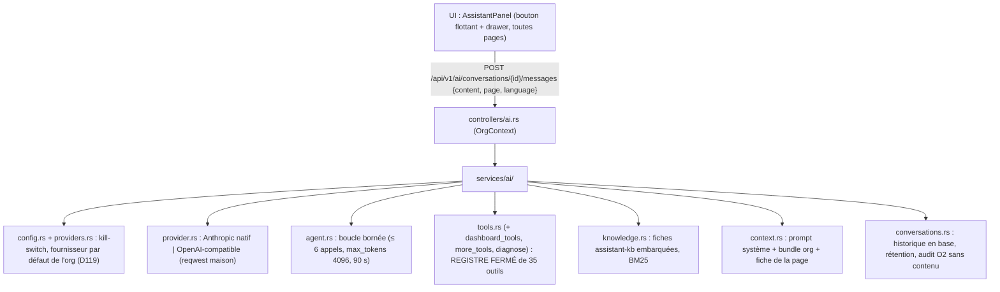

# Assistant IA intégré (2026-09-06)

> **Statut : IMPLÉMENTÉ (tranche v1)** — chat multi-tools, connecteur par
> org, lecture OpenObserve, création/modification de **drafts** de flows.
> Détail des décisions : `docs/inventory.md` D20b ; plan de conception
> validé en session (A1–A5).
>
> **2026-10-01 (secrets.md D116, lot S7)** : le connecteur par org et les
> `PNEX_AI_*` sont remplacés par des **fournisseurs LLM en CRUD**
> (`llm_providers`, clé dans le coffre). A3 et A5 sont caducs ; §2, §3, §6,
> §7 décrivent l'état actuel.
>
> **2026-10-07 — finalisation (§10)** : erreurs fournisseur et refus
> d'outils en codes machine (i18n), trace d'outils localisée, plus d'erreur
> base brute dans les sorties d'outils, garde « flow déployé » sous le
> verrou d'écriture. §1–§8 réécrits sur l'état réel (v1 + D116/D119 + v2).
>
> **2026-10-04 — v2 SPÉCIFIÉE (D142–D145, §9)** :
> étapes 1–5 du §9.5 livrées (doc des nœuds générée, garde
> `ai-flow-running`, conversations D145, fiches + diagnostics, outils
> dashboards D144, rétention réglable) — **v2 complète**. Base de
> connaissance embarquée autoportante, édition de flow seulement à l'arrêt,
> outils dashboards, conversations par utilisateur en base (CRUD, reprise,
> rétention RGPD) + audit sans contenu dans O2.

## 0. Décisions actées (2026-09-06)

| # | Décision |
|---|---|
| A1 | Tranche complète v1 : chat + connecteur par org (UI+DB) + lecture O2 + flows draft |
| A2 | UI = panneau flottant global (drawer latéral, pattern `DebugDrawer`, monté dans `pages/shell.rs`) |
| A3 | ~~Config : env `PNEX_AI_*` > connecteur org > désactivé~~ → remplacé par D116 : défaut de l'org > défaut plateforme > non configuré ; kill-switch `PNEX_AI_ENABLED=false` conservé |
| A4 | Devices **read-only** : l'agent ne pousse aucune commande (frontière D17 propre) |
| A5 | Table `ai_connectors` par org ; drop des 3 colonnes mortes `user_profiles.llm_*` (« modèle sans copies ») |

## 1. Architecture

**Garde-fous** (invariant structurel, testé) :
- la surface exécutable par le LLM est **exactement**
  `services/ai/tools::execute` — un `match` fermé sur le registre (35
  outils, liste au §9 et dans la fiche `assistant`) ;
  pas de deploy, pas de suppression, pas de commande device, aucun outil
  générique (http/sql) ;
- les outils d'écriture re-vérifient `can_write` (chat ouvert aux viewers,
  écriture owner/admin/member ; refus `ai-write-forbidden`) ;
- `create_flow`/`update_flow` passent `pnex_core::validate_graph` avant
  persistance ; `validate_calc_expression` permet l'auto-correction ;
- le chemin `flow_supervisor` / `POST /flows/{id}/deploy` n'est référencé
  nulle part dans le module `ai` — **enregistrer ≠ déployer** (le déploiement
  reste un geste humain, versionné, dans l'éditeur).

## 2. Fournisseurs LLM (D116, 2026-10-01)

> **D119 (2026-10-01)** : plus de fournisseur plateforme — les passages
> « plateforme » ci-dessous sont caducs ; résolution = défaut de l'org,
> sinon non configuré. Gestion à un seul endroit : détail de l'org.

Table `llm_providers` (migration de base D120) : `org_id` (toujours
renseigné depuis D119), `name` (unique par org), `kind` (`anthropic` |
`openai_compat`), `base_url` (requise pour openai_compat, racine de
version `…/v1`, sans slash final), `model`, `secret_id` (clé API = référence
au coffre, secret dédié `llm/<nom>/api_key`), `is_default` (un seul par
propriétaire, index partiels).

Résolution (`services/ai/providers.rs::effective`) : fournisseur par
défaut de l'org, sinon **non configuré** (le drawer l'indique, code
`ai-not-configured`). La clé est déchiffrée en mémoire à chaque appel.

Plus aucune configuration LLM en variable d'environnement : seul le
kill-switch `PNEX_AI_ENABLED=false` subsiste (chat 403 + UI masquée, sans
requête DB). L'ancienne table `ai_connectors` et sa reprise au boot ont
disparu avec la migration de base (D120).

## 3. API

| Endpoint | Accès | Effet |
|---|---|---|
| `GET /api/v1/ai/status` | membre | `{enabled, configured, provider_name, provider, model}` |
| `GET /api/v1/ai/providers` | membre | fournisseurs de l'org (sans référence de clé) |
| `POST /api/v1/ai/providers`, `PUT`/`DELETE /{id}` | owner/admin | clé : `{"value"}` (secret dédié) ou `{"secret_id"}` (secret de l'org) ; `PUT` sans `api_key` = conserver ; 409 `llm-provider-name-taken` |
| `POST /api/v1/ai/providers/{id}/test` | owner/admin | ping one-shot, `{ok, latency_ms, error, code, args}` (échec codé comme les erreurs du chat) |
| `/api/v1/ai/conversations*` | membre | conversations et tour d'agent (D145, tableau du §9.4) |
| `GET/PUT /api/v1/ai/retention`, `PUT …/retention/default` | membre / owner-admin / admin plateforme | rétention des conversations (§9.5) |

`POST /api/v1/ai/chat` et `/api/v1/system/ai/providers` sont **supprimés**
(D145, D119). Chat **sync** (boucle multi-tours, réponse finale non
streamée, budget borné) ; SSE non prévu.

**Erreurs du fournisseur** (`services/ai/error.rs`) : code machine +
description anglaise canonique, rendues `err-<code>` par l'UI —
`ai-disabled` 403, `ai-not-configured` 400, `ai-auth-rejected` 502,
`ai-rate-limited` 429, `ai-upstream` 502 (`args.status`), `ai-timeout` 502,
`ai-network` 502 (`args.detail`, diagnostic verbatim), `ai-bad-response`
502.

## 4. Outils (registre fermé)

Socle v1 : `list_devices` · `get_device_pins` · `list_flows` · `get_flow` ·
`query_telemetry` (réutilise `visualization::series_points`, anti-injection
promwrap, `available:false` dégradé) · `list_notifications` ·
`describe_node_types` (généré depuis `NODE_DOCS`, §9.5) ·
`validate_flow_graph` · `validate_calc_expression` · `create_flow` ·
`update_flow` (flow arrêté uniquement, note « changed by the AI assistant »).
Extensions v2 (connaissance, diagnostics, dashboards, templates,
fonctions, lectures annotations/visites/POI/contrôles/mémoire) : §9.5.

**Trace** : chaque appel réussi porte une clé `ai-trace-*` + `args`
(chaînes) que l'UI rend dans la langue de l'utilisateur, le résumé
anglais restant le repli et ce que l'historique rejoue au modèle ; un refus
porte `code` + `args` (`err-<code>`). Garde : toute clé émise existe dans
les deux `.ftl`, chaque outil du registre a son résumé.

Écriture = `services::flow::{create_flow, append_version}` — point
d'écriture **unique** partagé avec `controllers/flows.rs` (extraction de la
tranche refactor ; comportement HTTP identique, tests existants verts).

## 5. Prompt système

Reconstruit à chaque tour (`context.rs`) : rôle + garde-fous explicites
(« ne promets jamais deploy/suppression/commandes »), règles de graphe
générées (`FLOW_AUTHORING_RULES`, §9.5), bundle org vivant (devices ≤50 +
pins, séries O2 ≤30, flows ≤20), fiche de la page courante, langue
(celle du dernier message ; à défaut celle de l'UI).

## 6. UI (Dioxus)

- `components/assistant.rs` — bouton flottant bas-droite (visible si
  `enabled && configured`) + drawer (pattern `DebugDrawer`) : bulles,
  trace d'outils repliable, carte « Ouvrir dans l'éditeur » (deep-link via
  `state::flows::OPEN_FLOW`).
- `components/llm_providers.rs` — liste + formulaire en ligne, monté
  **uniquement** dans `OrgDetail` (D119). Clé = `SecretField` ; boutons
  Tester / Modifier / Supprimer (échec du test localisé par son code).
- `components/ai_retention.rs` — carte de rétention (/system pour l'org,
  /admin/status pour la plateforme).
- i18n : clés `ai-*`, `ai-trace-*`, `err-ai-*`, `err-llm-*` dans les deux
  `.ftl` (test de parité).

## 7. Variables d'environnement

| Variable | Rôle | Défaut |
|---|---|---|
| `PNEX_AI_ENABLED` | kill-switch global | `true` |

Les anciennes `PNEX_AI_PROVIDER`, `PNEX_AI_BASE_URL`, `PNEX_AI_API_KEY` et
`PNEX_AI_MODEL` sont **retirées sans import** (D116) : chaque org crée son
fournisseur dans le détail de l'organisation (D119).

## 8. Tests

- **Unitaires** : précédence config, mapping wire des deux protocoles
  (fixtures JSON, regroupement tool_result Anthropic, arguments string→Value
  OpenAI), registre == ensemble autorisé (aucun nom deploy/delete/command),
  `execute` refuse les noms hors registre.
- **Intégration** (`tests/ai.rs`, mock LLM HTTP local) : kill-switch 403
  sans requête LLM ; CRUD fournisseurs (clé au coffre, défaut unique,
  validations, 409 nom) ; viewer 403 ; tour complet → **flow créé draft,
  0 deploy, tool_result dans le 2e appel** ; outil interdit → ok:false ;
  401 → 502 `ai-auth-rejected` ; sans fournisseur → 400
  `ai-not-configured` ; borne d'itérations (+ `summary_key` de la trace) ;
  viewer → refus `ai-write-forbidden` ; deploy entre la lecture et
  l'écriture → `FlowWriteError::Deployed` ; conversations, dashboards,
  rétention, templates (voir §9.5).

## 9. v2 — spécification (2026-10-04, D142–D145, implémentation en cours)

> Décisions utilisateur du 2026-10-04. Constat de départ : la connaissance
> de l'assistant est écrite à la main (`context.rs`, `describe_node_types`)
> et dérive — `pnex-starlark`, `pnex-coolprop`, `pnex-reg-pid`,
> `pnex-reg-tt-*` absents ; dashboards, surfaces, carte, notifications
> hors de portée ; aucun historique de conversation (le client renvoie tout
> le tableau `messages` à chaque tour).

### 9.0 Décisions

| # | Décision |
|---|---|
| D142 | **Base de connaissance embarquée et autoportante** — pas de RAG vectoriel. Doc des nœuds **générée depuis le registre** (une seule source), corpus de fiches versionné dans le repo et compilé dans le binaire, recherche lexicale en mémoire via deux outils lecture seule ; gardes CI anti-dérive |
| D143 | **Édition de flow par l'assistant seulement à l'arrêt** — `update_flow` refuse un flow déployé/en cours (`ai-flow-running`) ; jamais de deploy, d'arrêt, de suppression ; **jamais d'action physique** : ni commande device, ni écriture de contrôle/surface, ni écriture mémoire Valkey (A4 étendu) |
| D144 | **Outils dashboards** — création libre, modification sous concurrence optimiste (409), via le service d'écriture de l'UI ; règle générale d'extension du registre (§9.3) |
| D145 | **Conversations par utilisateur × org en base relationnelle** — CRUD, reprise, export, rétention, cascade d'effacement RGPD ; historique reconstruit côté serveur ; **audit sans contenu** dans O2 (O2 écarté pour le contenu : pas d'effacement par enregistrement, append-only) |

### 9.1 D142 — base de connaissance

**Pourquoi pas de RAG vectoriel** : corpus petit (doc utilisateur ≈ 11 k
mots ≈ 15 k tokens), lexical suffisant ; un modèle d'embedding dépendrait
du fournisseur de l'org (absent en `openai_compat` selon les cas) ; index
vectoriel = rupture de parité PG/SQLite (D120) ; un index mêlant contenu
produit et contenu d'org = risque inter-org (R1). Réévaluer seulement si
le corpus dépasse quelques centaines de fiches ou s'il faut indexer du
contenu **propre à l'org** — l'interface outil reste la même, seul le
moteur change.

**Autoportante** = l'assistant ne dépend d'aucune source externe au
binaire (pas le site pnex-website, pas d'accès réseau) ; ce que la
plateforme sait faire, le binaire le sait sur lui-même.

Trois couches :

1. **Doc des nœuds générée** — chaque type `pnex-*` du registre porte sa
   doc assistant (résumé, champs de config, ports d'entrée/sortie, pièges)
   au même endroit que sa déclaration (recette « 8 points de câblage » →
   9ᵉ point). `describe_node_types` sérialise le registre ; plus aucune
   liste manuelle. Option : `describe_node_types(kinds?)` pour ne renvoyer
   que les types demandés (budget tokens).
2. **Fiches** — `crates/pnex-backend/assistant-kb/*.md` (anglais :
   langue canonique, l'assistant répond dans la langue de l'utilisateur),
   embarquées par `include_str!`/`include_dir`. En-tête : `id`, `title`,
   `kind` (`feature` | `howto` | `troubleshooting`), `tags`, `pages`
   (routes UI concernées), `nodes`, `err_codes`. Les fiches
   `troubleshooting` suivent **symptôme → cause → geste dans l'UI** (règle
   « l'UI est la seule interface utilisateur » : jamais de CLI/API manuelle
   dans une réponse). Amorçage : une fiche par fonctionnalité + les pièges
   utilisateur connus (télémétrie absente = aucun pin souscrit, version
   sauvegardée ≠ déployée, trigger booléen du notify, onglets ignorés au
   deploy, etc.). Les pièges de développement interne n'y vont **pas**.
3. **Outils** (registre fermé, lecture seule, aucune donnée d'org) :
   - `search_knowledge {query, limit ≤ 5}` → `[{id, title, kind, snippet,
     score}]` — BM25 en mémoire construit au boot (pas de dépendance
     d'index externe ; crate éventuelle soumise à `cargo deny` + licence
     permissive) ;
   - `read_knowledge {id}` → fiche complète.
   - La fiche de la **page courante** (`page` déjà transmis par le chat)
     est injectée d'office dans le prompt système (titre + résumé).

**Diagnostic (lecture seule, org-scopé)** — les fiches donnent la cause
type, les faits viennent d'outils structurés :
- `diagnose_device {device_id}` → en ligne (présence D108), pins
  souscrits, dernière télémétrie par pin, version firmware/OTA en cours,
  dernière erreur ;
- `diagnose_flow {flow_id}` → état runtime, version déployée vs dernière
  sauvegardée, `last_error`/`flow_error`, statuts de nœuds (`/node-status`).
Aucun identifiant ni secret dans les sorties (R4, R16) ; un secret n'est
cité que par son nom de référence.

**Gardes CI (bloquantes)** :
- tout type `pnex-*` enregistré a une doc assistant non vide ;
- toute fiche ne référence que des nœuds, routes UI et `err_codes`
  existants ;
- toute route UI de premier niveau est couverte par au moins une fiche
  `feature` ;
- tout outil du registre est décrit dans une fiche (l'assistant sait
  expliquer ce qu'il peut et ne peut pas faire).
Ajouter une fonctionnalité sans fiche = test rouge, comme une clé fluent
manquante.

### 9.2 D143 — édition de flow et frontière physique

- `create_flow` inchangé (brouillon, version 1, jamais déployé).
- `update_flow` : **avant** `append_version`, refus si le flow a une
  version déployée active ou un runtime en cours → erreur outil
  `ai-flow-running` (code machine, clé `err-ai-flow-running`) ; le modèle
  explique à l'utilisateur d'arrêter le flow dans l'éditeur, puis de
  redemander. Motif : éviter le piège « sauvegardé ≠ déployé » (l'éditeur
  montrerait la version de l'assistant pendant que le moteur exécute
  l'ancienne) et garder l'humain dans la boucle à chaque cycle.
- Le contrôle se fait **côté serveur au moment de l'exécution de l'outil**
  (jamais sur une affirmation du modèle). La fenêtre arrêt → écriture →
  redéploiement est sans risque : le redéploiement est un geste humain sur
  une version qu'il voit.
- Concurrence optimiste 409 inchangée.
- Interdits structurels (test « registre == ensemble autorisé » étendu) :
  deploy, stop, delete de flow ; commande device, OTA, flash ; écriture de
  contrôle (D123+) ou de mémoire Valkey ; lecture de valeur de secret.
  L'assistant **peut lire** l'état d'un contrôle et la valeur courante
  d'une mémoire (lecture = surface, D123 « une surface lit, un flow agit »).

### 9.3 D144 — dashboards et règle d'extension

- `list_dashboards`, `get_dashboard` (lecture).
- `create_dashboard {name, format (pc | mobile), layout}` — format fixé à
  la création (D123) ; la provision des sources de contrôle au save (D131)
  passe par le même service : créer un widget de contrôle **déclare** une
  source, n'actionne rien.
- `update_dashboard {dashboard_id, expected_version, layout}` — sauvegarde
  dashboard = **live** (pas de brouillon) → concurrence optimiste
  obligatoire (409 rendu au modèle, qui recharge). Pas de suppression.
- `validate_dashboard_layout` (à blanc), symétrique de `validate_flow_graph`.

**Arrêt exigé seulement pour les widgets couplés** (précision utilisateur
2026-10-04). Un dashboard n'agit pas sur le monde physique — c'est le flow
qui agit (D123) — et D131 garantit déjà qu'aucun flow ne perd sa source
(retirée → conservée comme contrôle indépendant). Mais un widget de
contrôle **couplé** — son contrôle est consommé par un `control-source`
d'au moins un flow **déployé** — définit ce que ce flow reçoit et ce que
l'humain croit actionner. Il est donc gelé pour l'assistant tant que ses
flows tournent, comme un flow l'est en D143 :

| Changement par l'assistant | Widget couplé (flow déployé) | Sinon |
|---|---|---|
| ajout d'un widget, déplacement / redimensionnement | libre | libre |
| widget d'affichage (graphe, jauge, valeur, carte…) | libre | libre |
| retrait, re-liaison (`control_id`), changement de type ou de spec (bornes, pas, options, commandes), renommage | **refus** `ai-flow-running` | libre |

- **Détection côté serveur** au moment de l'outil, par le même balayage de
  références que `release_surface` (D131 : contrôles cités par la version
  déployée des flows de l'org) — jamais sur la parole du modèle.
- Le refus porte la **liste des flows concernés** (id + nom, args du code
  machine, pas de message pré-rendu) : l'assistant demande à l'utilisateur
  de les arrêter dans l'éditeur, puis de redemander. L'arrêt reste humain
  (D143 : l'assistant n'a pas d'outil stop).
- `validate_dashboard_layout` signale les mêmes conflits à blanc, pour
  que le modèle prévienne l'utilisateur **avant** de proposer la
  modification.
- `get_dashboard` marque chaque widget couplé (`coupled_flows: [{id,
  name}]`) : l'assistant le sait dès la lecture.
- La trace d'outil liste les widgets ajoutés/retirés/modifiés : la surface
  est live dès la sauvegarde.
- Le renommage est inclus volontairement : le libellé est ce que l'humain
  lit au moment d'appuyer.

**Règle d'extension du registre** (opposable à tout nouvel outil) :
1. écriture = le **service partagé avec le contrôleur HTTP de l'UI** (mêmes
   validations, mêmes 409) — jamais d'écriture directe en base ;
2. garde de rôle re-vérifiée dans l'outil (`can_write`), org depuis le
   principal (R1, R2) ;
3. pas de suppression, pas d'action physique (§9.2) ;
4. une fiche de connaissance qui décrit l'outil (garde §9.1) ;
5. trace UI (`summarize`) + deep-link quand une ressource est écrite.
Candidats suivants, dans cet ordre : notifications (canaux/templates en
lecture, templates en écriture), annotations/studio, POI (lecture).

**Ontologie (D189, livré 2026-10-10)** : schéma de l'org généré depuis le
registre (prompt système + `describe_ontology`), `query_ontology`,
`get_object`, `create_object`, `update_object`, `open_link`,
`close_link`, `save_object_type` — services du contrôleur
`/api/v1/ontology`, `expected_version` → 409, schéma réservé aux admins
d'org, rôle d'écriture du type (D188) re-vérifié ; ni archivage ni
suppression (un lien fermé reste dans l'historique). Fiche
`assistant-kb/ontology.md`, test `assistant_works_the_ontology_through_the_ui_services`.

### 9.4 D145 — conversations

**Modèle** (nouvelle migration, parité PG/SQLite, règles `migrations.md`) :
- `ai_conversations` : `id` (uuid), `org_id`, `user_id`, `title`,
  `created_at`, `updated_at`, `last_message_at` ; index `(user_id, org_id,
  last_message_at desc)` ; FK `ON DELETE CASCADE` vers `users` et `orgs`.
- `ai_messages` : `id`, `conversation_id` (cascade), `seq`, `role`
  (`user` | `assistant` | `tool`), `content` (texte), `tool_trace` (JSON
  borné : nom d'outil, arguments, résultat **tronqué**), `page`,
  `created_at`, `tokens_in`, `tokens_out`.

**Strictement privé** : une conversation n'est visible que de son auteur,
**dans l'org où elle a été créée**. Ni l'owner de l'org ni l'admin
plateforme n'y ont accès (aucun endpoint de lecture transverse). Requêtes
filtrées `user_id = principal ∧ org_id = principal` ; ressource d'un autre
→ **404** (pas 403 : on ne révèle pas l'existence).

**API** (remplace `POST /api/v1/ai/chat`, accès membre y compris viewer —
lire est permis, l'écriture reste gardée dans les outils) :

| Endpoint | Effet |
|---|---|
| `GET /api/v1/ai/conversations` | mes conversations dans l'org courante (pagination D14) |
| `POST /api/v1/ai/conversations` | nouvelle conversation (titre optionnel) |
| `GET /api/v1/ai/conversations/{id}` | messages (reprise) |
| `PATCH /api/v1/ai/conversations/{id}` | renommer |
| `DELETE /api/v1/ai/conversations/{id}` | effacement définitif |
| `DELETE /api/v1/ai/conversations` | effacer **toutes** mes conversations de l'org |
| `GET /api/v1/ai/conversations/export` | export JSON de mes conversations (portabilité) |
| `POST /api/v1/ai/conversations/{id}/messages` | `{content, page, language}` → tour d'agent ; `{answer, tool_trace}` |

- **Historique reconstruit côté serveur** : le client n'envoie que le
  nouveau message. Ferme la porte au faux historique forgé (faux
  `tool_result`, faux tours assistant).
- **Fenêtre de contexte** : derniers N tours + résultats d'outils
  anciens remplacés par leur résumé `summarize` ; budget tokens borné
  (pas de résumé par appel LLM supplémentaire en v2).
- **Titre** : premiers caractères du premier message (aucun appel LLM).
- **Un tour à la fois** par conversation → 409 `ai-conversation-busy`.
- **Rétention** : conversations inactives purgées après N jours —
  défaut plateforme (`system_settings`, D72), surcharge par l'org à la
  baisse uniquement ; purge par tâche périodique (pattern `retention.rs`).
- **Cascades RGPD** : suppression du compte → tout ; départ d'une org →
  conversations de cet utilisateur dans cette org ; suppression d'org →
  tout ; suppression de fournisseur LLM → aucune (l'historique ne dépend
  pas du fournisseur).
- **Fournisseur tiers** : le contenu part chez le fournisseur LLM de l'org
  (déjà le cas) — mention explicite dans l'UI du drawer et dans la fiche
  de l'assistant ; ce que le fournisseur retient relève de son contrat.

**Audit dans O2 (sans contenu)** — stream `ai_audit`, un événement par
tour : `org_id`, `user_id`, `conversation_id`, fournisseur, modèle,
tokens in/out, noms des outils appelés + ok/erreur, ids des ressources
écrites (flow/dashboard + version), latence. **Jamais** le texte des
messages ni les arguments/résultats d'outils. Rétention O2 par plage
(D72) ; durée bornée et documentée (base légale : sécurité/traçabilité
des écritures automatisées). C'est le seul usage d'O2 dans D145 :
append-only, pas d'effacement unitaire nécessaire.

**UI** : le drawer gagne une liste de conversations (nouvelle,
reprendre, renommer, supprimer, tout effacer, exporter) ; i18n `ai-*` dans
les deux `.ftl`.

**Sécurité (grille §6 de security.md à l'implémentation)** : R1/R2
ci-dessus ; tests obligatoires — un autre utilisateur de la même org →
404 sur lecture/renommage/suppression ; même utilisateur dans une autre
org → 404 ; viewer peut converser mais `update_flow`/`create_dashboard`
→ refus outil ; aucune réponse de liste ne contient de `tool_trace`.

### 9.5 Ordre d'implémentation proposé

1. D142 couche 1 (doc des nœuds générée + garde) — corrige la dérive
   existante ;
2. D143 (garde `ai-flow-running`, petit et isolé) ;
3. D145 (conversations + audit) — prérequis UX avant d'élargir les outils ;
4. D142 couches 2–3 (fiches + `search_knowledge` + diagnostics) ;
5. D144 (dashboards), puis candidats suivants selon la règle d'extension.

**État d'implémentation**

| Étape | État | Où |
|---|---|---|
| 1. Doc des nœuds générée | **livrée** | `pnex_core::flow::node_docs` (`NODE_DOCS`, `FLOW_AUTHORING_RULES`, `FLOW_EXAMPLE`) ; `describe_node_types {kinds?}` la sérialise ; règles du prompt système générées depuis la même table. Garde `every_kind_is_documented` : les kinds acceptés par le désérialiseur de `FlowNodeKind` (scan de `graph.rs`) == kinds documentés. 7 kinds absents ajoutés (cool_prop, reg_tt_heat/cool, reg_pid, pnex_function, json_split/merge) ; l'exemple au kind `device` supprimé est remplacé par un exemple validé par test. Recette « nouveau nœud » : 9ᵉ point = une entrée `NODE_DOCS` |
| 2. D143 | **livrée** | `update_flow` refuse `status = deployed` → `ai-flow-running` (`args.flow`), lu en base au moment de l'outil ; trace d'outil porte `code`/`args`, résolus côté UI en `err-<code>` (repli verbatim). **Correctif au passage** : `update_flow` relisait la dernière version côté serveur et l'utilisait comme version attendue → une sauvegarde humaine entre `get_flow` et `update_flow` était écrasée sans conflit ; `expected_version` (= `latest_version_number` de `get_flow`) est désormais obligatoire. Test : `tests/ai.rs::update_flow_only_on_a_stopped_flow` |
| 3. D145 | **livrée** | Migration `m20261004_000004_ai_conversations` (PG + SQLite, parité verte) ; `services/ai/conversations.rs` ; `POST /api/v1/ai/chat` **supprimé**, remplacé par l'API du tableau ci-dessus (lecture/effacement/export permis kill-switch coupé : on peut toujours lire et effacer ce qui est stocké sur soi). Historique reconstruit serveur : 24 derniers messages en texte, les outils d'un tour ancien rejoués sous forme de résumé `summarize` (aucun rejeu d'appel d'outil, neutre vis-à-vis du fournisseur). Bail « un tour à la fois » = colonne `busy_until` posée par UPDATE conditionnel (atomique, multi-réplicas, 300 s) → 409 `ai-conversation-busy`. Trace stockée bornée (16 entrées, arguments ≤ 2 000 car., résumé ≤ 500). Rétention : clé `system_settings` `ai_conversation_retention_days` (défaut 180 j), purge horaire mono-pod (`singleton`). Cascades : FK utilisateur et org ; départ d'une org = effacement dans la même transaction que le retrait du membre. Audit O2 `ai_audit` sans contenu (test). UI : liste dans le drawer (nouvelle, reprendre, renommer, supprimer, tout effacer, exporter) + mentions fournisseur et confidentialité. ~~Reste : surcharge de rétention par l'org et réglage UI plateforme~~ → livrés (ligne « Rétention ») |
| 4. Fiches + diagnostics | **livrée** | 39 fiches `crates/pnex-backend/assistant-kb/*.md` (25 `feature` — une par route de premier niveau + `assistant`, `llm-providers`, `roles` —, 3 `howto`, 8 `troubleshooting`), embarquées par `include_dir` (déjà au workspace, MIT/Apache ; `build.rs` suit le dossier). `services/ai/knowledge.rs` : parseur front-matter, BM25 en mémoire (titre/tags ×3), `card_for_page`. Outils `search_knowledge` (≤ 5), `read_knowledge`. La fiche de la page courante est injectée (le panneau envoie la route). `services/ai/diagnose.rs` : `diagnose_device` (présence D108, pins + intervalle + dernière valeur, firmware, dernier OTA, indices) et `diagnose_flow` (version sauvegardée vs déployée, état moteur + `last_error`, dernier message des nœuds debug/display, indices). Gardes bloquantes : fiche bien formée (id = fichier), pages ∈ routes du routeur (scan de `app.rs`), nœuds ∈ `NODE_DOCS`, codes ∈ `err_codes::ALL`, chaque route couverte par une fiche `feature`, chaque outil du registre cité par une fiche, aucune CLI/API dans un corps ; test de pertinence sur des questions types |
| 5. D144 | **livrée** | `services/ai/dashboard_tools.rs` : `list_dashboards`, `get_dashboard` (+ `coupled_flows` par widget), `validate_dashboard_layout` (violations + conflits de couplage à blanc), `create_dashboard`, `update_dashboard` (`expected_version`, live). Écriture par `services::dashboards` (même service que l'UI). Widget couplé = un de ses contrôles est cité par un `control-source` d'une version **déployée** : seuls position/taille (et sources d'affichage) peuvent changer, sinon `ai-flow-running` + flows. Un widget **ajouté** par l'assistant perd toute liaison fournie par le modèle (contrôle neuf provisionné) : il ne peut jamais s'accrocher à un contrôle existant. Pas de suppression. Test : `tests/ai.rs::coupled_dashboard_widget_is_frozen_while_its_flow_runs` |
| Rétention | **livrée** | Migration `m20261004_000005_org_ai_retention` (`organizations.ai_retention_days`, NULL = plateforme). Effective = min(org, plateforme) ; la purge horaire applique la plateforme partout puis la valeur plus courte des orgs qui en ont une. `GET/PUT /api/v1/ai/retention` (lecture tout membre ; écriture owner/admin, refus `ai-retention-forbidden`, au-delà de la plateforme `ai-retention-above-platform` + `args.max`) ; `PUT /api/v1/ai/retention/default` (admin plateforme, 1–3650). UI : carte « Conversations de l'assistant » sur /system (org) et /admin/status (plateforme). Fiches `system`, `admin-status`, `assistant` mises à jour |
| Extension (règle §9.3) | **livrée** (2026-10-04) | `services/ai/more_tools.rs`, 35 outils au total. **Templates de notification** : `get_`/`preview_` (rendu seul, jamais d'envoi)/`create_`/`update_notification_template` — écriture extraite du contrôleur dans `services/notify_templates.rs` (même chemin UI/assistant, tests notify inchangés verts) ; `update` exige `expected_updated_at` (édition en place, sinon conflit). Canaux **hors de portée** (identifiants ; leur test envoie un vrai message). **Fonctions JS/Starlark** : `list_`/`get_function` (code + flows déployés qui l'utilisent), `validate_function` (compilation seule), `test_function` (bac à sable du bouton Test), `create_`/`update_function` ; le contrôle de version optimiste est désormais **dans la transaction** de `services::functions::save_new_version` (avant : seulement dans le contrôleur, fenêtre de course) → l'UI en bénéficie. Un flow déployé garde la version épinglée. **Lecture seule** : `list_annotation_sets`, `list_tours` (jamais le jeton de partage, seulement « lien public oui/non »), `list_pois` (+ devices placés), `list_controls` (spec, dernière valeur commandée, flows déployés à l'écoute) et `read_memory` (clés, champs numériques, valeurs) — la lecture permise par §9.2, l'écriture restant interdite. Écriture annotations/tours écartée : une annotation peut porter des contrôles (même couplage que D144) et la géométrie sur image/360 se fait mieux à la main |

## 10. Finalisation (2026-10-07)

Relevés de l'audit de release 0.1.0-beta.1 (« à surveiller ») et dette
i18n de l'assistant, fermés :

- **Erreurs du fournisseur codées** : `AiError` porte un code machine
  (`ai-disabled`, `ai-not-configured`, `ai-auth-rejected`,
  `ai-rate-limited`, `ai-upstream`, `ai-timeout`, `ai-network`,
  `ai-bad-response`) et une description anglaise ; avant, un message
  français pré-rendu, affiché tel quel à un utilisateur anglophone. Le
  test d'un fournisseur renvoie le même code (`llm-provider-no-key`,
  `llm-provider-key-unreadable` pour les échecs avant appel).
- **Trace d'outils localisée** : clé `ai-trace-*` + `args` (§4) ; avant,
  des résumés mi-français mi-anglais affichés verbatim. Les traces
  stockées avant ce changement (sans clé) restent affichées verbatim.
- **Refus d'outil codés** : rôle viewer → `ai-write-forbidden` (garde
  unique `tools::require_write`, partagée par tous les outils d'écriture).
- **Plus d'erreur base brute dans une sortie d'outil** :
  `tools::internal(contexte)` journalise le détail côté serveur et ne rend
  au modèle (et à la trace) qu'un refus générique `ai-tool-internal` — une
  `DbErr` peut porter du SQL ou des identifiants (R4, R16).
- **« Flow déployé » vérifié sous le verrou d'écriture** :
  `services::flow::append_version_if_stopped` relit le statut dans la
  transaction, après le verrou de ligne du flow → un deploy intercalé entre
  la lecture de l'outil et l'écriture est refusé (`ai-flow-running`).
  Test : `tests/ai.rs::update_flow_only_on_a_stopped_flow`.
- **Résiduel accepté — dashboards** : le couplage d'un widget dépend des
  versions déployées d'**autres** flows ; aucun verrou commun ne sérialise
  un deploy et une sauvegarde de dashboard. La fenêtre est de l'ordre de la
  milliseconde (lecture du couplage puis écriture dans le même appel
  d'outil, version du dashboard protégée par le 409), et le deploy reste
  un geste humain sur un layout visible. Un verrou commun deploy/dashboard
  n'est pas justifié à ce stade (security.md §7).
- **Reste ouvert** : SEC-14 (filtrage des plages privées de l'URL d'un
  fournisseur) attend le résolveur filtrant de SEC-W3, activable en SaaS
  — un LLM local sur le LAN (Ollama) reste un usage central en
  auto-hébergé.
