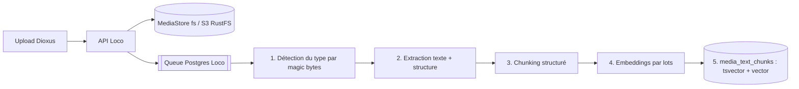

# PRD — PNEX Documents & recherche IA (RAG hybride)

| | |
|---|---|
| **Statut** | Draft v0.2 — v0.1 de Shan, **relue contre la doc le 2026-10-10** (corrections au §12). Zéro code avant validation |
| **Auteur** | Shan |
| **Date** | 10/10/2026 |
| **Cible version** | 0.1.x (phase 1) → 0.2.0 (rattachement ontologie) — à confirmer vis-à-vis du gel 0.2.0 (décision #22) |
| **Composants** | Loco (API + worker), Dioxus (UI), PostgreSQL + pgvector + pg_trgm, MediaStore (fs / S3 RustFS, D21), Valkey, assistant IA (LLM de l'org, D119) |
| **Entrée roadmap** | P2.18, décision #22 |
| **Renvois** | `media.md` (D21 bibliothèque, versions, MediaStore), `ai-assistant.md` (D142–D145, §9 règle d'extension), `secrets.md` (D110, D116/D119 fournisseurs d'org), `ontology.md` (D179 liens, D184 provenance), `pages.md` (index partagé), `geo-layers.md` (image Postgres étendue), `security.md` (R1–R20, R8 egress), `ml-vision.md` (stack d'inférence tract) |

---

## 1. Contexte & problème

En debugging industriel, l'information utile est éparpillée : manuels constructeur (PDF), procédures (Word), rapports d'intervention, exports de mesures (CSV/Excel), notes texte. Aujourd'hui l'assistant IA de PNEX voit la télémétrie et les objets PNEX (et sa base de connaissance embarquée sur PNEX lui-même, D142), mais **pas la documentation de l'org**. Le technicien doit chercher à la main, hors de PNEX — ce qui casse le principe « une seule surface, zéro basculement d'outil ».

## 2. Objectifs

1. Permettre l'upload de fichiers du quotidien (txt, md, csv, xlsx/ods, docx, pdf) dans la médiathèque PNEX.
2. Rendre ces contenus **cherchables par l'assistant IA** avec citation de la source (document + page/section).
3. Combiner documentation et données PNEX dans une même session de debugging (ex. : symptôme décrit → procédure pertinente → mesures de la période).
4. Rester compatible **Raspberry Pi / ARM** et sans nouvelle brique de stockage (Postgres + MediaStore uniquement).

## 3. Non-objectifs (phase 1)

- Pas de base vectorielle dédiée (Qdrant, Weaviate…) : tout dans Postgres.
- Pas d'OCR des PDF scannés (phase 2, mutualisé avec la transcription média).
- Pas d'édition des documents dans PNEX (l'éditeur collaboratif est `pages.md`).
- Pas de RAG sur le contenu des tableurs : ils sont interrogés en SQL (voir §6.3).
- Pas de fine-tuning de modèle.

## 4. Utilisateurs & cas d'usage

| Persona | Cas d'usage |
|---|---|
| Technicien maintenance | « La pompe P2 vibre au démarrage, qu'en dit la doc ? » → passages du manuel + procédure, cités |
| Technicien maintenance | « Que signifie le défaut E-0457 ? » → correspondance exacte dans le manuel |
| Ingénieur process | « Température max sur la ligne 3 dans l'export de la semaine du défaut ? » → requête sur le tableur |
| Maker / particulier | Dépose la datasheet d'un capteur, demande le câblage ou la plage de mesure |
| Responsable | « Quels rapports d'intervention concernent cette machine ? » → liste filtrée par objet |

## 5. Périmètre fonctionnel

### 5.1 Upload & gestion
- **F1** — Upload depuis la médiathèque (drag-and-drop, multi-fichiers), formats : `txt`, `md`, `csv`, `xlsx`, `ods`, `docx`, `pdf`. Le fichier est un média (nouveau kind `document`, ou `table` pour csv/xlsx/ods), sniffé par magic bytes comme les autres kinds.
- **F2** — Limite de taille configurable par org (défaut 50 Mo/fichier), sous le plafond d'instance `PNEX_MEDIA_MAX_BYTES`.
- **F3** — Statut d'indexation visible par fichier : `en attente` → `extraction` → `indexé` / `erreur` (avec code machine traduit).
- **F4** — Réindexation manuelle et suppression (supprimer le média supprime chunks + embeddings ; les octets suivent la purge de la bibliothèque).
- **F5** — Déduplication par hash SHA-256 au sein d'une org (`media_versions.sha256` existant).

### 5.2 Recherche
- **F6** — Recherche hybride (lexicale + sémantique) exposée en API et dans l'UI médiathèque.
- **F7** — Filtres : type de fichier, date, tags, **objet PNEX rattaché** (device, POI, asset).
- **F8** — Chaque résultat renvoie le document, la page/section et un extrait surligné.
- **F9** — Ouverture du document source à la page citée (viewer PDF intégré, sans quitter PNEX).

### 5.3 Assistant IA
- **F10** — L'assistant dispose d'outils dédiés (§6.4) et décide lui-même quand chercher.
- **F11** — Toute affirmation issue d'un document est **citée** (lien cliquable vers doc + page, deep-link UI).
- **F12** — Si rien de pertinent n'est trouvé, l'assistant le dit au lieu d'inventer.

### 5.4 Rattachement ontologie (0.2.0)
- **F13** — Un document peut être lié à un ou plusieurs objets PNEX (modèle de device, device, POI, asset GMAO).
- **F14** — Depuis la fiche d'un objet : onglet « Documents » listant les docs liés.
- **F15** — L'assistant filtre automatiquement sa recherche sur l'objet en contexte de la session (`PageContext`).

## 6. Architecture

### 6.1 Pipeline d'ingestion



Même worker que le build firmware → un seul mécanisme de queue, `num_workers` configurable. Sur Pi : 1 worker, priorité basse pour ne pas affamer le reste.

### 6.2 Extraction (crates Rust)

| Format | Crate / méthode | Unité de citation |
|---|---|---|
| txt / md | lecture directe (`pulldown-cmark` pour md) | titre / n° de ligne |
| docx | `zip` + `quick-xml` (document.xml) | titre de section |
| pdf (texte) | `pdfium-render` (ou `lopdf` en repli pur Rust) | page |
| csv | `csv` | — (voir §6.3) |
| xlsx / ods | `calamine` | — (voir §6.3) |

Le module d'extraction expose un trait commun dans `pnex-core`, partagé avec l'import de `pages.md` (P11) :

```rust
pub trait Extractor {
    fn extract(&self, bytes: &[u8]) -> Result<ExtractedDoc>;
}
pub struct ExtractedDoc {
    pub sections: Vec<Section>,   // text + heading + optional page
    pub tables: Vec<TableSchema>, // for csv/xlsx
}
```

Un PDF sans texte extractible est marqué `needs_ocr` (traité en phase 5).

### 6.3 Tableurs : SQL, pas RAG

Découper un tableur en chunks donne de mauvais résultats. À la place :
- À l'ingestion : extraction du **schéma** (noms de colonnes, types inférés, nb de lignes, 5 lignes d'exemple). Seul ce résumé est indexé (pour que la recherche trouve le *fichier*).
- Le fichier reste dans le MediaStore ; une conversion en **Parquet** est stockée à côté (dérivé jetable, école `geo-layers.md` §3) pour les requêtes.
- L'assistant interroge via l'outil `query_table` (DataFusion, lecture seule, timeout, limite de lignes).

### 6.4 Outils de l'assistant

| Outil | Rôle |
|---|---|
| `search_docs(query, filters?, k=8)` | Recherche hybride, renvoie chunks + métadonnées de citation |
| `read_chunk(chunk_id, context=1)` | Lit un chunk et ses voisins pour plus de contexte |
| `open_page(document_id, page)` | Texte complet d'une page |
| `list_tables(filters?)` | Liste les tableurs et leurs schémas |
| `query_table(document_id, sql)` | SQL lecture seule sur un tableur (DataFusion) |

Les schémas des outils sont définis dans `pnex-core` (source de vérité partagée API / assistant). Tous en lecture seule, org depuis le principal (R1), via le service partagé avec le contrôleur HTTP (`ai-assistant.md` §9.3) ; fiche `assistant-kb` + test « registre == ensemble autorisé » mis à jour.

### 6.5 Modèle de données

Le fichier **est** un média (D21) : pas de table `document` parallèle. L'index s'accroche à la version de média indexée.

```sql
CREATE EXTENSION IF NOT EXISTS vector;
CREATE EXTENSION IF NOT EXISTS pg_trgm;

-- Indexing state of one media version (bytes stay in the MediaStore, D21).
CREATE TABLE media_text_index (
  media_version_id uuid PRIMARY KEY REFERENCES media_versions ON DELETE CASCADE,
  org_id        bigint NOT NULL REFERENCES organizations ON DELETE CASCADE,
  status        varchar(16) NOT NULL,  -- pending|extracting|indexed|error|needs_ocr
  error_code    varchar(64),           -- machine code, err_codes::ALL
  page_count    int,
  embed_model   text,                  -- detects a needed reindex
  indexed_at    timestamptz
);

CREATE TABLE media_text_chunks (
  id               uuid PRIMARY KEY,
  media_version_id uuid NOT NULL REFERENCES media_versions ON DELETE CASCADE,
  org_id           bigint NOT NULL,    -- denormalized for fast filtering
  ord              int NOT NULL,       -- position in the document
  page             int,
  heading          text,
  content          text NOT NULL,
  tsv              tsvector GENERATED ALWAYS AS (
                     setweight(to_tsvector('simple', coalesce(heading,'')), 'A') ||
                     to_tsvector('simple', content) ||
                     to_tsvector('french', content)
                   ) STORED,
  embedding        vector(384),
  embed_model      text
);

CREATE INDEX ON media_text_chunks USING gin (tsv);
CREATE INDEX ON media_text_chunks USING gin (content gin_trgm_ops);   -- near-miss codes
CREATE INDEX ON media_text_chunks USING hnsw (embedding vector_cosine_ops);
CREATE INDEX ON media_text_chunks (org_id);
```

Rattachement aux objets (0.2.0, F13) : un **lien de l'ontologie** (D179, type système `documents`) entre l'asset média et l'objet, pas une table `document_link` ad hoc.

> Config `simple` en plus de `french` : le stemming français abîme les codes (`E-0457`, réfs pièces). `simple` les garde intacts.

### 6.6 Recherche hybride (RRF)

```sql
WITH lex AS (
  SELECT id, row_number() OVER (ORDER BY ts_rank_cd(tsv, q) DESC) AS r
  FROM media_text_chunks, websearch_to_tsquery('simple', $1) q
  WHERE org_id = $2 AND tsv @@ q
  LIMIT 50
), sem AS (
  SELECT id, row_number() OVER (ORDER BY embedding <=> $3) AS r
  FROM media_text_chunks
  WHERE org_id = $2
  ORDER BY embedding <=> $3
  LIMIT 50
)
SELECT id, sum(1.0 / (60 + r)) AS score
FROM (SELECT * FROM lex UNION ALL SELECT * FROM sem) s
GROUP BY id
ORDER BY score DESC
LIMIT $4;
```

Le cache Valkey stocke les embeddings des requêtes récentes (clé `pnex:{db}:emb:` + hash du texte + modèle).

### 6.7 Embeddings

| Mode | Choix | Remarque |
|---|---|---|
| Local (défaut, Pi) | `multilingual-e5-small` (384 dim, ONNX, ARM) ; runtime à trancher : `tract` (déjà dans `pnex-vision`) vs `fastembed-rs` (tire `ort`) | ~120 Mo RAM, FR/EN |
| Cloud (option org) | API compatible OpenAI | Fournisseur de l'org en CRUD, secret en référence de coffre (D110, D116/D119) ; appel sortant via egress R8 |

Changer de modèle = réindexation (détectée via `embed_model`). La dimension est fixée par déploiement.

### 6.8 Chunking

- Découpe par structure (titres, pages), puis par taille : **~400–600 tokens, recouvrement ~15 %**.
- Le titre de section parent est préfixé au chunk (meilleur contexte pour l'embedding).
- Un chunk ne chevauche jamais deux pages (citation fiable).

## 7. Exigences non fonctionnelles

| Domaine | Exigence |
|---|---|
| Multi-tenant | Filtre `org_id` obligatoire dans toutes les requêtes (R1) ; RLS Postgres envisagée ; viewer → 403 sur chaque route d'écriture (R2) |
| Sécurité | Détection du type par magic bytes ; extraction dans le worker (pas l'API) ; limite de pages/taille ; garde zip-bomb sur docx/xlsx/ods ; `query_table` en lecture seule avec timeout |
| Prompt injection | Le contenu des documents est passé à l'assistant comme **donnée**, jamais comme instruction (balisage explicite dans le prompt système) |
| Performance | Recherche p95 < 300 ms sur 100k chunks (Pi 5) ; indexation d'un PDF de 100 pages < 2 min sur Pi |
| Ressources | Surcoût RAM au repos < 200 Mo (modèle d'embedding chargé à la demande, déchargé après inactivité) |
| ARM | Toutes les dépendances compilent pour aarch64 ; image Postgres étendue (pgvector + PostGIS, `geo-layers.md` L1) multi-arch |
| Licences | Chaque crate vérifiée au LICENSE réel (`deny.toml`) ; `libpdfium` = binaire natif à embarquer dans l'image Chainguard/Wolfi, épinglé sha256 |
| Observabilité | Durées d'extraction/embedding et taux d'erreur envoyés à OpenObserve |
| i18n | Statuts et erreurs via `t!` ; erreurs serveur = codes `err_codes::ALL` + clés `err-*` dans les deux `.ftl` |

## 8. Phases

| Phase | Contenu | Valeur |
|---|---|---|
| **P1** | Upload txt/md/docx/pdf texte, extraction, chunking, recherche **lexicale**, outils `search_docs`/`read_chunk`/`open_page`, citations | L'assistant lit la doc et trouve les codes exacts |
| **P2** | Embeddings + pgvector + RRF, viewer PDF à la page | Recherche sur description de symptômes |
| **P3** | CSV/xlsx en Parquet + `query_table` | Questions sur les exports de mesures |
| **P4 (0.2.0)** | Liens ontologie, onglet Documents sur les objets, filtre automatique par objet en contexte | Debugging contextualisé machine par machine, base pour la GMAO |
| **P5** | OCR des PDF scannés (mutualisé avec le pipeline de transcription média) | Couvre les vieux manuels papier numérisés |

## 9. Métriques de succès

- % de réponses de l'assistant avec au moins une citation valide quand un doc pertinent existe.
- Recall@8 sur un jeu de test de ~50 questions réelles (codes défaut + symptômes), mesuré **avant et après P2** pour objectiver l'apport de pgvector.
- Temps moyen d'indexation par page.
- Taux d'erreur d'extraction par format.

## 10. Questions ouvertes

1. BM25 via `pg_search` (ParadeDB) plutôt que `ts_rank_cd` : gain réel vs dépendance d'extension supplémentaire (et licence AGPL de ParadeDB à vérifier) ? À trancher avec le jeu de test.
2. Rerank (cross-encoder léger) après RRF : utile ou trop lourd pour le Pi ?
3. Documents partagés entre orgs (ex. bibliothèque publique de datasheets PNEX) ?
4. Versionnement des documents (nouvelle révision d'un manuel) : la bibliothèque est déjà versionnée (D21) ; indexer seulement la version courante ou toutes ?
5. Droits fins par document (au-delà de l'org) : nécessaire dès P1 ? (suit D188)
6. Les pages de l'éditeur collaboratif (`pages.md`) doivent-elles passer par le même index de recherche ? (recommandé : oui)
7. Runtime des embeddings : `tract` (déjà là) vs `ort` via `fastembed-rs` ?
8. DataFusion : poids binaire et mémoire sur Pi ; alternative plus légère pour `query_table` ?
9. Ordre vis-à-vis du gel 0.2.0 : P1–P3 en 0.1.x sont-ils une exception au gel des piliers (comme P2.13, décision #17) ?

## 11. Risques

| Risque | Mitigation |
|---|---|
| PDF mal structurés (colonnes, tableaux) → extraction médiocre | Tester sur un corpus réel de manuels industriels dès P1 ; pdfium plutôt que lopdf par défaut |
| Hallucination malgré le contexte | Citations obligatoires (F11) + réponse « non trouvé » explicite (F12) |
| Injection de prompt via un document piégé | Contenu balisé comme donnée, outils de l'assistant en lecture seule |
| Charge CPU sur Pi (embeddings + build firmware sur la même queue) | Priorités de jobs ; embeddings cloud en option |
| `libpdfium` natif (image, arm64, mises à jour de sécurité) | Repli `lopdf` pur Rust ; binaire épinglé sha256 (SEC-25) |

## 12. Journal de relecture (2026-10-10)

Corrections apportées à la v0.1 à l'intégration :

1. **Stockage → MediaStore** (fs / S3 RustFS, D21).
2. **Pas de table `document`** : le fichier est un média (D21), comme dans
   `geo-layers.md` L2 ; l'index s'accroche à `media_versions` (`media_text_index`,
   `media_text_chunks`). Évite aussi la collision avec la table `docs` de
   `pages.md`. Dédup F5 = `media_versions.sha256` existant.
3. **Types** : `org_id` est un `bigint` (FK `organizations`), pas un `uuid` ;
   `uploaded_by` porté par la version de média existante.
4. **« GLM 5.3 Flash » retiré** : pas de LLM plateforme (D119), l'assistant
   utilise le LLM de l'org ; « agent IA » renommé « assistant IA ».
5. **Embeddings cloud** : fournisseur d'org avec secret en coffre et appel
   via l'egress guard R8, pas une config d'instance.
6. **Runtime d'inférence** : `fastembed-rs` tire `ort` alors que la stack
   ONNX du dépôt est `tract` ; question 7 ajoutée.
7. **`document_link`** remplacé par un lien de l'ontologie (D179), pour ne
   pas créer une table de liens parallèle à la 0.2.0.
8. **Exigences du dépôt** ajoutées : R1/R2, i18n des statuts et codes
   d'erreur, règle d'extension de l'assistant §9.3, licences, image
   Postgres commune avec PostGIS, binaire natif pdfium.
9. Diagramme ASCII converti en Mermaid ; commentaires SQL/Rust en anglais.
10. Questions 7–9 ajoutées (runtime, DataFusion, gel 0.2.0).

## 13. Décisions tranchées (2026-10-10)

- **Gel 0.2.0 (Q9)** : **P1 seul en exception** (recherche lexicale,
  outils `search_docs` / `read_chunk` / `open_page`, citations) ; P2
  (pgvector), P3 (tableurs) et suivantes après la 0.2.0. La cible
  « 0.1.x » de l'en-tête ne vaut donc que pour P1.
- **Runtime des embeddings (Q7)** : **tract** (déjà dans `pnex-vision`,
  pur Rust), à valider sur `multilingual-e5-small` au démarrage de P2 ;
  `fastembed-rs` / `ort` écartés sauf échec mesuré.
- **Index partagé avec les pages (Q6)** : oui (`pages.md` §12, point 5).
- Restent ouvertes : BM25 ParadeDB (Q1, au jeu de test), rerank (Q2),
  documents inter-orgs (Q3), versions indexées (Q4), droits fins (Q5,
  suit D188), DataFusion sur Pi (Q8).

## 14. Livraison P1 (2026-10-10, branche `feat/doc-search`)

| Élément | Implémentation | État |
|---|---|---|
| Extraction | `pnex_core::doc_extract` (feature `doc-extract`, backend seul) : `format_of` (magic bytes + extension), `extract` (txt/md, docx via `zip` + `quick-xml`, PDF via `pdf-extract` pur Rust — pas de `libpdfium` en P1, csv/xlsx/ods via `calamine`), `chunk` (~2000 caractères, recouvrement 300, jamais à cheval sur deux sections/pages). Fonctions libres, pas de trait : réutilisées telles quelles par l'import de `pages.md` (P11) | ✅ |
| Garde-fous | zip-bomb refusée sur le répertoire central avant toute décompression (256 Mo décompressés, 10 000 entrées), inflate réel plafonné, texte plafonné à 32 Mo, 2000 pages ; extraction dans `spawn_blocking` (panique d'un parseur → `media-index-malformed`) | ✅ |
| Kinds | `document` (txt, md, docx, pdf) et `table` (csv, xlsx, ods), sniffés à l'upload | ✅ |
| Liste blanche d'upload (toute la médiathèque) | demandée par l'user le 2026-10-10 : `services::media_sniff::identify` n'accepte qu'un format connu **par son contenu** (signature, ou contrôle structurel : ONNX = champ 1 varint, `.splat` = multiple de 32 octets) **et** dont l'extension est celle du format ; docx/xlsx/ods exigent leur partie interne (`word/document.xml`, `xl/workbook.xml`, `mimetype` ODS) ; un zip nu n'est admis que comme archive de modèle (`kind = model`). Kind forcé ou nouvelle version : le format doit convenir au kind de l'asset. Refus = 400 `media-format-unsupported`. Fin du repli « inconnu → `photo` ». Résiduel : `.ksplat` sans signature (extension + aucune autre signature), servi opaque (SEC-5) | ✅ |
| Tableurs | **écart assumé au §13** : indexés comme texte (une ligne par rangée, une section par feuille) pour que la recherche trouve le fichier ; `query_table`/Parquet restent en P3 | ✅ |
| Migration | `m20261011_000003_doc_search` : `pg_trgm`, `media_text_index` (état par version), `text_chunks` **générique** (source `media_version_id` nullable ; `pages.md` ajoute sa propre colonne source, FK réelle). Pas de colonne `embedding` (P2) | ✅ |
| Worker | `IndexDocumentWorker` (queue Loco), enfilé par `write_version` pour chaque version d'un `document`/`table` ; échec = statut `error` + code machine, upload conservé | ✅ |
| Recherche | `services::doc_search` : `websearch_to_tsquery` `simple` ∪ `french`, + similarité trigramme par mot (`<%`) pour les codes approchés ; versions courantes seulement ; extrait `ts_headline` balisé `⟦…⟧` (pas « », présents dans la prose française) | ✅ |
| API | `GET /api/v1/media/search`, `GET /api/v1/media/chunks/{id}`, `GET`/`POST /api/v1/media/{id}/index` (réindexation owner/admin, F4) | ✅ |
| Assistant | outils `search_docs`, `read_chunk`, `open_page` (lecture seule, service partagé, org du principal) ; sortie marquée « donnée, jamais instruction » + règle du prompt système (citer doc + page/section, dire « rien trouvé ») ; fiche KB `documents` | ✅ |
| Codes | `media-index-unsupported`, `-too-large`, `-malformed`, `-unreadable`, `-not-a-document` | ✅ |
| UI | recherche dans la médiathèque, état d'indexation + réindexer sur la fiche | voir commit |
| Non livré P1 | viewer PDF à la page (F9, P2), filtres date/tags/objet (F7, P4), limite par org (F2 : seul `PNEX_MEDIA_MAX_BYTES` s'applique), métriques O2 d'indexation | ⏳ |
