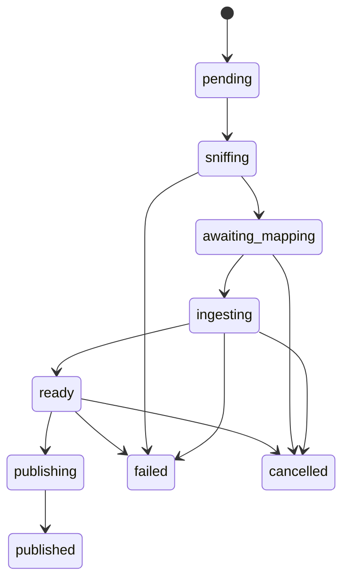

# Couches géographiques — PostGIS natif, sans GeoServer (2026-10-10)

> PRD — **Proposé**. Ajoute à la base map (`viz-bases.md`) des **couches
> géographiques complexes** (vecteur importé depuis des fichiers, stylées,
> tuilées, cachées, seedables), servies **en Rust dans Loco**, sans GeoServer.
> **Martin reste en place pour le fond de carte** (PMTiles Protomaps) : ce
> PRD n'y touche pas.
>
> Renvois : `viz-bases.md` (D27 maplibre 4.x + style Protomaps auto-hébergé,
> D37 clustering POI, D38 positions GPS), `media.md` (D21 — octets jamais en
> base, MediaStore opendal `fs`/`s3`, versions append-only), `worker-fabric.md`
> (jobs par capabilities), `ontology.md` (D181 temps des objets, D184
> provenance obligatoire), `roadmap.md` (§ Geofencing : PostGIS accepté
> GPL-2, stockage pas temps réel ; PostgreSQL seul moteur, décision #19),
> `secrets.md` (D110 références de coffre, D116/D119 fournisseurs LLM
> d'org), `horizontal-scaling.md` (D108 Valkey obligatoire).
>
> Positionnement : **extension de la base map**, pas un nouveau pilier
> (cf. gel des piliers en 0.2.0). Entrée roadmap : P2.16, décision #20.
>
> Contraintes transverses : Dioxus CSR pur, endpoints **additifs** (ne jamais
> bumper `pnex_api_contract::CONTRACT`), org = frontière (D2), listes D14,
> doit tourner sur Raspberry Pi.
>
> Numérotation : décisions **L1–L28 provisoires**, renumérotées `Dxxx` au
> merge (prochain libre au moment de la validation ; D192+ est déjà réservé
> par `media-vision-studio.md`).

## 1. Constat

- La carte affiche aujourd'hui un fond Protomaps, des POIs clusterisés (D37)
  et les positions GPS live (D38). Aucune donnée géographique **métier**
  importée : zones, réseaux, parcelles, emprises, itinéraires.
- Les utilisateurs ont ces données en fichiers (Shapefile, GeoPackage,
  GeoJSON, KML, GPX, CSV, DXF…).
- GeoServer est exclu : JVM lourde, administration séparée, UI hors PNEX,
  incompatible avec la cible Pi et l'exigence « une seule surface ».

## 2. Objectifs / non-objectifs

**Objectifs**

- Importer des fichiers géo variés en **layers** vectorielles, sans GDAL.
- Servir des tuiles **MVT** depuis PostGIS, directement par Loco.
- Styler les layers dans PNEX (MapLibre Style Spec, éditeur Dioxus).
- Cache multi-niveaux cohérent, seeding opt-in, GC des dérivés.
- Réimport **sans coupure**, en remplacement complet ou en mise à jour.
- Même codebase du Pi (1 pod) au SaaS (N pods + workers).
- Fournisseurs de **fond de carte, geocoding, reverse geocoding et routage
  configurables par l'org** (Martin, Nominatim, Pelias, Valhalla…), avec
  leurs secrets et en-têtes, et un **défaut par org** (§8). Supprime l'URL
  de fond de carte codée en dur (D27, `viz-bases.md` §9.2).

**Non-objectifs (V1)**

- Raster complet (GeoTIFF/COG → tuiles) : seul le PMTiles raster prêt à
  servir est accepté (§10).
- Édition de géométries dans l'UI (dessin de polygones) : V2.
- Interop OGC complète (WMS/WFS) : au mieux un sous-ensemble OGC API –
  Features en lecture (§10).
- Geofencing temps réel : **consommateur** des layers, PRD séparé
  (cf. `roadmap.md`).
- Données live (GPS, états) en tuiles : elles restent en GeoJSON pollé (L11).
- **Héberger** des moteurs de geocoding ou de routage : PNEX s'y **connecte**
  (§8), il ne les embarque pas.

## 3. Principe directeur

**Upload ≠ import ≠ publication.**

1. **Upload** — rapide, synchrone : le fichier devient un `media_asset`
   (ou une nouvelle version) de la bibliothèque média. Rien de géo.
2. **Import** — long, asynchrone : action lancée sur une version de média,
   exécutée par un worker, qui produit un **staging** prêt à publier.
3. **Publication** — transaction courte : le staging devient le contenu
   servi de la layer. Le nettoyage des dérivés part ensuite en tâche de fond.

**Sources vs dérivés.** Les versions de média sont les **sources** (à
l'utilisateur, gérées par la bibliothèque). Features, tuiles en cache,
seeds et staging sont des **dérivés** jetables, rattachés à
`(layer, génération)` et toujours recalculables depuis une source.

## 4. Décisions

| # | Décision | Pourquoi |
|---|----------|----------|
| L1 | **PostGIS dans le Postgres existant** — extension, pas une brique de plus. L'image `postgres:18-alpine` passe à une image PostGIS **multi-arch (arm64 obligatoire)** | Spatial en SQL (`ST_*`, GiST) sans service supplémentaire ; GPL-2 déjà accepté (roadmap) ; l'image arm64 est un risque à valider (§9) |
| L2 | **Un fichier géo est un média** : nouveaux kinds `vector` et `raster` (strings, sans migration de kind) ; sniff par magic bytes + inspection d'archive | Réutilise upload, versions, stockage, purge et UI de la bibliothèque (D21) ; un fichier peut alimenter plusieurs layers |
| L3 | **Stockage des octets = MediaStore existant** (`fs` / `s3`), choisi par config d'instance ; **pas de backend `db`** | D21 maintenue : des fichiers géo de plusieurs centaines de Mo en base gonfleraient les sauvegardes Postgres et la mémoire sur Pi ; `fs` couvre déjà le cas « tout sur une machine » |
| L4 | **Registre `geo_layers`** (ligne mutable, D24) avec `generation` BIGINT ; style **MapLibre Style Spec** en JSONB, appliqué côté client | Le style ne fait pas partie de la clé de cache : le changer n'invalide aucune tuile |
| L5 | **Une table `geo_features` partagée** (pas une table par layer) : `geom` 4326 + colonne générée stockée `geom_3857` indexée GiST | Pas de DDL dynamique, scoping org indexable, `ST_AsMVT` sans reprojection à chaque requête |
| L6 | **Tuiles MVT des layers métier servies par Loco** : une requête `ST_AsMVTGeom`/`ST_AsMVT` paramétrée, simplification et sous-ensemble d'attributs par plage de zoom, plafond de features par tuile. **Martin conserve le fond de carte** | Martin n'a pas d'auth par org ; le passer derrière un proxy Loco + injecter le tenant dans ses function sources coûterait plus que l'endpoint, et génération, set dirty, GC et Valkey vivraient de toute façon dans Loco. L'endpoint n'est pas un « Martin bis » : une requête SQL (PostGIS encode le MVT) + le cache |
| L7 | **Import = job worker** `import_geo` (worker fabric, capability CPU), cycle d'états explicite (§6), annulable, relançable | Long et lourd ; découplé de l'upload ; jamais dans un handler HTTP |
| L8 | **Lecteurs Rust en streaming** convergeant vers le `GeomProcessor`/`FeatureProcessor` de `geozero` ; **reprojection et validation en PostGIS** (`ST_Transform`, `ST_MakeValid`) ; **pas de GDAL** | Une interface pour tous les formats ; mémoire bornée sur Pi ; pas de `proj` dupliqué côté Rust |
| L9 | **Case « Vider avant import »** : cochée = le résultat est exactement le fichier ; décochée = **upsert par clé** (suppressions via `_op = delete`, ajout pur sans clé). Dans les deux cas un **diff interne** calcule les features touchées | UX à une case ; le wipe n'invalide quand même que les tuiles réellement changées |
| L10 | **Publication sans coupure** : swap en transaction courte ; au-delà d'un seuil de delta, swap complet par génération plutôt que des milliers d'updates | Lecteurs jamais bloqués ; services jamais arrêtés |
| L11 | **Live ≠ tuiles** : GPS (D38), états et alarmes restent des sources GeoJSON pollées ; POI clusterisés (D37) inchangés | Mélanger live et tuiles ruine le taux de hit |
| L12 | **Cache = Valkey, obligatoire** : aucun cache mémoire côté Rust, en mono-pod (Pi) comme en multi-pod ; sans Valkey le serveur **refuse de démarrer** (école device liveness D108) ; anti-stampede par lock `SET NX PX` ; tuiles vides cachées ; `maxmemory` + `allkeys-lru` dimensionnés par profil de déploiement | Valkey fait partie de la stack ; un seul chemin de code, pas de comportement qui diverge entre Pi et SaaS |
| L13 | **Seeding opt-in** par layer (zooms, bbox) vers le MediaStore, sous forme d'**un PMTiles par `(layer, génération)`** ; servi par Loco (auth conservée) | Évite des millions d'objets S3 ; nettoyage = un objet à supprimer |
| L14 | **GC des dérivés en job** après chaque publication : seed et staging de l'ancienne génération supprimés, clés Valkey `UNLINK` en arrière-plan ; rollback = **nouvelle génération recalculée**, jamais un vieux cache ressuscité | S3 n'a pas de TTL ; la publication ne doit jamais échouer à moitié sur un nettoyage |
| L15 | **Layer publique déléguable à Martin** : une layer marquée `public` (aucune donnée tenant) et seedée peut voir son PMTiles servi par Martin comme le fond de carte, au lieu de Loco | Réutilise l'infra existante pour le seul cas où l'auth org n'est pas requise ; opt-in, désactivé par défaut |

## 5. Modèle de données

Migration additive unique. École repo : PK UUID, `org_id` dénormalisé
NN FK CASCADE, JSONB, codes string, index via `execute_unprepared`.

**`geo_layers`** — la layer servie

| Colonne | Type | Rôle |
|---|---|---|
| `id` | UUID PK | — |
| `org_id` | BIGINT NN | scoping D2 |
| `name`, `description` | varchar / TEXT | affichage |
| `geometry_type` | varchar(16) NN | `point`, `line`, `polygon` (une layer = un type, L8) |
| `generation` | BIGINT NN DEFAULT 0 | incrémentée à chaque publication complète ; clé de cache |
| `identity_key` | varchar(128) NULL | attribut d'identité pour l'upsert (L9) ; NULL = ajout pur |
| `cache_policy` | varchar(16) NN | `immutable` (remplacement seul) ou `revalidate` (upsert autorisé) |
| `attributes_schema` | JSONB NN | nom, type et visibilité par zoom de chaque attribut |
| `zoom_min`, `zoom_max` | SMALLINT | plage servie |
| `style` | JSONB NN | couches MapLibre (fill/line/circle/symbol, expressions data-driven) |
| `source_media_version_id` | UUID NULL FK SET NULL | dernière version source publiée (provenance) |
| `seed` | JSONB NULL | `{generation, zmin, zmax, bbox, storage_key, state}` |
| `extent` | geometry(Polygon, 4326) NULL | emprise publiée, pour le « zoomer sur la couche » |
| `feature_count` | BIGINT NN DEFAULT 0 | — |
| `created_at`, `updated_at` | timestamptz | — |

**`geo_features`** — le contenu publié

| Colonne | Type | Rôle |
|---|---|---|
| `id` | BIGSERIAL PK | — |
| `org_id`, `layer_id` | NN FK CASCADE | scoping |
| `fid` | TEXT NULL | valeur de `identity_key` ; UNIQUE `(layer_id, fid)` partiel |
| `geom` | geometry(Geometry, 4326) NN | géométrie source normalisée |
| `geom_3857` | geometry GENERATED STORED | `ST_Transform(geom, 3857)`, GiST |
| `props` | JSONB NN | attributs |
| `content_hash` | BYTEA NN | hash géométrie + props, pour le diff |
| `source_media_version_id` | UUID NULL | provenance par feature (D184) |

Index : GiST `(geom_3857)`, btree `(layer_id)`, `(org_id, layer_id)`.

**`geo_import_jobs`** — un import

| Colonne | Type | Rôle |
|---|---|---|
| `id` | UUID PK | — |
| `org_id`, `layer_id` (NULL = nouvelle layer), `media_version_id` | — | cible et source |
| `source_ref` | varchar NULL | table GeoPackage, dossier d'archive… (un fichier → plusieurs layers) |
| `state` | varchar(24) NN | §6 |
| `wipe` | BOOL NN | la case L9 |
| `mapping` | JSONB NULL | CRS confirmé, champs, clé d'identité, types |
| `preview` | JSONB NULL | CRS détecté, types, N premières features |
| `delta` | JSONB NULL | `{inserted, updated, deleted, invalid}` |
| `errors` | JSONB NULL | erreurs par feature (bornées) |
| `progress` | REAL | 0–1 |
| `created_by`, `created_at`, `finished_at` | — | — |

**Staging** : `geo_features_staging` (même forme + `job_id`), purgée par
le GC (L14).

## 6. Cycle de l'import

1. **sniffing** — magic bytes, inspection d'archive (garde zip-bomb :
   taille décompressée totale et ratio plafonnés), CRS, types de
   géométrie et d'attributs, N premières features → `preview`.
2. **awaiting_mapping** — l'utilisateur confirme le CRS (**obligatoire si
   absent**, jamais deviné), mappe les champs, choisit la clé d'identité,
   coche ou non **Vider avant import**. Géométries mixtes → proposition
   d'éclater en une layer par type.
3. **ingesting** — streaming lecteur → `COPY` binaire EWKB par lots vers
   le staging ; `ST_MakeValid` + `ST_Transform` en SQL ; erreurs par
   feature collectées, l'import ne s'arrête pas sur une feature invalide.
4. **ready** — diff staging ↔ publié calculé, affiché avant publication
   (« +120, ~34, −8, 2 invalides »).
5. **publishing** — transaction courte (L10) ; mise à jour `extent`,
   `feature_count`, `source_media_version_id`.
6. **published** — invalidation (§7) puis GC (L14) en jobs séparés ;
   reseed si la layer est seedée.

Progression poussée par pub/sub Valkey.

### Formats V1

| Format | Lecteur |
|---|---|
| GeoJSON | `geozero` |
| Shapefile (zip) | `shapefile` + `zip` (encodage `.cpg`, CRS `.prj`) |
| GeoPackage | `sqlx` sqlite + WKB GPKG via `geozero` |
| FlatGeobuf | `flatgeobuf` |
| KML / KMZ | `kml` + `zip` |
| GPX | `gpx` |
| CSV (lat/lon ou WKT) | `csv` + `wkt` |
| GeoParquet | `geoarrow` (V1.1 si la crate pèse trop sur Pi) |
| DXF | `dxf` (plans d'usine, CRS local à ancrer manuellement) |

Licences à vérifier au LICENSE réel avant ajout (`deny.toml`).

## 7. Tuiles et cache

**Endpoint** : `GET /api/v1/geo/layers/{id}/tiles/{gen}/{z}/{x}/{y}.mvt`

Ordre de lecture :

1. **Seed** si `seed.generation = gen`, `z` dans la plage et tuile absente
   du set dirty → lecture par plage dans le PMTiles.
2. **Cache Valkey**.
3. **PostGIS** → `ST_AsMVT` → écriture cache avec TTL.

Clé : `pnex:{db}:tile:{org}:{layer}:{gen}:{z}:{x}:{y}` (préfixe par base,
école D108). MVT stockés gzip, servis tels quels.

**HTTP** : `Cache-Control: private` ; `immutable` pour les layers en
`cache_policy = immutable` (la génération dans l'URL suffit) ; ETag +
`max-age` court pour `revalidate` (l'upsert garde la même génération).

**Invalidation** :

- **Wipe** (case cochée) : `generation++` → nouvelles URLs ; pas de purge
  synchrone.
- **Upsert** (case décochée) : bboxes des features touchées → tuiles
  impactées de `zoom_min` à un zoom plafond → `UNLINK` ciblé ; ces tuiles
  vont dans le **set dirty** Valkey de la layer (elles court-circuitent le
  seed) jusqu'au prochain reseed.
- Au-delà du zoom plafond : TTL court.

**Auth navigateur** : MapLibre ne pose pas d'en-têtes par défaut →
`transformRequest` ajoute Bearer + `X-Org-Id`, token rafraîchi exposé par
le pont Rust (`window.pnexMap`). Cas natif Android : §9.

## 8. Fournisseurs géo (fond de carte, geocoding, reverse, routage)

L'org branche **ses propres moteurs**, école `llm_providers` (D116/D119) :
PNEX fournit les adaptateurs, l'auth et le cache, jamais le moteur
lui-même (Nominatim ou Valhalla sur la France demandent bien plus que ce
qu'offre un Pi).

### Décisions

| # | Décision | Pourquoi |
|---|----------|----------|
| L16 | **Table `geo_providers` par org** (pas de repli plateforme, D119) : nom, `kind` (adaptateur), `capabilities` (`basemap`, `geocode`, `reverse`, `autocomplete`, `route`, `isochrone`, `matrix`), `base_url`, `auth`, `headers` non secrets, `params` (langue, pays, profil), `rate_limit`, `timeout_ms`, `store_allowed` ; **un défaut par capability** (index partiel) | Même modèle que les fournisseurs LLM, déjà compris par l'utilisateur ; un Nominatim pour le geocoding et un Valhalla pour le routage coexistent |
| L17 | **Adaptateurs natifs** : Nominatim, Pelias, Photon (geocoding) ; Valhalla, OSRM, GraphHopper (routage) ; plus un adaptateur **`generic-http`** (gabarit de requête + mapping de réponse par chemins JSON) comme échappatoire | Couvre les moteurs OSS courants sans code par fournisseur exotique |
| L18 | **DTO normalisés dans `pnex-core`** : `GeocodeResult` (libellé, lat/lon, bbox, type, confiance, parties d'adresse) et `Route` (géométrie GeoJSON décodée des polylines, distance, durée, étapes, manœuvres) | L'UI, l'import et les flows ne connaissent jamais le format d'un fournisseur ; changer de moteur ne casse rien |
| L19 | **Auth en références de coffre** (D110) : `none`, `header` (nom + `SecretRef`), `bearer`, `basic` (utilisateur + `SecretRef`), `query` (nom de paramètre + `SecretRef`, ex. clé d'API Pelias hébergé) ; en-têtes non secrets libres (`User-Agent` exigé par Nominatim) ; usages tracés dans `secret_usages` | Mêmes modes que le nœud http-fetch (S5) ; aucune valeur secrète en config ni renvoyée au client |
| L20 | **Proxy serveur obligatoire** : le navigateur n'appelle jamais un fournisseur ; endpoints `/api/v1/geo/geocode`, `/reverse`, `/autocomplete`, `/route`, `/isochrone` | Les secrets restent côté serveur ; un seul point pour le cache, le rate limit et l'audit |
| L21 | **Cache Valkey** des réponses, clé = fournisseur + hash de config + requête normalisée ; TTL par capability (geocoding long, routage court) ; **rate limit par fournisseur** en token bucket Valkey (politique publique Nominatim : 1 req/s) | Évite de se faire bannir d'un service public ; l'autocomplete coûte sinon une requête par frappe |
| L22 | **`store_allowed`** : si faux, les résultats ne sont **ni persistés en features ni cachés au-delà d'un TTL court** ; si vrai, provenance enregistrée (fournisseur + date) et attribution affichée | Certains fournisseurs commerciaux interdisent le stockage ; OSM impose l'attribution ODbL |
| L23 | **Bouton « Tester »** dans l'UI (geocoder une adresse connue, router entre deux points) ; statut remonté dans l'état système | L'erreur de config (URL, clé, en-tête) se voit au moment où on la fait |
| L24 | **Fond de carte = fournisseur `basemap`** : style MapLibre (spec v8) par URL, ou gabarit de tuiles (`{z}/{x}/{y}` vecteur ou raster), ou archive PMTiles ; variante sombre optionnelle (`style_url_dark`) ; attribution obligatoire | Supprime l'URL `map.alpine-box.com` codée en dur (D27) ; l'org choisit son fond (Martin maison, MapTiler, IGN, OSM raster…) |
| L25 | **Fond par défaut de l'org + sélecteur** : la carte s'ouvre sur le défaut de l'org ; l'utilisateur bascule entre les fonds disponibles depuis la carte (choix mémorisé par utilisateur, préférence locale) | « L'org choisit le défaut, l'utilisateur garde la main » |
| L26 | **Fond semé à la création d'org** : l'instance déclare son fond (`PNEX_BASEMAP_STYLE_URL`, le Martin livré) ; chaque nouvelle org reçoit un fournisseur `basemap` correspondant, **par défaut, modifiable et supprimable**. Sans aucun fond : carte vide + message « aucun fond configuré » | Une carte sans fond est inutilisable dès le premier lancement ; contrairement au LLM (D119), un fond auto-hébergé ne coûte rien et ne porte pas de clé |
| L27 | **Deux modes de diffusion d'un fond** : `direct` (le navigateur charge style et tuiles lui-même ; refusé si l'auth contient un secret, sauf clé explicitement marquée « publiable » côté navigateur) ou `proxied` (Loco relaie style et tuiles, injecte les secrets, cache en Valkey, réécrit les URLs du style) | Une clé MapTiler posée dans l'URL du style finit sinon en clair chez chaque visiteur ; le proxy coûte de la bande passante, donc opt-in |
| L28 | **« Tester » un fond** : chargement du style, contrôle `version: 8`, résolution des sources, première tuile récupérée, compatibilité WebGL1 (maplibre 4.x épinglé, D27) signalée | Un style v5-only ou une source injoignable se voit avant d'être mis par défaut |

### Usages dans PNEX

- **Fond de carte** : /map, dashboards à carte, POIs et layers s'affichent
  sur le fond par défaut de l'org ; sélecteur de fond sur la carte.
- **/map** : barre de recherche (geocode, autocomplete si supporté), clic
  droit → adresse (reverse), création de POI pré-remplie avec l'adresse.
- **Import** : nouvelle option de mapping « **colonne adresse** » pour un
  CSV sans coordonnées → **geocoding par lots dans le job d'import**, au
  rythme du rate limit du fournisseur ; lignes non trouvées listées dans
  les erreurs de l'import.
- **Routage** : itinéraire entre POIs affiché comme layer temporaire ;
  base du futur **corridor de geofence** (polyligne + tolérance,
  `roadmap.md`).
- **Flows** : nœuds `geo_geocode` / `geo_route` qui passent par le même
  service (route interne, école `/internal/flow/secret`) — jamais d'appel
  direct au fournisseur depuis le runtime. Chacun avec son `NodeDoc`
  (`ai-assistant.md` §9).
- **Assistant IA** : outils geocode/route exposés via le même service
  (règle d'extension §9.3, lecture seule).

### Sans fournisseur configuré

Fond de carte : voir L26. La recherche, le reverse et le routage
s'affichent comme **non configurés**, avec un lien vers la page de l'org. Le reste de la carte
fonctionne normalement.

## 9. Risques

| Risque | Parade |
|---|---|
| Image PostGIS arm64 absente ou en retard sur PG 18 | Construire l'image depuis `postgres:18-alpine` + paquet `postgis` Alpine ; CI multi-arch ; mesure sur Pi en DoD. Même image que pgvector (`doc-search.md`) : une seule image Postgres étendue |
| Webview Android : requêtes de tuiles cross-origin / en-têtes | Même problème déjà noté en `media.md` ; protocole custom MapLibre (`addProtocol`) qui délègue le fetch au pont Rust |
| Gros polygones (communes, réseaux) → tuiles lourdes | Simplification par zoom, plafond de features et d'octets par tuile, attributs filtrés par zoom |
| Mémoire Pi pendant l'import | Streaming de bout en bout, lots `COPY` bornés, un seul worker d'import, priorité basse |
| Diff coûteux sur grosses layers | Seuil → swap complet par génération (L10) |
| Fournisseur public saturé ou banni (Nominatim) | Rate limit L21, cache, `User-Agent` obligatoire, message clair : un usage soutenu demande une instance auto-hébergée |
| Divergence de format entre versions d'un moteur | DTO normalisés L18 + tests de contrat par adaptateur sur réponses enregistrées |
| Fichiers malveillants | Garde zip-bomb, plafond `PNEX_MEDIA_MAX_BYTES` existant, parsing dans le worker, jamais dans l'API |
| URL de fournisseur pointant vers le réseau interne (SSRF) | Appels sortants via `pnex_core::egress` (R8), comme http-fetch et le LLM |

## 10. Questions ouvertes

1. **Rétention des seeds** : garder les N dernières générations pour un
   rollback instantané (réglable par layer) ou seulement la courante ?
2. **Raster** : PMTiles raster uniquement en V1 ; GeoTIFF/COG → conversion
   en job (pur Rust vs dépendance C) à trancher.
3. **OGC API – Features** en lecture pour QGIS : utile en V1.1 ou plus tard ?
4. **Plafonds par tier** (`subscription_tiers`) : nombre de layers,
   features, taille de seed.
5. **Lien ontologie** : une feature peut-elle porter un `object_id`
   (D177/D179), et une layer être une **projection d'objets** à propriété
   géométrique plutôt qu'un import ? Lot 0.2.0 probable.
6. **Lecteurs comme nœud de flow** : exposer les mêmes lecteurs pour
   l'ingestion planifiée (fichier déposé périodiquement).
7. **Ordre vis-à-vis du gel 0.2.0** : extension de la base map ou nouveau
   pilier ? La phase F (fournisseurs, retrait de l'URL en dur) est de la
   consolidation et peut passer avant ; les phases A–E ajoutent une
   surface. À trancher (décision #20).

## 11. Tests

- **Backend** (école `tests/common`) : CRUD layers + isolation org ;
  viewer → 403 sur chaque route d'écriture (R2) ; import de fixtures par
  format (petits fichiers versionnés) ; CRS absent → `awaiting_mapping`
  bloquant ; géométries invalides comptées sans échec global ; wipe vs
  upsert vs `_op = delete` (deltas attendus) ; publication concurrente
  (409) ; tuiles : MVT décodable, tuile vide cachée, génération dans la
  clé ; GC : seed et staging supprimés après publication ; rollback =
  nouvelle génération.
- **Fournisseurs** : chaque adaptateur testé sur des réponses enregistrées
  (fixtures) ; secret jamais présent dans la réponse API ni les logs ;
  rate limit respecté sous charge ; `store_allowed = false` empêche la
  persistance.
- **Purs** : sniff par magic bytes, calcul des tuiles impactées par bbox,
  normalisation des clés de cache.
- **Pi** : import 100 k features et p95 tuile à froid mesurés en DoD
  (cibles à fixer après le premier spike).

## 12. Phases

| Phase | Contenu | Fini quand |
|---|---|---|
| **A — Socle** | Image PostGIS multi-arch, migration, `geo_layers`/`geo_features`, endpoint tuiles sans cache, layer GeoJSON importée en dur | Une layer GeoJSON s'affiche sur /map, web + Pi |
| **B — Import** | Kinds `vector`/`raster`, job `import_geo`, sniff, aperçu, mapping, staging, publication ; GeoJSON, Shapefile, GeoPackage | Un Shapefile uploadé devient une layer publiée depuis l'UI, sans coupure |
| **C — Cache & seed** | Cache Valkey, anti-stampede, seed PMTiles, GC des dérivés | Republier ne laisse aucun dérivé orphelin (S3, Valkey, staging) |
| **D — Upsert** | Case « Vider avant import », clé d'identité, diff, `_op = delete`, invalidation ciblée, set dirty | Un fichier partiel met à jour 3 features sans toucher le reste du cache |
| **E — Style & formats** | Éditeur de style Dioxus (catégorisé, gradué, étiquettes), formats restants (FlatGeobuf, KML, GPX, CSV, DXF) | Une layer se style par attribut sans écrire de JSON |
| **F — Fournisseurs géo** | `geo_providers`, **fond de carte configurable (retrait de l'URL en dur, fond semé à la création d'org, sélecteur)**, adaptateurs Nominatim + Valhalla d'abord, auth en références, proxy, cache, rate limit, bouton Tester, recherche et reverse sur /map, colonne adresse à l'import | Une org change son fond par défaut, branche son Nominatim et son Valhalla, cherche une adresse, crée un POI à partir d'elle et trace un itinéraire, sans qu'aucun secret ne quitte le serveur |

À chaque phase : clés i18n (deux `.ftl`), codes d'erreur dans
`err_codes::ALL`, revue de sécurité `security.md` §6, fiches assistant —
conditions de « fini », pas des tâches à part.

## 13. Journal de relecture (2026-10-10)

Corrections apportées à la v0.1 à l'intégration :

1. **L15 rangée à sa place** : elle apparaissait entre L6 et L7 ; numéros
   inchangés.
2. **Phase C** : « cache Valkey/local » contredisait L12 (aucun cache
   mémoire côté Rust) ; ramené à « cache Valkey ».
3. **Clé de cache** préfixée `pnex:{db}:` comme toutes les clés Valkey
   (école D108).
4. **Nœuds de flow** : `geo.geocode` / `geo.route` renommés en snake_case
   (`geo_geocode`, `geo_route`), convention des kinds ; `NodeDoc`
   obligatoire rappelé.
5. **Risque SSRF** ajouté : URL de fournisseur saisie par l'org = appel
   sortant à passer par l'egress guard R8.
6. **Image Postgres** : PostGIS (L1) et pgvector (`doc-search.md`) doivent
   tenir dans **une seule** image étendue, Chainguard/Wolfi en livraison
   (`container-images.md`) ; à valider ensemble.
7. **Question 7 ajoutée** : position vis-à-vis du gel des piliers 0.2.0.
8. Diagramme d'états ASCII converti en Mermaid (convention des docs).

## 14. Décisions tranchées (2026-10-10)

- **Gel 0.2.0 (Q7)** : la phase **F** (fournisseurs géo, fond
  configurable, retrait de l'URL en dur) est de la consolidation et peut
  démarrer avant la 0.2.0 ; les phases **A–E** (layers) attendent la
  0.2.0.
- **Rétention des seeds (Q1)** : génération courante seulement ; le
  rollback reste une nouvelle génération recalculée (L14).
- Restent ouvertes : raster (Q2), OGC API – Features (Q3), plafonds par
  tier (Q4), lien ontologie (Q5), lecteurs en nœud de flow (Q6).
- **Image Postgres** (2026-10-10, `ontology.md` annexe A3) : la 0.2.0
  reste sur PostgreSQL 18 (SQL/PGQ absent de 19) ; l'image étendue de L1
  se construit sur 18. La phase F n'en dépend pas.
