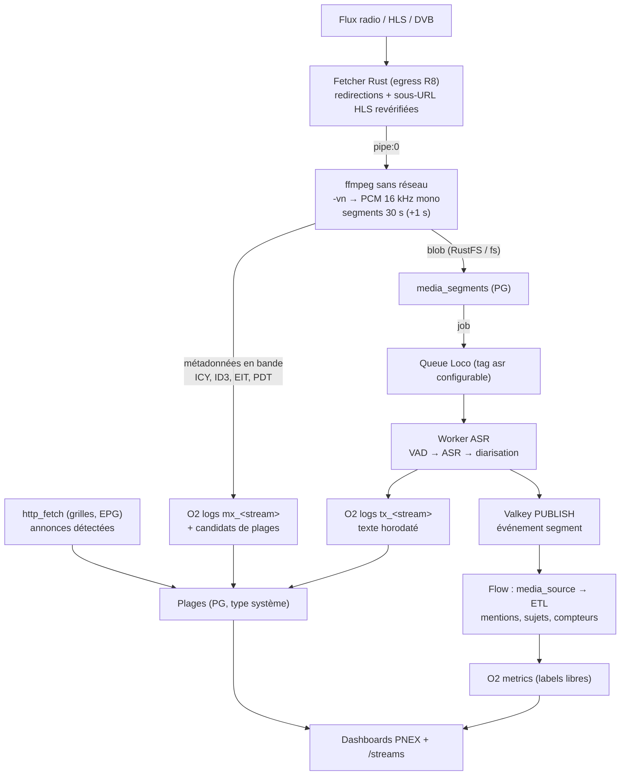

# PRD — Ingestion de flux média (radio, audio, vidéo → audio), transcription et plages (D159–D175)

**Statut :** Proposé (2026-10-09) — **relu contre le code le 2026-10-09**
(§15, journal de relecture), prêt pour validation. Zéro code avant
validation de ce PRD.
**Portée :** chantier **P2.13** de la roadmap (décision ouverte #16) :
capter des flux audio/vidéo continus, les transcrire, les découper en
**plages** (émissions, postes, lots), en tirer des séries pour les
dashboards, consultés dans PNEX (pas de publication, D173).
**Premier cas d'usage :** recensement de la couverture des sujets par
chaîne (radios et TNT publiques) — statistiques globales, pas de
redistribution de contenu.
**Renvois :** `camera-video.md` (D74 bus, D78 source/record, D79 segments,
D81 registre de modèles, D84 logs O2, D100 validation de modèle),
`worker-fabric.md` (capabilities, worker distant), `media.md` (D21
MediaStore), `edge-agent.md` (D95 agent = device), `security-tiers.md`
(D153–D158 identité X.509 + mTLS des devices), `ontology.md` (D176–D191 :
types système, plages D182, provenance D184, rapports D187), `viz-bases.md`
(dashboards, studio SCADA D40), `surfaces-controls.md` (D123 format de
dashboard), `studio.md` (S3 versioning, S5 lien public), `secrets.md`
(D113 `SecretRef`, D116/D119 LLM d'org), `ai-assistant.md` (D142–D145,
règle d'extension §9.3), `security.md` (R1–R20, grille §6),
`migrations.md` §2 (migrations PG + SQLite), `extension-collector.md` (C1b).

> **Numérotation** : PRD rédigé avec les numéros D148–D164 ; renuméroté D159–D175 à
> l'intégration (D148–D158 déjà pris par `security-tiers.md`).

> **Ordre vis-à-vis de l'ontologie (décision #17, tranchée par l'user le
> 2026-10-09 : média d'abord)** : P2.13 démarre sans attendre la 0.2.0.
> Ce n'est pas bloquant : les types système restent dans leurs propres
> tables (`ontology.md` D177), `media_streams` et `time_ranges` seront
> enregistrés comme types système par un adaptateur quand L1 arrivera,
> sans migration de données ; `ResourceRef` existe déjà
> (`pnex_core::resources`, D42) et le format de provenance D184 est une
> convention adoptée dès maintenant. Seule vraie dépendance : les
> **entités** nommées (personnalités, organisations, rattachements
> datés) sont des objets du pack « Couverture médiatique » (0.3) ; en
> attendant, le lot 2 s'en tient aux sujets (D168).

---

## 1. Contexte & problème

PNEX sait déjà :

- capter une source **événementielle** et l'enregistrer par segments
  (`camera_source` → `video_record` → `/internal/flow/video-segment`, D78) ;
- exécuter des jobs longs dans la queue Loco (`build_firmware`,
  `stitch_panorama`, `firmware_check`) ;
- gérer un registre de modèles ONNX vérifiés à l'enregistrement (D81, D100) ;
- interroger le web (`http_fetch`, C1a) avec filtre d'egress (R8) ;
- écrire et chercher des événements JSON dans OpenObserve (D84) ;
- afficher des séries dans des dashboards.

Il manque : une **source média continue** (flux radio / TV / HLS), une
étape **speech-to-text** horodatée, un moyen de **découper le temps en
plages nommées** (émissions, postes d'équipe…) et d'en **lire les
chiffres** sans quitter PNEX.

Contrainte produit forte (rappel) : **une seule surface, zéro basculement
d'outil**. Contrainte de plateforme : le cœur doit continuer à tenir sur
un Raspberry Pi (< 1 Go au repos) — la transcription GPU vit ailleurs.

## 2. Objectifs / non-objectifs

**Objectifs**

1. Déclarer des **flux média** (Icecast/MP3/AAC, HLS, DASH, RTMP/RTSP,
   tuner DVB-T via Tvheadend) et les capter 24/7 avec supervision.
2. Ne garder que l'**audio** (vidéo écartée au démuxage, jamais décodée côté image en V1).
3. Transcrire en **quasi temps réel** avec timestamps au mot, sur un
   worker GPU distant ou un CPU local.
4. Importer et vérifier des **modèles audio** (ASR, VAD, diarisation)
   comme on importe déjà les modèles vision.
5. Récupérer les **métadonnées** (en bande et hors bande) et les ranger
   en **plages** (annoncé vs recalé).
6. Alimenter les **dashboards existants** (séries O2) ; aucune
   publication de rapport en V1 (D173).

**Non-objectifs**

- Redistribuer l'audio ou les transcriptions intégrales.
- Contourner une protection technique (DRM, géoblocage) — interdit.
- Identifier une personne par sa **voix** (biométrie, RGPD art. 9) : les
  locuteurs sont nommés par des sources externes (bandeaux, grilles,
  annonces), jamais par empreinte vocale.
- Entraîner ou fine-tuner des modèles ASR (hors scope, école ml-vision).
- Analyse d'image des flux vidéo (OCR des bandeaux) : tranche ultérieure
  (§13), elle réutilisera `pnex-vision`.
- Capter un fichier ou un périphérique **local** au porteur (`file:`,
  `/dev/…`) : seules les URL réseau filtrées sont acceptées (D160).

## 3. Vue d'ensemble

Principe : **le calcul lourd ne passe jamais par le runtime de flows**
(école D78 : le flow transporte des références, pas des octets). Le flow
reçoit du **texte** et des événements, et fait l'ETL léger.

## 4. Décisions

### D159 — Un flux est une entité `media_streams`, pas un nœud ni un device

- Table `media_streams` (PK UUID, `org_id bigint`, R1) : `name`, `slug`
  (clé du bus et des streams O2, construite côté serveur, R18 ;
  `UNIQUE(org_id, slug)`, figé à la création — renommer ne change que
  `name` ; un slug supprimé n'est pas réattribuable tant que
  `tx_<slug>`/`mx_<slug>` existent dans la rétention O2), `kind`
  (`icecast` | `hls` | `dash` | `rtmp` | `rtsp` | `dvb` | `http_file` —
  varchar, `migrations.md` §2), `url` (**sans secret**), `auth_secret`
  (`SecretRef` optionnel, D113 — en-tête ou identifiants, destination
  verrouillée sur l'hôte de `url`, R9), `enabled`, `capture_on`
  (`server` | `worker` | `device:<device_registry_id>`), `asr_profile_id` (D164),
  `tracks` (`audio` défaut | `video` | `audio+video`, D175),
  `segment_secs` (défaut 30), `overlap_secs` (défaut 1),
  `audio_retention` (D161), `notify_channel_id` (optionnel, D160),
  `timezone`, `tdm_check` (D172), `created_by`.
- `url` ne contient jamais de jeton : un flux à jeton dans l'URL est
  refusé à l'enregistrement (`media-url-has-credentials`) et l'utilisateur
  passe par `auth_secret`. Les DTO de lecture ne renvoient jamais la
  valeur du secret (R4, R16). Nouveau `SecretConsumerKind` : `media-stream`.
- Changer l'origine de `url` (schéma, hôte, port) ou `auth_secret` d'un
  flux qui porte un secret exige `can_manage_secrets` ; sinon
  `secret-destination-locked` (R9, liaison existante des secrets).
- Références vérifiées à l'écriture : `capture_on = device:<id>`,
  `notify_channel_id` et `asr_profile_id` appartiennent à l'org (R1),
  sinon 400 de champ `invalid` (même réponse qu'un id inexistant : pas
  d'oracle inter-org).
- **Quotas** (école `horizontal-scaling.md` : `COUNT` sous verrou
  advisory par org) : `PNEX_MEDIA_MAX_STREAMS_PER_ORG` (défaut 3),
  plafond global de captures actives par porteur ; bornes de config :
  `segment_secs` ∈ [10, 120], `overlap_secs` ∈ [0, 3], `fps` (D175) ≤ 5 ;
  événements `mx_` ≤ 1/s par flux.
- Pourquoi pas un nœud de flow : capter 24/7 un flux externe n'est pas du
  code utilisateur, et lancer un process natif sur une URL arbitraire
  depuis le runtime multi-org violerait **R5** (pas de nœud `exec`),
  **R8** (URL choisie par l'utilisateur) et **R10** (process enfant). Le
  runtime **consomme** les événements d'un flux (D163), il ne le capte pas.
- Pourquoi pas un device : un flux n'a ni firmware ni clé. En revanche un
  **boîtier de capture** distant (Pi + tuner TNT) **est** un device : un
  `pnex-agent` (D95). Aujourd'hui son `Announce` ne porte aucune
  capability (`caps: None`) : il gagne `caps: [{id: "media_capture",
  family: "feature"}]` (vocabulaire des ids existants : mots simples,
  comme `camera`, `ota`) et reçoit la liste de ses flux
  (`capture_on = device:<id>`). Le canal d'upload est un canal device,
  pas `/internal/*` (D160).

### D160 — Capture : un superviseur par flux, ffmpeg sans réseau derrière un fetcher filtré

**Où tourne la capture** (`capture_on`) :

- `server` (all-in-one, Pi) : superviseur **dans le binaire serveur**,
  démarré par un hook dédié (comme le pruner D79, pas dans le chemin des
  requêtes). Isolation des crashs : ffmpeg est un **process enfant** —
  son crash ne touche ni le serveur ni les autres flux. En multi-pod, un
  bail par flux (`services::singleton`, clé `media-capture:<stream_id>`)
  garantit un seul capteur par flux.
- `worker` : process de la fabric (`worker-fabric.md`, capabilities
  `has:ffmpeg` + `feature:media_capture`, même id que l'`Announce` D159). Attention : un process
  `--worker` Loco ne passe jamais par `after_routes` ; le superviseur y
  est démarré par son propre hook (au démarrage du worker), pas par celui
  du serveur.
- `device:<id>` : agent edge (D159).

**Chaîne de capture et sécurité (R8, R10)** :

- `pnex_core::egress` ne protège que les clients `reqwest`. ffmpeg fait
  sa propre résolution DNS, ses redirections, ses sous-requêtes HLS et a
  des protocoles dangereux (`file`, `concat`, `subfile`, `data`). Une
  vérification préalable de l'URL ne suffit donc pas (DNS rebinding,
  redirection vers le LAN, segment HLS pointant ailleurs).
- Le filtrage suit `PNEX_EGRESS` : en `lan` (auto-hébergé), loopback,
  link-local, métadonnées cloud et noms à un seul label sont refusés, le
  LAN reste joignable (caméras IP, Tvheadend) ; en `public` (hébergement
  partagé, **obligatoire** dès que des orgs non liées partagent
  l'instance), RFC 1918/CGNAT/ULA sont refusés aussi. Limites connues du
  filtre (noms `*.svc.cluster.local`, adresses du réseau d'infra en
  `lan`, NAT64/6to4) : SEC-23. Les erreurs exposées à l'UI ne
  distinguent pas « refusé / injoignable / port fermé »
  (`media-stream-unreachable` uniforme) : pas d'oracle de scan.
- **Famille HTTP** (`icecast`, `hls`, `dash`, `http_file`, `dvb` via
  l'API HTTP de Tvheadend) : un **fetcher Rust** (`reqwest` +
  `egress::guarded`, redirection revérifiée à chaque saut) lit le flux,
  interprète **seul** les manifestes HLS/DASH et écrit les octets
  élémentaires dans `stdin` de ffmpeg :
  - toute URL issue d'un manifeste (variantes, segments, `EXT-X-KEY`,
    `EXT-X-MAP`, `EXT-X-MEDIA`, `BaseURL`) repasse `check_url` + le
    résolveur filtrant ; MPD parsé sans DTD ni entités, `xlink` distant
    refusé ;
  - bornes : taille de playlist (1 Mo), profondeur de variantes (2),
    débit entrant plafonné par `kind`, `icy-metaint` ∈ [256, 65 536] ;
    une réponse Shoutcast v1 `ICY 200 OK` (refusée par hyper) passe par
    un petit lecteur dédié branché sur le **même** résolveur ;
  - `auth_secret` n'est envoyé qu'à l'origine exacte (schéma, hôte,
    port) de `url` ; une redirection ou une sous-URL vers une autre
    origine part sans lui.
- ffmpeg est lancé **sans réseau ni secret**, options d'entrée **avant**
  `-i` : `-protocol_whitelist pipe -format_whitelist <démuxeurs attendus>
  -f <format imposé par kind> -codec_whitelist
  mp3,aac,opus,vorbis,flac,pcm_* -i pipe:0`. Démuxeurs `hls`, `dash`,
  `concat`, `image2`, `tee` exclus.
- **RTSP** (caméras IP) : client RTSP Rust (candidat : crate `retina`,
  licence à vérifier) qui ouvre la session sur l'IP validée, gère
  l'authentification, **refuse toute redirection**, transport TCP
  entrelacé uniquement (pas d'UDP dont le SDP choisirait l'adresse),
  puis pousse le flux élémentaire à ffmpeg par `pipe:0` — même régime
  que la famille HTTP. **RTMP** : hors V1 (ffmpeg devrait ouvrir la
  socket et lire les identifiants dans l'URL, donc en argv).
- Process enfant (R10) : patron `flow_supervisor/process.rs`
  (`env_clear` + liste blanche, `kill_on_drop`, `PR_SET_PDEATHSIG`,
  `RLIMIT_AS`), aucune valeur secrète en argv ; ffmpeg décode des octets
  non fiables. **Confinement retenu au lot 1** (mesuré le 2026-10-10) :
  bwrap exige des user namespaces, refusés par Ubuntu 24.04
  (`apparmor_restrict_unprivileged_userns`) et dans les conteneurs non
  privilégiés — l'image builder tourne déjà en `PNEX_FIRMWARE_SANDBOX=none`.
  Le confinement par défaut (`PNEX_MEDIA_SANDBOX=kernel`) n'utilise donc que
  ce qu'un process non privilégié s'applique avant `exec` : **seccomp**
  (`socket()` et `io_uring_setup()` refusés, ABI étrangère tuée : aucun
  réseau, ni socket unix vers Valkey ou Docker), **Landlock** (FS entier en
  lecture seule, TCP refusé ; best effort sur noyau ancien), rlimits
  (`RLIMIT_FSIZE` 0, mémoire 1 Gio, 64 fd, pas de core) et
  `PR_SET_PDEATHSIG`. ffmpeg n'écrit aucun fichier : il lit `pipe:0` et
  écrit du PCM sur `pipe:1`, le découpage en segments est fait en Rust.
  `PNEX_MEDIA_SANDBOX=bwrap` ajoute bwrap par-dessus là où les namespaces
  marchent ; `none` est réservé au développement. Tests : un enfant
  confiné n'atteint pas un port TCP local qu'un enfant non confiné atteint,
  et n'écrit pas un fichier qu'un enfant non confiné écrit.
- Un superviseur par flux : redémarrage à backoff exponentiel borné
  (patron `flow_supervisor::run_supervisor`, généralisé à N enfants) ;
  un flux qui plante n'affecte pas les autres.
- Prérequis d'image : ffmpeg n'est installé dans **aucune** image
  aujourd'hui ; l'image serveur et l'image worker le gagnent (paquet
  distribution, licence LGPL si build sans `--enable-gpl`, à vérifier
  au lot 1 — `deny.toml` ne couvre pas les binaires système).

**Segments** :

- Piste audio : sortie PCM 16 kHz mono, découpage `segment` de
  `segment_secs`. Si `tracks` ne contient pas `video`, la vidéo est jetée
  au démux (`-vn`) ; sinon voir D175.
- Horodatage **absolu** de chaque segment, par ordre de préférence :
  `EXT-X-PROGRAM-DATE-TIME` (HLS, lu par le fetcher), TDT du signal DVB,
  horloge NTP du porteur au démarrage du segment. La source de l'horloge
  est stockée (`clock_source`) : une stat doit pouvoir dire d'où vient
  son heure.
- Chevauchement de `overlap_secs` entre segments pour ne pas couper un mot
  (recollage au mot côté ASR, D166).

**Remontée des segments** (aucun fichier local durable) :

- `server` : écriture directe par le service (`MediaStore` + ligne
  `media_segments`, patron `services::video::write_segment`), puis
  enfilage du job.
- `worker` (mesh de la fabric) : `POST /internal/media/segment`, jeton
  de service, route non publiée par nginx (R7) — patron
  `/internal/flow/video-segment`. Le `stream_id` doit appartenir à
  l'`org_id` fourni et avoir `capture_on = worker` ; taille du corps
  plafonnée (`segment_secs` × débit PCM + marge). Un worker joint au mesh
  (accès PG direct, jeton de service, identifiants S3 limités dont le
  worker ASR a besoin pour lire les blobs) est de l'**infrastructure
  plateforme** : une org ne joint jamais un tel worker ; un worker d'org
  passera par l'API de job authentifiée (`worker-fabric.md` §6).
- `device:<id>` : **jamais** de jeton de service sur un device (un device
  compromis ne doit agir pour personne d'autre). Upload par un canal
  binaire **device** sur l'endpoint mTLS + Noise (école `/ws/camera`,
  D73 ; D153, D156, D158) ; org et device tirés du certificat (R1) ; le
  `stream_id` doit avoir `capture_on = device:<id du certificat>`, sinon
  404. Le boîtier ne détient aucun secret de stockage.

**Supervision** :

- Métriques `media_capture_up{stream}`, `media_capture_gap_seconds{stream}`,
  `media_segment_lag_seconds{stream}` dans O2 (helper de métriques à
  labels libres, D171).
- Alerte « flux muet > 2 min » : notification in-app (patron OTA,
  `services::notify::deliver_in_app`) ; si `notify_channel_id` est
  renseigné, envoi sur ce canal (smtp, ntfy, slack…) par un dispatch
  serveur via `pnex_notify` — aujourd'hui seuls les flows et le bouton
  « Tester » pilotent ces canaux, c'est un ajout.
- **Les trous de capture sont des données** (§9, taux de couverture).

### D161 — Rétention audio : nulle par défaut, glissante en option

- `audio_retention` : `none` (défaut — blob supprimé dès la transcription
  réussie), `days:N` (rétention glissante, pruner horaire école D79 :
  `services::video::spawn_pruner` + bail `singleton`), ou `keep` (réservé
  aux flux dont l'org détient les droits).
- Seul le **texte horodaté** est conservé durablement (D165). Raison :
  finalité d'analyse, empreinte minimale, défendable au regard de
  l'exception TDM (§11).
- Un échec ASR garde le blob jusqu'à `asr_retry_window` (défaut 15 min)
  pour rejeu, puis purge et segment marqué `failed` (trou visible). Le
  rejeu est explicite (`retry_failed` de Loco ou ré-enfilage) : un job
  Loco `failed` n'est jamais rejoué automatiquement.

### D162 — Table `media_segments`

`media_segments` (PK UUID, `org_id bigint`) : `stream_id` (FK CASCADE),
`seq`, `started_at`, `ended_at`, `clock_source`, `storage_key`
(nullable après purge, construite côté serveur, R18), `size_bytes`,
`state` (varchar : `captured` | `queued` | `transcribing` | `transcribed`
| `failed` | `skipped_silence` | `skipped_backlog`), `asr_model_id` +
`asr_model_version` (épinglés au moment du job), `asr_ms`, `error` (code
court, jamais de chemin). Index `idx_media_segments_org_id_stream_id_started_at`
sur `(org_id, stream_id, started_at DESC)`. Les octets ne sont jamais en
base.

### D163 — Nœud de flow `media_source` : événements de segments transcrits

- Kind `media_source` (`node_docs.rs`), type runtime `pnex-media-source`.
  Source événementielle (école `camera_source`) : `SUBSCRIBE` Valkey sur
  le canal du flux (`pnex:media:v1:{org}:{slug}:tx`), émet un message **par
  segment transcrit** : `{stream, segment_id, started_at, ended_at, text,
  words_ref, lang, speakers[], confidence, asr_model}`. Les mots horodatés
  restent dans O2 (`words_ref` = clé de recherche), seul le texte transite.
- Options : `streams` (un ou plusieurs slugs), `min_confidence`, `emit`
  (`segment` | `sentence` — découpage en phrases côté nœud).
- Isolation (R3) : le canal est construit par le runtime à partir de
  `pnex_org_id` tamponné et du slug, jamais d'une chaîne de config ;
  `SUBSCRIBE` exact, jamais `PSUBSCRIBE`. Le deploy vérifie que chaque
  slug est un flux de l'org (école des vérifications `camera_source`),
  sinon refus.
- Le flow fait l'aval léger : détection de mentions (liste d'entités),
  classification de sujets (taxonomie versionnée, D168), compteurs →
  O2 metrics, notifications.
- Livrable obligatoire du même commit : `NodeDoc` dans
  `pnex-core/src/flow/node_docs.rs` (garde `every_kind_is_documented`) et
  fiche `assistant-kb` (règle CLAUDE.md).

### D164 — Profil de transcription = modèles audio du registre

`asr_profiles` (`org_id bigint`) : `vad_model_id` (optionnel),
`asr_model_id` (obligatoire), `diarization_model_id` (optionnel),
`language` (`fr` par défaut, `auto` autorisé), `beam`, `word_timestamps`
(vrai par défaut). Un flux référence un profil ; changer de profil
n'affecte que les **nouveaux** segments (le rejeu de l'historique est
impossible sans audio, D161 — c'est assumé et affiché).

### D165 — Transcriptions → O2 logs `tx_<slug>`, jamais Postgres

- Un document par segment : `ts` (= `started_at`), `stream`, `segment_id`,
  `text`, `words` (chaîne JSON : O2 aplatit les objets imbriqués, piège
  déjà rencontré en D84), `speakers` (idem), `lang`, `confidence`,
  `asr_model`, `asr_model_version`.
- Noms de streams construits côté serveur à partir du slug
  (`tx_<slug>`, `mx_<slug>`, mêmes règles que `event_stream_name` :
  `[a-z0-9_]`, partie utilisateur ≤ 48).
- **Recherche** : l'API existante `GET /api/v1/events` est verrouillée sur
  le préfixe `ev_` et renvoie des `EventRecord`. Elle ne sert pas les
  transcriptions. Nouvel endpoint `GET /api/v1/media/transcripts`
  (`stream`, `q`, `from`, `to`, pagination D14), restreint à l'org (une
  org O2 par org PNEX, D2) : `stream` est résolu en ligne `media_streams`
  de l'org, puis le serveur construit `tx_<slug>` — jamais de nom de
  stream ni de motif reçu du client ; `q` passé en littéral échappé
  (`match_all`), longueur bornée ; recherche multi-flux = liste explicite
  de slugs de l'org.
- Rétention = celle du stream O2 (réglable, D72). Postgres ne garde que
  l'état des segments (D162).

### D166 — Worker `transcribe_segment` dans la queue Loco, tag `asr` configurable

- Calqué sur `stitch_panorama` : arguments minuscules (`segment_id`,
  `org_id`), réclamation idempotente dans la ligne de domaine
  (`queued → transcribing`, reprise d'un `transcribing` périmé), état
  terminal écrit par le worker seul, échec déterministe → `failed` sans
  rejeu, sémaphore de concurrence par process.
- **Sémantique vérifiée de Loco 1.1** (`bgworker/pg.rs`, idem SQLite) :
  - `tags()` est **statique par type de worker** (pas par job) ;
  - un process **sans tag** (`--server-and-worker`, `--all`, `--worker`)
    ne prend **que** les jobs sans tag ;
  - un process `--worker=asr,…` ne prend **que** les jobs portant un de
    ses tags — jamais les jobs sans tag ;
  - `queue()` est ignoré par la queue PG : les tags sont le seul routage ;
  - `perform_later_with_priority` : colonne `priority`, la plus haute
    d'abord, **tous types confondus** dans l'ensemble filtré par tags ;
  - un job dont le handler n'est pas enregistré dans le process reste
    `processing` jusqu'au reaper (30 min) : tout process qui annonce un
    tag enregistre les handlers de ce tag.
- **Décision** : le tag est un réglage plateforme `PNEX_ASR_QUEUE_TAG`,
  lu par `TranscribeSegmentWorker::tags()` et identique sur tous les
  process (l'enfileur estampille le tag) :
  - vide (défaut, all-in-one / Pi) : l'ASR partage la queue non taguée
    avec firmware et stitch, **priorité 0** (pas de dépassement des
    autres jobs) ; `PNEX_QUEUE_NUM_WORKERS ≥ 2` recommandé, sinon un
    stitch de 25 min bloque l'ASR (absorbé par `max_lag`) ;
  - `asr` (worker dédié) : process `--worker=asr` sur la machine GPU ;
    les jobs existants restent non tagués et ne sont pas affamés ; la
    priorité live > rattrapage y est active.
- Quand la fabric (P2.7) livrera `required_capabilities`, le tag devient
  la capability `feature:asr` ; d'ici là le tag Loco est le mécanisme
  intérimaire.
- Équité entre orgs : concurrence ASR plafonnée par org (sémaphore par
  org dans le job, ré-enfilage différé au-delà) ; `max_lag` s'applique
  par org. Une org ne sature pas la transcription des autres.
- Priorité (worker dédié) : live > rattrapage. Métrique
  `media_asr_queue_lag_seconds` ; si le retard dépasse `max_lag` (défaut
  10 min), les segments les plus anciens d'un flux passent en
  `skipped_backlog` (trou visible) plutôt que de laisser la queue diverger.
- Pipeline du job : lecture du blob → VAD (segment silencieux →
  `skipped_silence`, aucun appel ASR) → ASR → diarisation intra-segment →
  recollage du chevauchement au mot → O2 → PUBLISH Valkey → purge blob
  selon D161.
- Diarisation : labels **locaux au flux** (`S1`, `S2`…), raccordés de
  segment en segment par similarité d'embeddings **éphémères** (jamais
  stockés, jamais rattachés à une identité — §2 non-objectifs).
- Dépendance : la fabric de workers (P2.7) pour le worker GPU distant.
  En attendant le MVP fabric : process `--worker=asr` sur la machine GPU,
  joint par mesh WireGuard — archétype « control léger + worker
  distant » (`worker-fabric.md` §5, réseau §6) ; il atteint Postgres
  (queue) et le stockage (blobs) par le mesh, jamais par Internet.

### D167 — Import de modèles audio : extension du registre D81, même UX que la vision

- Les octets vivent dans la bibliothèque média (kind `model`, D21).
  `ml_models.task` et `ml_models.family` sont déjà des `varchar(32)` en
  base ; les enums fermés de `pnex_core::vision` (`VisionTask`,
  `VisionFamily`) sont généralisés (module `pnex_core::ml`) et gagnent :
  - tâches : `asr`, `vad`, `diarization_segmentation`, `speaker_embedding` ;
  - familles `asr` : `whisper`, `parakeet_tdt`, `canary`, `sensevoice` (liste
    ouverte, une famille = un adaptateur testé) ;
  - familles `vad` : `silero` ;
  - familles de diarisation : `pyannote_segmentation` + `speaker_embedding`.
  Les colonnes propres à la vision (`input_width`, `labels`,
  `score_threshold`, `nms_iou`) restent nulles pour l'audio ; les
  métadonnées audio (langues, fréquence) vont dans une colonne JSONB
  `audio_meta` lue à l'import.
- Formats acceptés V1 : **ONNX** (exports sherpa-onnx) et **GGUF/GGML**
  (whisper.cpp). Un modèle multi-fichiers (encodeur, décodeur, joiner,
  `tokens.txt`) est importé comme **archive** `.tar` ou `.zip` dont le
  manifeste est lu à l'import.
- **Introspection et vérification (école D100)** — mêmes endpoints que la
  vision : `GET /api/v1/ml/models/inspect` lit ce que les fichiers
  déclarent (famille détectée, langues, fréquence) ; `POST …/{id}/check`
  (déclenché aussi à la création et à la mise à jour) charge le modèle
  **et** transcrit un échantillon de référence embarqué (10 s de
  français) → `load_ms`, `rtf` (facteur temps réel) et WER sur
  l'échantillon. L'UI affiche le **débit soutenable** : `≈ 1 / rtf` flux
  temps réel en parallèle. Ce que le fichier dicte n'est jamais saisi par
  l'utilisateur.
- **Vérification par porteur** : aujourd'hui `check_status` est global
  (le check tourne dans le process backend). Un modèle peut être valide
  sur le GPU et trop lent sur le Pi : nouvelle table
  `ml_model_checks(model_id, carrier, check_status, rtf, load_ms,
  checked_at)`, où `carrier` = `server` ou le tag/hôte du worker qui a
  exécuté le check (job `check_model` enfilé avec le tag ASR). Elle
  référencera l'entité `worker` de la fabric quand elle existera.
  `ml_models.check_status` reste le statut sur le serveur.
- Test manuel sur `/models` : déposer un fichier audio → transcription +
  timestamps + temps mesuré (école D81 : `POST /api/v1/ml/models/{id}/test`
  accepte un audio).
- Licence affichée à l'import (champ obligatoire, liste SPDX) ; la
  palette signale les licences non commerciales.
- Runtime (crate `pnex-asr`, créé au lot 0) : adaptateurs derrière un
  trait unique `Transcriber`. **Lot 0 mesuré** (`media-asr-bench.md`) :
  sherpa-onnx = runtime par défaut (CPU), whisper.cpp = option de build
  pour le GPU Vulkan ; aucun modèle imposé. Candidats évalués :
  **sherpa-onnx** (bindings Rust, ONNX, CPU/ARM et CUDA, couvre Whisper,
  Parakeet, SenseVoice, Silero VAD et la diarisation) et **whisper.cpp**
  via `whisper-rs` (GGUF, CPU/Vulkan/CUDA). Licences des deux à vérifier
  au lot 0 (briques permissives obligatoires). Les modèles qui n'existent
  qu'en Python (ex. Voxtral via vLLM) passent par un **service externe**
  appelé en HTTP (client `reqwest` filtré, R8), jamais par une stack
  Python embarquée.
- Garde de déploiement (école D101) : un flux dont le profil référence un
  modèle `invalid` ou supprimé ne démarre pas (`media-asr-model-invalid`).

### D168 — Taxonomies de sujets versionnées ; les entités vivent dans l'ontologie

- `taxonomies` + `taxonomy_versions` (append-only, école `flow_versions`
  D18) : liste de **sujets** avec définition, mots-clés et/ou consigne de
  classification. Rien d'autre.
- Les **entités** (personnalités, organisations) et leurs rattachements
  (parti, groupe) ne sont **pas** des entrées de taxonomie : ce sont des
  objets et des liens temporels de l'ontologie (pack « Couverture
  médiatique », `ontology.md` D190 ; liens temporels D179 — un rattachement a une validité
  `valid_from`/`valid_to`, ce qu'une liste versionnée ne sait pas dire).
  Les alias de détection sont une propriété de l'objet.
- Toute série dérivée porte `taxonomy_version` en label : changer de
  taxonomie crée de nouvelles séries, ne réécrit jamais l'historique.
- Reclassification de l'historique = job batch (tag réglable
  `PNEX_RECLASSIFY_QUEUE_TAG`, vide par défaut, même règle que D166) qui relit `tx_<slug>` (le texte est conservé, D161) et
  réémet les séries sous la nouvelle version. C'est le « batch
  processing » possible sans audio.
- Classification par LLM autorisée **comme classifieur** (sortie fermée :
  un identifiant de sujet de la taxonomie ou `none`), jamais comme
  rédacteur. Modèle, prompt et version stockés avec le résultat. LLM =
  celui de l'org (D119) ; sans LLM configuré, seuls les mots-clés servent.
- Les transcriptions sont du texte **non fiable** (n'importe qui peut
  diffuser) : le texte est passé comme donnée délimitée, jamais comme
  instruction ; la sortie est validée contre l'ensemble fermé (hors
  ensemble → `none`, compté) ; aucun outil n'est exposé au classifieur ;
  plafond d'appels LLM par org et par jour.
- L'assistant peut créer une version de taxonomie (service partagé,
  `expected_version`, D144).

### D169 — Plages : intervalles nommés, annoncés et recalés (type système, D182)

Concept **générique** : une émission, un poste d'équipe, un lot de
production, un cycle machine sont tous des plages. C'est un **type
système** de l'ontologie (D176) ; D182 étend sa portée à tout objet.

- Table `time_ranges` (`org_id bigint`) : `scope_kind` + `scope_id`
  (`ResourceRef`, D182 : flux, device, objet, org), `label`,
  `external_id`, `category`, `planned_start`, `planned_end`,
  `actual_start`, `actual_end` (nullables), `origin` (varchar : `epg` |
  `grid` | `detected` | `manual` | `import`), `confidence`, `source_url`
  (URL de la grille d'origine, affichée en lien, validée `http(s)` à
  l'écriture et au rendu, R11), `source_ref`
  (provenance au format D184 : `flow:<id>@<version>`,
  `stream:<id>/segment:<id>`, `import:<job>`, `manual:<user>`), `attrs`
  (JSONB : animateur, invités annoncés…).
- **Deux niveaux** : `planned_*` (grille annoncée) et `actual_*` (recalé).
  Les stats utilisent `actual` quand il existe, sinon `planned`, et
  exposent lequel a servi. L'écart planned/actual est une série en soi.
- Écriture : API REST (UI + import CSV/ICS) et **nœud de flow
  `range_upsert`** (clé = `scope` + `external_id` : idempotent, un même
  programme réimporté met à jour au lieu de dupliquer).
- Recalage `detected` : un flow peut proposer `actual_start/end` à partir
  d'une annonce détectée dans la transcription (« il est 8 heures… ») ;
  la preuve est la provenance elle-même (`source_ref =
  stream:<id>/segment:<id>` + timecode dans `attrs`).

### D170 — Métadonnées : en bande par la capture, hors bande par les flows

| Source | Exemples | Récupération |
|---|---|---|
| **En bande, radio** | ICY `StreamTitle` (Icecast/Shoutcast) | fetcher (D160 : `Icy-MetaData: 1`, il extrait les blocs de métadonnées entrelacés et ne passe à ffmpeg que l'audio) → O2 `mx_<slug>` |
| **En bande, HLS** | `EXT-X-PROGRAM-DATE-TIME`, ID3 timed metadata | idem ; sert aussi d'horloge (D160) |
| **En bande, TNT** | EIT présent/suivant et grille 7 jours, TDT | Tvheadend (API EPG) ou analyse EIT → candidats `time_ranges` (`origin=epg`) |
| **Hors bande** | grilles publiées (API des éditeurs, XMLTV) | flow : `inject` (cron) → **`http_fetch`** → transformation → **`range_upsert`** |
| **Contenu** | annonces, jingles | flow sur `media_source` → `range_upsert` (`origin=detected`) |

- Le nœud `http_fetch` existant suffit pour le hors bande : réponse
  JSON auto-parsée, secrets en coffre (D113), egress filtré (R8). Il
  manque un parseur **XMLTV** : edgelink fournit un nœud `xml` derrière
  la feature `nodes_xml`, non compilée aujourd'hui
  (`default-features = false`) et absente de `RED_ALLOWED_TYPES`.
  L'activer = feature + liste blanche + revue R5 (parseur sans entités
  externes) ; à trancher avec le catalogue P2.11.
- Les métadonnées en bande sont des **événements** (O2 logs), pas des
  plages : un `StreamTitle` change à chaque morceau ou rubrique ; c'est
  un flow qui décide d'en faire une plage.

### D171 — Séries pour les dashboards : O2 metrics à labels libres

Le flow (ou le worker pour les métriques techniques) écrit des séries
**métriques** O2 :

- `media_speech_seconds{stream}` (parole détectée par la VAD) ;
- `media_mentions_total{stream, entity, taxonomy_version}` ;
- `media_topic_seconds{stream, topic, taxonomy_version}` ;
- `media_capture_up{stream}`, `media_coverage_ratio{stream}` ;
- `media_asr_queue_lag_seconds`, `media_asr_rtf{worker}`.

Ce que le code ne sait pas encore faire (ajouts, pas « dashboards
inchangés ») :

- **Écriture** : le seul producteur de métriques (`TelemetryPoint`) a des
  labels fixes (`device_id`, `pred_dev`…) et le nœud `metric` impose le
  préfixe `etl_` sur un device virtuel `flow_<id>`. Il faut un helper
  backend de remote-write à labels libres (liste blanche de clés,
  cardinalité bornée par flux) et une option `labels` du nœud `metric`.
- **Lecture** : `SourceRef` des widgets = `(metric, device_id, window)`.
  Il gagne une variante à sélecteur de labels
  (`{metric, labels: {stream, entity…}, window}`), additive, alignée sur
  la cible `object_property` de D187.
- **Agrégation** « par plage » (intervalles `time_ranges`) et « par
  tranche horaire » (0–6 h, 6–9 h…, configurable) : primitive de lecture
  du noyau (D182), pas une fonction média. Elle sert aussi l'IoT
  (consommation par poste d'équipe).

### D172 — Garde-fous juridiques encodés dans le produit

- `media_streams.tdm_check` : date + note de vérification de
  l'opposition à la fouille de textes et de données (CGU, robots.txt,
  mentions de l'éditeur) ; un flux sans vérification affiche un
  avertissement persistant (pas de blocage technique).
- Aucun endpoint ne sert un segment audio ni une transcription intégrale
  hors de l'org ; aucune publication en V1 (D173).
- Registre de traitement RGPD : modèle fourni dans la doc d'installation
  (voix et propos = données personnelles ; personnalités publiques dans
  leur rôle).

### D173 — Pas de publication : les chiffres restent dans PNEX, lus dans O2

Décision user (2026-10-09) : **aucune publication de rapport pour le
moment**. Les données restent dans l'org, consultées dans PNEX.

- Les séries (D171) et les transcriptions (D165) vivent dans O2 ; on les
  lit avec les **dashboards PNEX existants** (format `desktop` ou
  `mobile`, D123 inchangée), widgets à liaison par labels (D171), et
  avec la page `/streams` (recherche de transcriptions, frise des plages).
- **D3 n'est pas amendée** et aucun studio de rapports n'est créé : pas
  de format `document`, pas de rapport figé, pas d'export, pas de lien
  public, pas de kind média `report`. Remarque : le Report Server d'O2
  visé par D3 n'est câblé nulle part dans le code, et il ne capture que
  des dashboards O2, pas les dashboards PNEX ; ce n'est donc pas un
  chemin disponible pour ce PRD.
- Conséquence : la partie « publication » du cadre juridique (§11 :
  courtes citations, avis d'avocat) ne s'applique pas tant que rien ne
  sort de l'org. Reste la fouille de textes et de données (D172).
- Le studio de rapports (format paginé, rapport figé et rejouable, bloc
  méthode, extraits sourcés, export, lien public) est noté en tranche
  ultérieure (§13), avec les garde-fous de la relecture sécurité (§15).

### D174 — Synthèses IA : reportées avec le studio de rapports

Pas de bloc de synthèse rédigé par un LLM en V1. Le seul usage du LLM
est la classification fermée (D168). Si le studio de rapports revient
(§13), les règles relevées à la relecture s'appliquent : LLM d'org
(D116/D119), texte toujours marqué « généré par IA », interdit en mode
« factuel », jamais publié sans relecture humaine (transcriptions = texte
non fiable), chiffres cités vérifiés contre les données figées.

### D175 — Piste vidéo : un flux IP rejoint le bus caméra

`media_streams` est le point d'entrée commun de **toute** source réseau,
y compris les caméras IP (RTSP/ONVIF, HLS). Quand `tracks` contient
`video` :

- le superviseur échantillonne la vidéo (`fps` configurable, défaut 1),
  encode chaque image en JPEG et la publie au **format du bus caméra**
  (D74 : `SET frame` TTL 15 s + `PUBLISH` de `BusFrameMeta`) dans un
  espace de clés propre aux flux, `pnex:media:v1:{org}:{slug}:cam`
  (+ `:cam:f:{seq}`), distinct du canal `:tx` des transcriptions, pour ne
  jamais entrer en collision avec un slug de device
  (`pnex:cam:v1:{org}:{device}`) ;
- la piste audio éventuelle suit le chemin ASR de ce PRD : une même
  caméra peut produire détections **et** transcriptions.

Changements de contrat assumés (additifs, défaut = comportement actuel) :

- `camera_source`, `vision_detect` et `video_record` gagnent un
  sélecteur de source `source: device | stream` ; `device_id` reste le
  défaut. Le champ existant `video_record.stream` (nom logique de
  l'enregistrement) est renommé `label` côté UI pour lever l'ambiguïté
  avec « flux » (le champ JSON reste lu pour compatibilité).
- `video_segments.device_registry_id` (bigint, FK, D79) devient
  nullable et la table gagne `stream_id` (FK CASCADE), contrainte
  « exactement un des deux non nul ». Pas de device virtuel.
- Le réveil de caméra par flow (D76/D102) ne s'applique pas : un flux IP
  est capté en continu tant qu'il est `enabled`.

## 5. Modèle de données (récapitulatif)

| Table / stream | Stockage | Contenu |
|---|---|---|
| `media_streams` | PG (type système) | flux déclarés (D159) |
| `media_segments` | PG | état des segments, pas d'octets (D162) |
| `asr_profiles` | PG | combinaison VAD/ASR/diarisation (D164) |
| `ml_models` (+ `audio_meta`), `ml_model_checks` | PG + média | registre étendu, check par porteur (D167) |
| `taxonomies`, `taxonomy_versions` | PG | sujets versionnés (D168) |
| `time_ranges` | PG (type système) | plages annoncées/recalées (D169, D182) |
| `video_segments` (+ `stream_id`) | PG | segments vidéo d'un flux IP (D175) |
| `tx_<slug>` | O2 logs | transcriptions horodatées (D165) |
| `mx_<slug>` | O2 logs | métadonnées en bande (D170) |
| `media_*` | O2 metrics | séries de dashboards (D171) |
| blobs audio | RustFS / fs | éphémères (D161) |

Migrations : `migrations.md` §2 et `convention.md` — chaque `up()` écrit
PostgreSQL **et** SQLite (`schema_parity.rs` bloquant), enums en
`varchar`, `org_id bigint`, index `idx_<table>_<cols>`, après la base
`m20261009_000001_baseline` (0.1.0) ; `schema_invariants.rs` complété.

## 6. API (additive — ne pas bumper `pnex_api_contract::CONTRACT`)

- `GET|POST /api/v1/media/streams`, `PATCH|DELETE /api/v1/media/streams/{id}`,
  `POST /api/v1/media/streams/{id}/start|stop`,
  `GET /api/v1/media/streams/{id}/segments` (pagination D14).
- `POST /api/v1/media/streams/test` (test d'URL : premier segment capté
  et transcrit, §7), `POST /api/v1/media/streams/{id}/segments/retry`
  (rejeu des `failed`, D161).
- `GET /api/v1/media/transcripts` (recherche plein texte, D165).
- `POST /internal/media/segment` (jeton de service, workers du mesh
  seulement, non routé par nginx, R7).
- Canal device d'upload pour les boîtiers de capture (endpoint device
  mTLS + Noise, D160) — spécifié au lot 6.
- `GET|POST /api/v1/asr/profiles`, `PATCH|DELETE …/{id}`.
- `ml_models` : `task`/`family` étendus ; `POST /api/v1/ml/models/{id}/test`
  accepte un audio ; `check` renvoie `rtf` + débit soutenable par porteur.
- `GET|POST /api/v1/time-ranges` (+ import CSV/ICS), `PATCH|DELETE …/{id}`.
- `GET|POST /api/v1/taxonomies`, versions append-only.

Chaque handler d'écriture : garde de rôle en tête + test viewer → 403
(R2) ; org depuis le principal (R1) ; aucun secret dans les DTO (R4, R16) ;
clés de stockage et noms de streams O2 construits côté serveur (R18).

## 7. UI

- **/streams** (`/media` est déjà la médiathèque D21) : liste des flux (état de capture, retard ASR, couverture
  24 h), création avec test de l'URL (premier segment capté et transcrit
  sous les yeux), onglet transcriptions (recherche plein texte, lecture
  du texte horodaté), onglet plages (frise annoncé vs recalé).
- **/models** : formulaires audio (famille détectée, champs verrouillés
  « lu dans le fichier »), test par dépôt d'un audio, débit soutenable
  par porteur.
- Palette de flows : `media_source`, `range_upsert` (+ parseur XMLTV).
- i18n : toutes les chaînes en `t!`, parité `fr-FR`/`en-US`, nouveaux
  codes d'erreur kebab-case dans `err_codes::ALL` + clés `err-<code>`
  (`media-stream-unreachable`, `media-asr-model-invalid`,
  `media-url-has-credentials`, `media-stream-write-forbidden` — distinct
  de `media-write-forbidden`, déjà pris par la bibliothèque). Les raisons
  internes de `pnex_core::egress` (`egress_host_refused`,
  `egress_address_refused`) ne sont pas des codes enregistrés : à la
  création d'un flux, elles sont rendues sous `media-stream-unreachable`
  (pas d'oracle, D160).

## 8. Assistant IA (obligatoire dans les mêmes commits)

- `NodeDoc` pour `media_source` et `range_upsert` (+ pièges : pas
  d'audio dans le flow, `taxonomy_version` en label).
- Fiches `assistant-kb` : `/streams`, modèles audio, plages, dépannage (« flux muet », « retard de transcription »,
  « modèle trop lent pour ce worker »).
- Outils (règle d'extension `ai-assistant.md` §9.3) : lecture des flux
  et des plages ; écriture limitée aux taxonomies (service partagé,
  D144) ; **jamais** démarrer ni arrêter une capture (D143).
- Les outils de lecture renvoient des agrégats et des identifiants, pas
  de texte de transcription brut (injection indirecte vers un assistant
  qui écrit).

## 9. Mesure de la qualité (ce qui rend les chiffres défendables)

- **Couverture** : `media_coverage_ratio` par flux et par période (temps
  capté et transcrit / temps de la période) ; affichée sur `/streams` et
  disponible comme série pour les dashboards.
- **Confiance** : distribution des scores ASR par période ; les segments
  sous `min_confidence` sont comptés à part, jamais silencieusement jetés
  (principe D100 : toute donnée écartée est comptée et expliquée).
- **Référence** : jeu d'évaluation interne (quelques heures annotées à la
  main par type de contenu : flash info, débat, interview) pour mesurer
  le WER et le taux d'erreur sur les noms propres à chaque changement de
  modèle.

## 10. Ordres de grandeur

| Hypothèse | Valeur |
|---|---|
| Flux suivis (radios + TNT publiques) | ~15 |
| Audio par jour | ~360 h |
| Segments par jour (30 s) | ~43 000 |
| Débit entrant (PCM 16 kHz mono s16) | ~0,25 Mbit/s par flux, transitoire |
| Texte stocké | quelques centaines de Mo par mois (ordre de grandeur, à mesurer au lot 1) |
| Calcul ASR | dépend du modèle : RTF mesuré à l'import (D167) ; cible ≥ 15 flux temps réel sur un GPU grand public **atteinte au lot 0** : ≈ 30 flux radio (whisper.cpp Vulkan, large-v3-turbo, GPU portable 6 Go) et ≈ 32 flux en CPU seul (Parakeet v3) — `media-asr-bench.md` |
| Queue | ~43 000 jobs/jour sur 15 flux : worker dédié `asr` obligatoire à cette échelle (D166) ; l'all-in-one vise 1–3 flux |

## 11. Cadre juridique (rappel, non un avis juridique)

- Captation et conservation du texte pour **analyse** : exception de
  fouille de textes et de données (CPI L122-5-3), sous réserve d'accès
  licite et d'absence d'opposition de l'ayant droit (D172).
- Pas de redistribution intégrale, pas de contournement de protection.
- Rien ne sort de l'org en V1 (D173). Si une publication est envisagée
  plus tard : agrégats + **courtes citations** sourcées (CPI L122-5 3°a),
  discours publics en assemblée politique ou réunion publique
  (L122-5 3°c), et **validation par un avocat en propriété
  intellectuelle avant toute publication grand public**.

## 12. Lots

| Lot | Contenu | Critère de sortie |
|---|---|---|
| **0 — POC ASR** ✅ (2026-10-09, `media-asr-bench.md`) | crate `pnex-asr` (trait `Transcriber`) ; benchmark sherpa-onnx vs whisper.cpp, CPU/CUDA/Vulkan, 6 modèles sur FLEURS fr + 10 min de radio ; licences (sherpa-onnx Apache-2.0, whisper-rs Unlicense, whisper.cpp MIT) | tableau WER / noms propres / RTF ; runtimes supportés et mesurés, aucun modèle imposé. Restent : Pi réel, radio annotée à la main |
| **1 — Capture + transcription** | ffmpeg dans les images ; fetcher filtré + superviseur sous bwrap (D160, `server` et `worker`) ; D159 (+ quotas), D161, D162, D164, D165 (+ endpoint transcripts), D166 (tag configurable, équité par org), D167 (import + check audio par porteur) ; D171 partie écriture (helper de remote-write à labels libres) ; D172 (avertissement TDM) ; page `/streams` minimale | France Inter capté 24 h, texte dans O2, couverture ≥ 99 %, zéro audio résiduel ; tests SSRF : loopback, 169.254.169.254, `*.svc.cluster.local` et redirection / sous-URL HLS / `EXT-X-KEY` vers ces cibles refusés en `lan`, RFC 1918 refusé en `public` |
| **2 — Flows + séries** | D163 (`media_source`), D168 (taxonomie de sujets v1), D171 (option `labels` du nœud `metric`, `SourceRef` à labels), NodeDoc + KB | dashboard « mentions par heure » sur 3 flux |
| **3 — Plages + métadonnées** | D169, D170 (`range_upsert`, EPG TNT, grilles via `http_fetch`, recalage par annonces) ; agrégation par plage (primitive D182) | stats par émission sur une semaine, écart annoncé/recalé visible |
| **4 — Consultation** | D173 : dashboards « par plage » et « par tranche horaire » sur les séries média, onglets transcriptions et plages de `/streams` | une semaine de stats par émission lisible dans PNEX, sans export |
| **5 — Diarisation** | D166 diarisation, temps de parole par locuteur local ; nommage par sources externes (grilles, annonces) | temps de parole par plage avec taux d'erreur mesuré |
| **6 — Boîtier de capture** | `media_capture` dans l'`Announce` de l'agent, canal d'upload device mTLS + Noise (D160) ; D175 (caméras IP sur le bus) | Pi + tuner TNT capte 24 h sans jeton de service ni secret de stockage |

Dépendances :

- ontologie : aucune pour les lots 0, 1, 3, 4 (D177, `ResourceRef`
  existant, convention D184) ; entités du pack « Couverture médiatique »
  (D190) avant les mentions **nominatives** du lot 2 (décision #17 :
  média d'abord) ;
- fabric de workers P2.7 (worker GPU distant) — contournable au lot 1
  par le process `--worker=asr` joint en mesh ;
- catalogue de nœuds P2.11 (parseur XML) pour le lot 3.

## 13. Tranches ultérieures (hors de ce PRD)

- OCR des bandeaux TV (vision `pnex-vision`, frames échantillonnées) pour
  nommer les locuteurs et dater les sujets à l'écran.
- Empreintes de jingles (recalage précis des plages sans transcription).
- Extension navigateur (P2.1) comme porteur de capture « signalement »
  (URL + position de lecture), jamais pour du contenu protégé.
- **Studio de rapports et publication** (retirés de la V1, D173/D174) :
  format paginé, rapport figé et rejouable, bloc méthode, extraits
  sourcés, export Markdown/PDF, lien public, synthèse IA. À rouvrir avec
  une décision explicite sur D3 et les garde-fous du §15 (échappement,
  rendu PDF sans réseau, pas de publication automatique d'une synthèse
  IA, avis d'avocat).

### 13.1 Autres cas d'usage de la chaîne (noté le 2026-10-09, non prioritaire)

La chaîne capter → transcrire → classer → découper en plages → agréger
n'est pas propre à la couverture des chaînes TV/radio. Cas relevés par
l'user, à garder en tête pour ne pas figer le design sur le premier cas
(aucun travail planifié) :

- **Investisseurs** : note de synthèse journalière, hebdomadaire ou
  mensuelle à partir de sources d'actualité, podcasts, conférences de
  résultats, conférences de presse des banques centrales, API publiques
  (`http_fetch` : SEC EDGAR, communiqués).
- **Recherche scientifique** : veille sur conférences, séminaires
  enregistrés, podcasts et publications.
- **Veille concurrentielle** et **suivi d'annonces** (produits,
  partenariats, recrutements).

Ce que ces cas demandent en plus du PRD :

- une **synthèse privée** (D174 reporté) livrée par les canaux de
  notification existants, jamais publiée ; chaque affirmation sourcée
  (source + timecode), chiffres vérifiés contre la transcription,
  transcription traitée comme texte non fiable (injection) ;
- des entités génériques dans l'ontologie (société, ticker, laboratoire,
  produit) au lieu des seules personnalités/organisations ;
- des sources de type podcast/RSS et page web, en plus des flux continus.

Sources — position du produit (rappel, pas un avis juridique) : PNEX
est un outil générique, comme un lecteur ou ffmpeg. Il capte toute URL
fournie par l'utilisateur, qui reste responsable de ses sources.

- PNEX **ne fournit** aucun moyen de contournement (connecteur, script,
  préréglage de téléchargeur YouTube ou de déverrouillage de flux à
  DRM) : fournir un tel moyen est en soi un délit (CPI L335-3-1 s.,
  DMCA), indépendamment de l'usage.
- PNEX **n'encourage** pas ces pratiques : documentation, tutoriels,
  site et démos n'utilisent que des sources propres (radio en clair,
  BFM Business par la TNT, podcasts, RSS, banques centrales, webcasts
  publics, API publiques).
- En **hébergé**, l'opérateur est hébergeur (LCEN) : clause des CGU
  (l'utilisateur garantit son droit d'accès aux sources) et retrait sur
  signalement d'un usage manifestement illicite ; pas de surveillance
  générale.
- Les obligations d'usage restent celles de l'utilisateur et sont
  rappelées par le produit : pas de redistribution, respect de
  l'opposition TDM (D172).

## 14. Questions ouvertes

1. ~~Runtime ASR~~ — **tranché au lot 0** : les deux derrière
   `Transcriber` ; sherpa-onnx par défaut, whisper.cpp en option de
   build (meilleur chemin GPU) ; cohabitation dans un binaire seulement
   avec sherpa en bibliothèque partagée (`media-asr-bench.md` §4).
2. ~~Tags de worker Loco 1.1 suffisants ou queue dédiée ?~~ — **tranché
   à la relecture** : `queue()` est ignoré par la queue PG, les tags sont
   le seul routage et suffisent, avec un tag ASR configurable (D166).
3. ~~Superviseur in-process ou séparé sur Pi ?~~ — **proposé à la
   relecture** : in-process (`capture_on = server`), l'isolation des
   crashs venant de ffmpeg en process enfant (D160). À confirmer.
4. Agrégation « par plage » : côté O2 (SQL sur intervalles) ou côté
   backend ? Devenue une primitive du noyau (D182) : se tranche avec
   l'ontologie L4 (D185).
5. ~~Plafond des extraits publiés~~ — sans objet : pas de publication
   en V1 (D173).
6. ~~Amendement de D3~~ — **tranché par l'user** (2026-10-09) : pas de
   publication, les chiffres restent dans PNEX ; D3 inchangée, studio de
   rapports en tranche ultérieure (§13).
7. ~~Ordre P2.13 / ontologie~~ — **tranché par l'user** (2026-10-09) :
   média d'abord ; seules les mentions nominatives attendent le pack
   « Couverture médiatique ».

## 15. Journal de relecture (2026-10-09)

Relecture du PRD contre le code (`main` à `c31fa57`) et les autres docs.
Corrections intégrées ci-dessus :

| Point | Avant | Constat dans le code / les docs | Correction |
|---|---|---|---|
| Portée | « nouvel axe » | roadmap : chantier P2.13, décision #16 | en-tête |
| D159 | « R5/R6 » | R6 = secrets ; process/URL = R5, R8, R10 | citations |
| D159 | URL = « référence de coffre si elle porte un token » | `SecretRef` (D113) remplace un champ entier | `url` sans secret + `auth_secret` (R9) |
| D159 | agent « annonce `media.capture` » | `Announce` de l'agent : `caps: None` ; ids de caps = mots simples | `media_capture`, extension du protocole (lot 6) |
| D160 | « toute URL passe par le résolveur filtrant » | `egress` ne couvre que `reqwest` ; ffmpeg résout et redirige seul | fetcher Rust + ffmpeg `pipe:0` sans réseau ; IP pré-validée pour RTSP |
| D160 | `file_url` | capter un chemin local = SSRF / lecture de fichiers | `http_file`, non-objectif « local » |
| D160 | porteur → `/internal/media/segment` (jeton de service) | `/internal/*` non routé par nginx (R7) ; device = mTLS + Noise (D153–D158) | trois chemins : direct, mesh, canal device |
| D160 | superviseur in-process | `after_routes` ne tourne pas en `--worker` | hook propre, bail par flux |
| D160 | alerte via les notifications | seul l'OTA émet côté serveur, in-app seulement | `notify_channel_id` + dispatch serveur |
| D160 | `has:ffmpeg` | ffmpeg absent de toutes les images | prérequis lot 1 |
| D162 | états | `skipped_backlog` utilisé en D166 mais absent | ajouté ; `org_id bigint`, nom d'index |
| D163 | `media-source` | kinds en snake_case, runtime `pnex-…` | `media_source` / `pnex-media-source` |
| D165 | « endpoint `_search` existant (D84) » | l'app expose `/api/v1/events`, verrouillé `ev_` ; O2 aplatit les objets | endpoint `transcripts`, `words` en chaîne JSON |
| D166 | tag `asr` « ne tourne que sur les porteurs qui l'annoncent » | Loco 1.1 : process sans tag ⇒ jobs sans tag seulement ; `queue()` ignoré en PG ; priorité tous types confondus | tag configurable, défaut vide en all-in-one |
| D166 | « split LAN, §6 » | archétypes au §5 ; le MVP P2.7 = « control léger + worker distant » | citation |
| D167 | `validate` ; statut « par porteur » | endpoints `inspect`/`check`/`test` ; `check_status` global | `check` + table `ml_model_checks` |
| D167 | test « école D104 » | D104 = test live caméra ; dépôt de fichier = D81 `/test` | citation |
| D168 | entités dans la taxonomie | ontologie : objets + liens temporels (pack Couverture médiatique) | taxonomie = sujets seulement |
| D169 | `scope` chaîne, `source_ref` = URL | D182 (`ResourceRef`), D184 (`source_ref` = provenance) | `scope_kind/id`, `source_url` + `source_ref` |
| D170 | « nœud xml générique » | `nodes_xml` d'edgelink non compilé, hors liste blanche | feature + revue R5 |
| D171 | « dashboards inchangés » | labels fixes en écriture, `SourceRef` = `(metric, device_id, window)` | helper à labels libres + `SourceRef` à labels |
| D173 | `report_templates`, « école S3/D18 », « S4 » | D3 a supprimé `ReportTemplate` ; D123 fixe `desktop\|mobile` ; lien public = S5 | format `document`, amende D3/D123, kind `report` |
| D174 | LLM D116, frontière D123 | D119 : LLM d'org seulement ; frontière assistant = D143 | citations |
| D175 | bus « clé par `device_registry_id` », nœuds « sans modification » | bus clé par slug de device ; `camera_source.device_id` validé comme device | espace `pnex:media:v1`, sélecteur `source`, `stream_id` nullable |
| §5 | migrations « école convention.md » | `migrations.md` §2 : PG + SQLite, parité bloquante, base 0.1.0 | renvoi |
| D173 / D174 | studio de rapports, rapports figés, lien public, synthèse IA | décision user : pas de publication, consultation dans PNEX | studio et synthèse en tranche ultérieure, lot 4 = consultation, D3 intacte |
| §14 | 5 questions | Loco 1.1 vérifié ; D3 contredit ; ordre ontologie | Q2 tranchée, Q3 proposée, Q6–Q7 ajoutées ; lot 6 reporté dans `roadmap.md` |

Seconde passe (relecture sécurité adversariale, même jour) :

| Point | Constat | Correction |
|---|---|---|
| D160 | `-protocol_whitelist` placé après `-i` = sans effet ; démuxeurs `hls`/`concat` atteignables par sondage | options d'entrée avant `-i`, `-format_whitelist`, `-codec_whitelist`, `-f` imposé |
| D160 | RTSP par ffmpeg : identifiants en argv, redirections suivies, UDP choisi par le SDP | client RTSP Rust, TCP entrelacé, sans redirection ; RTMP hors V1 |
| D160 | sous-URL HLS/DASH incomplètes, XXE du MPD, `ICY 200 OK`, secret suivi vers une autre origine | liste exhaustive, bornes, secret limité à l'origine exacte |
| D160 | `lan` autorise RFC 1918 ; noms `*.svc.cluster.local` acceptés ; NAT64/6to4 non jugés | politique explicitée, `public` obligatoire en mutualisé, SEC-23 |
| D160 | ffmpeg décode des octets non fiables | bwrap, `RLIMIT_CPU`, namespace réseau vide |
| D159 / D166 | aucun quota : 1 000 flux par org, queue ASR FIFO toutes orgs | quotas par org, bornes de config, équité ASR par org |
| D159 | changer `url` en gardant `auth_secret` détourne le secret | `can_manage_secrets` (R9) |
| D163 / D175 | même canal Valkey pour transcriptions et frames ; slug d'une autre org en config | `:tx` / `:cam`, canal construit depuis l'org tamponnée, vérif au deploy |
| D165 | `tx_*` en motif, `q` vers O2 | stream résolu côté serveur, `q` échappé et borné |
| D168 / D174 / §8 | injection d'instructions depuis les transcriptions | donnée délimitée, sortie fermée, synthèse jamais publiée sans relecture, outils sans texte brut |
| D168 / D173 | tags fixes `reclassify`/`report` jamais exécutés en all-in-one | tags réglables, vides par défaut |
| D173 | exports et page publique : injection Markdown, SSRF du rendu PDF, `source_url` `javascript:` | échappement, rendu sans réseau, `http(s)` seulement |
| §7 | `egress_*` présentés comme codes enregistrés | rendus sous `media-stream-unreachable` |
| §10 | 0,5 Mbit/s | PCM 16 kHz mono s16 = 0,25 Mbit/s |
| §12 | D164, D172 sans lot ; métriques du lot 1 dépendantes du lot 2 | ajoutés au lot 1, D171 scindé |

## 16. Avancement du lot 1

Le lot 1 avance par tranches, chacune testée et commitée seule.

| Tranche | Contenu | État |
|---|---|---|
| 1a — Schéma + API + page | tables `media_streams`, `media_segments`, `asr_profiles`, colonne `ml_models.audio_meta` (base 0.1.0, PG + SQLite) ; contrat `pnex_core::media_ingest` ; CRUD `/api/v1/media/streams` (+ `segments`) et `/api/v1/asr/profiles` ; quota par verrou advisory ; secret `media-stream` lié à l'origine de l'URL ; page `/streams` ; fiche KB `streams` | ✅ 2026-10-10 |
| 1b — Capture `server` | fetcher filtré (icecast, http_file, HLS ; redirections suivies à la main, secret à l'origine exacte, débit et tailles bornés), ffmpeg confiné (seccomp + Landlock + rlimits), découpage PCM en Rust avec chevauchement, superviseur par flux avec bail `task:media-capture:<id>` et backoff, segments `captured` ; capté et transcrit à la main sur France Inter (icecast et HLS) | ✅ 2026-10-10 |
| 1c — Transcription | worker `transcribe_segment` (pnex-asr), `tx_<slug>`, PUBLISH, purge D161, `GET /api/v1/media/transcripts` | à faire |
| 1d — Modèles audio | registre D167 (tâches/familles audio, import archive, check par porteur, test par dépôt d'audio) | à faire |
| 1e — Images + porteur `worker` | ffmpeg et bwrap dans les images, `/internal/media/segment` | à faire |

Écarts au PRD décidés en implémentant :

- La page s'appelle `/streams` : `/media` est la médiathèque (D21).
- Une référence d'une autre org (profil, canal, modèle) répond un 400 de
  champ `invalid`, comme un id inexistant, et non un 404.
- `capture_on` n'accepte que `server` tant que les chemins d'upload
  `worker` et `device` n'existent pas (`media-capture-unsupported`).
- Les kinds acceptés sont ceux dont la capture existe : `icecast`, `hls`,
  `http_file` ; `dash`, `rtsp`, `dvb` arrivent avec leur fetcher.
- Horodatage icecast : `host` au premier octet reçu ; le serveur envoie
  d'abord quelques secondes de tampon, l'heure du segment est donc en
  avance d'autant (≤ ~20 s). HLS avec `PROGRAM-DATE-TIME` : horloge `pdt`.
- Shoutcast v1 (`ICY 200 OK`), métadonnées ICY (D170) et HLS chiffré
  (`EXT-X-KEY`) ne sont pas pris en charge au lot 1 (`format-unsupported`,
  `encrypted`).
- Un slug supprimé peut être réattribué : la vérification « streams O2
  `tx_<slug>` encore en rétention » de D159 n'est pas faite. À traiter
  avant la tranche 1c (sinon un nouveau flux hérite de l'historique d'un
  ancien du même nom).

