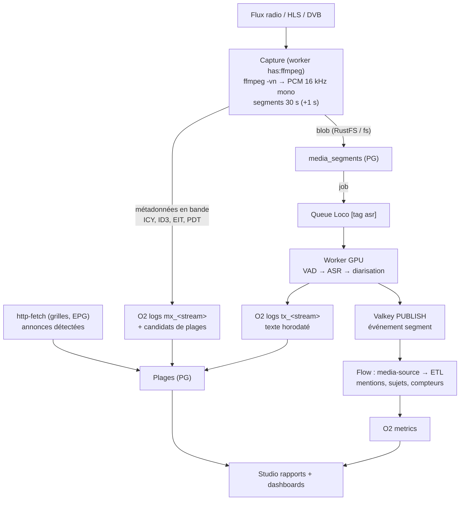

# PRD — Ingestion de flux média (radio, audio, vidéo → audio), transcription, plages et rapports (D159–D175)

**Statut :** Proposé (2026-10-09) — zéro code avant validation de ce PRD.
**Portée :** nouvel axe « média entrant » de PNEX : capter des flux audio/vidéo
continus, les transcrire, les découper en **plages** (émissions, postes,
lots), en tirer des séries pour les dashboards et des **rapports** générés
dans PNEX.
**Premier cas d'usage :** recensement de la couverture des sujets par
chaîne (radios et TNT publiques) — statistiques globales, pas de
redistribution de contenu.
**Renvois :** `camera-video.md` (D78 source/record, D81 registre de
modèles, D84 logs O2, D100 validation de modèle), `worker-fabric.md`
(capabilities, worker distant), `media.md` (D21 MediaStore), `edge-agent.md`
(D95 agent = device), `viz-bases.md` (dashboards, studio SCADA D40),
`ai-assistant.md` (D142–D145, règle d'extension §9), `security.md`
(R1–R20, `pnex_core::egress`), `extension-collector.md` (C1b).

> **Numérotation** : PRD rédigé en D148–D164 ; renuméroté D159–D175 à
> l'intégration (D148–D158 déjà pris par `security-tiers.md`).

---

## 1. Contexte & problème

PNEX sait déjà :

- capter une source **événementielle** et l'enregistrer par segments
  (`camera-source` → `video-record` → `/internal/flow/video-segment`, D78) ;
- exécuter des jobs longs dans la queue Postgres Loco (`build_firmware`,
  `stitch_panorama`, `firmware_check`) ;
- gérer un registre de modèles ONNX vérifiés à l'enregistrement (D81, D100) ;
- interroger le web (`pnex-http-fetch`, C1a) avec filtre d'egress ;
- écrire et chercher des événements JSON dans OpenObserve (D84) ;
- afficher des séries dans des dashboards.

Il manque : une **source média continue** (flux radio / TV / HLS), une
étape **speech-to-text** horodatée, un moyen de **découper le temps en
plages nommées** (émissions, postes d'équipe…) et de **générer des
rapports** sans quitter PNEX.

Contrainte produit forte (rappel) : **une seule surface, zéro basculement
d'outil**. Contrainte de plateforme : le cœur doit continuer à tenir sur
un Raspberry Pi (< 1 Go au repos) — la transcription GPU vit ailleurs.

## 2. Objectifs / non-objectifs

**Objectifs**

1. Déclarer des **flux média** (Icecast/MP3/AAC, HLS, DASH, RTMP/RTSP,
   tuner DVB-T via Tvheadend) et les capter 24/7 avec supervision.
2. Ne garder que l'**audio** (vidéo démuxée, jamais décodée côté image en V1).
3. Transcrire en **quasi temps réel** avec timestamps au mot, sur un
   worker GPU distant ou un CPU local.
4. Importer et vérifier des **modèles audio** (ASR, VAD, diarisation)
   comme on importe déjà les modèles vision.
5. Récupérer les **métadonnées** (en bande et hors bande) et les ranger
   en **plages** (annoncé vs recalé).
6. Alimenter les **dashboards existants** (séries O2) et générer des
   **rapports** versionnés, exportables, dans un studio intégré.

**Non-objectifs**

- Redistribuer l'audio ou les transcriptions intégrales.
- Contourner une protection technique (DRM, géoblocage) — interdit.
- Identifier une personne par sa **voix** (biométrie, RGPD art. 9) : les
  locuteurs sont nommés par des sources externes (bandeaux, grilles,
  annonces), jamais par empreinte vocale.
- Entraîner ou fine-tuner des modèles ASR (hors scope, école ml-vision).
- Analyse d'image des flux vidéo (OCR des bandeaux) : tranche ultérieure
  (§13), elle réutilisera `pnex-vision`.

## 3. Vue d'ensemble

Principe : **le calcul lourd ne passe jamais par le runtime de flows**
(école D78 : le flow transporte des références, pas des octets). Le flow
reçoit du **texte** et des événements, et fait l'ETL léger.

## 4. Décisions

### D159 — Un flux est une entité `media_streams`, pas un nœud ni un device

- Table `media_streams` (UUID, org-scoped, R1) : `name`, `kind`
  (`icecast` | `hls` | `dash` | `rtmp` | `rtsp` | `dvb` | `file_url`),
  `url` (référence de coffre si elle porte un token, D115), `enabled`,
  `capture_on` (`worker` | `device:<id>`), `asr_profile_id` (D164),
  `tracks` (`audio` défaut | `video` | `audio+video`, D175),
  `segment_secs` (défaut 30), `overlap_secs` (défaut 1),
  `audio_retention` (D161), `timezone`, `tdm_check` (D172), `created_by`.
- Pourquoi pas un nœud de flow : capter 24/7 un flux externe n'est pas du
  code utilisateur, et lancer `ffmpeg` depuis le runtime multi-org violerait
  R5/R6 (process natif, URL arbitraire). Le runtime **consomme** les
  événements d'un flux (D163), il ne le capte pas.
- Pourquoi pas un device : un flux n'a ni firmware ni clé. En revanche une
  **boîtier de capture** distant (Pi + tuner TNT) **est** un device : c'est
  un `pnex-agent` (D95) qui annonce la capability `media.capture` et
  reçoit la liste de ses flux (`capture_on = device:<id>`).
- Toute URL passe par le résolveur filtrant `pnex_core::egress` (même
  politique que http-fetch et les clients LLM).

### D160 — Capture : un superviseur ffmpeg par flux, sur un porteur `media.capture`

- Le porteur est un worker de la fabric (`worker-fabric.md`) avec
  `has:ffmpeg` + `feature:media-capture`, ou un agent edge (D159). Mode
  all-in-one : superviseur **in-process** (même binaire, cas dégénéré).
- Un process `ffmpeg` par flux. Piste audio : sortie PCM 16 kHz mono,
  découpage `segment` de `segment_secs`, `-reconnect` pour HTTP. Si
  `tracks` ne contient pas `video`, la vidéo est jetée au démux (`-vn`) ;
  sinon voir D175. Redémarrage avec backoff ; un flux qui plante n'affecte pas les
  autres.
- Horodatage **absolu** de chaque segment, par ordre de préférence :
  `EXT-X-PROGRAM-DATE-TIME` (HLS), TDT du signal DVB, horloge NTP du
  porteur au démarrage du segment. La source de l'horloge est stockée
  (`clock_source`) : une stat doit pouvoir dire d'où vient son heure.
- Chevauchement de `overlap_secs` entre segments pour ne pas couper un mot
  (recollage au mot côté ASR, D166).
- **Pas de fichier local durable** : le segment part au backend
  (`POST /internal/media/segment`, jeton de service, école D78) qui écrit
  le blob via `MediaStore` (fs ou RustFS) et la ligne `media_segments`,
  puis enfile le job de transcription. Le porteur ne détient aucun secret
  de stockage.
- Supervision : métriques `media_capture_up{stream}`,
  `media_capture_gap_seconds{stream}`, `media_segment_lag_seconds{stream}`
  dans O2 ; alerte « flux muet > 2 min » via les notifications existantes.
  **Les trous de capture sont des données** (§9, taux de couverture).

### D161 — Rétention audio : nulle par défaut, glissante en option

- `audio_retention` : `none` (défaut — blob supprimé dès la transcription
  réussie), `days:N` (rétention glissante, pruner horaire école D79), ou
  `keep` (réservé aux flux dont l'org détient les droits).
- Seul le **texte horodaté** est conservé durablement (D165). Raison :
  finalité d'analyse, empreinte minimale, défendable au regard de
  l'exception TDM (§11).
- Un échec ASR garde le blob jusqu'à `asr_retry_window` (défaut 15 min)
  pour rejeu, puis purge et segment marqué `failed` (trou visible).

### D162 — Table `media_segments`

`media_segments` (UUID, org-scoped) : `stream_id` (FK CASCADE),
`seq`, `started_at`, `ended_at`, `clock_source`, `storage_key`
(nullable après purge), `size_bytes`, `state` (`captured` | `queued` |
`transcribing` | `transcribed` | `failed` | `skipped_silence`),
`asr_model_id` + `asr_model_version` (épinglés au moment du job),
`asr_ms`, `error` (code court, jamais de chemin). Index
`(org_id, stream_id, started_at DESC)`. Les octets ne sont jamais en base.

### D163 — Nœud de flow `media-source` : événements de segments transcrits

- Source événementielle (école `camera-source`) : `SUBSCRIBE` Valkey sur
  le canal du flux, émet un message **par segment transcrit** :
  `{stream, segment_id, started_at, ended_at, text, words_ref, lang,
  speakers[], confidence, asr_model}`. Les mots horodatés restent dans O2
  (`words_ref` = clé de recherche), seul le texte transite.
- Options : `streams` (un ou plusieurs), `min_confidence`, `emit`
  (`segment` | `sentence` — découpage en phrases côté nœud).
- Le flow fait l'aval léger : détection de mentions (liste d'entités),
  classification de sujets (taxonomie versionnée, D168), compteurs →
  O2 metrics, notifications.
- Livrable obligatoire du même commit : `NodeDoc` dans
  `pnex-core/src/flow/node_docs.rs` (garde `every_kind_is_documented`) et
  fiche `assistant-kb` (règle CLAUDE.md).

### D164 — Profil de transcription = modèles audio du registre

`asr_profiles` (org-scoped) : `vad_model_id` (optionnel),
`asr_model_id` (obligatoire), `diarization_model_id` (optionnel),
`language` (`fr` par défaut, `auto` autorisé), `beam`, `word_timestamps`
(vrai par défaut). Un flux référence un profil ; changer de profil
n'affecte que les **nouveaux** segments (le rejeu de l'historique est
impossible sans audio, D161 — c'est assumé et affiché).

### D165 — Transcriptions → O2 logs `tx_<stream>`, jamais Postgres

Un document par segment : `ts` (= `started_at`), `stream`, `segment_id`,
`text`, `words[{w, start_ms, end_ms, p}]`, `speakers[{label, start_ms,
end_ms}]`, `lang`, `confidence`, `asr_model`, `asr_model_version`.
Recherche plein texte via l'endpoint `_search` existant (D84), scoppé org.
Rétention = celle du stream O2 (réglable, D72). Postgres ne garde que
l'état des segments (D162).

### D166 — Worker `transcribe_segment` dans la queue Loco, tag `asr`

- Calqué sur `stitch_panorama` : arguments minuscules (`segment_id`,
  `org_id`), état écrit par le worker seul, échec déterministe → `failed`
  sans rejeu, sémaphore de concurrence par process.
- Loco 1.1 fournit `BackgroundWorker::tags()` et
  `perform_later_with_priority` : le worker ASR porte le tag `asr` et ne
  tourne **que** sur les porteurs qui l'annoncent ; les workers existants
  (firmware, stitch) ne sont pas affamés par un flux continu de segments.
  **À valider par un test** : sémantique exacte du filtrage par tags dans
  la queue PG de Loco 1.1.
- Priorité : live > rattrapage. Métrique `media_asr_queue_lag_seconds` ;
  si le retard dépasse `max_lag` (défaut 10 min), les segments les plus
  anciens d'un flux passent en `skipped_backlog` (trou visible) plutôt
  que de laisser la queue diverger.
- Pipeline du job : lecture du blob → VAD (segment silencieux →
  `skipped_silence`, aucun appel ASR) → ASR → diarisation intra-segment →
  recollage du chevauchement au mot → O2 → PUBLISH Valkey → purge blob
  selon D161.
- Diarisation : labels **locaux au flux** (`S1`, `S2`…), raccordés de
  segment en segment par similarité d'embeddings **éphémères** (jamais
  stockés, jamais rattachés à une identité — §2 non-objectifs).
- Dépendance : la fabric de workers (P2.7) pour le worker GPU distant.
  En attendant le MVP fabric : process `--worker` sur la machine GPU,
  joint par mesh WireGuard (archetype « split LAN », `worker-fabric.md` §6).

### D167 — Import de modèles audio : extension du registre D81, même UX que la vision

- Les octets vivent dans la bibliothèque média (kind `model`, D21) ;
  `ml_models.task` gagne `asr`, `vad`, `diarization_segmentation`,
  `speaker_embedding` ; `family` fixe le pré/post-traitement :
  - `asr` : `whisper`, `parakeet_tdt`, `canary`, `sensevoice` (liste
    ouverte, une famille = un adaptateur testé) ;
  - `vad` : `silero` ;
  - diarisation : `pyannote_segmentation` + `speaker_embedding`.
- Formats acceptés V1 : **ONNX** (exports sherpa-onnx) et **GGUF/GGML**
  (whisper.cpp). Un modèle multi-fichiers (encodeur, décodeur, joiner,
  `tokens.txt`) est importé comme **archive** `.tar` ou `.zip` dont le
  manifeste est lu à l'import.
- **Introspection et validation à l'enregistrement (école D100)** :
  `inspect` lit ce que les fichiers déclarent (famille détectée, langues,
  fréquence d'échantillonnage) ; `validate` charge le modèle **et**
  transcrit un échantillon de référence embarqué (10 s de français) sur
  **ce** porteur → `load_ms`, `rtf` (facteur temps réel) et WER sur
  l'échantillon. L'UI affiche le **débit soutenable** : `≈ 1 / rtf` flux
  temps réel en parallèle par worker. Ce que le fichier dicte n'est jamais
  saisi par l'utilisateur.
- Validation **par porteur** : un modèle peut être `valid` sur le worker
  GPU et trop lent sur le Pi ; le statut est donc stocké par
  `(model, worker_capability_profile)`.
- Test manuel sur `/models` : déposer un fichier audio → transcription +
  timestamps + temps mesuré (école D104 « test live »).
- Licence affichée à l'import (champ obligatoire, liste SPDX) ; la
  palette signale les licences non commerciales.
- Runtime (crate `pnex-asr`, à créer) : adaptateurs derrière un trait
  unique `Transcriber`. Candidats à départager par le POC (§12, lot 0) :
  **sherpa-onnx** (bindings Rust, ONNX, CPU/ARM et CUDA, couvre Whisper,
  Parakeet, SenseVoice, Silero VAD et la diarisation) et **whisper.cpp**
  via `whisper-rs` (GGUF, CPU/Vulkan/CUDA). Les modèles qui n'existent
  qu'en Python (ex. Voxtral via vLLM) passent par un **service externe**
  appelé en HTTP (école CoolProp/FastAPI : la source de vérité reste le
  service), jamais par une stack Python embarquée.
- Garde de déploiement (école D101) : un flux dont le profil référence un
  modèle `invalid` ou supprimé ne démarre pas (`media-asr-model-invalid`).

### D168 — Taxonomies versionnées (sujets, entités)

- `taxonomies` + `taxonomy_versions` (append-only, école D18) : liste de
  sujets avec définition, mots-clés et/ou consigne de classification ;
  liste d'entités (personnalités, organisations) avec alias et
  rattachement (ex. parti déclaré, source citée).
- Toute série dérivée porte `taxonomy_version` en label : changer de
  taxonomie crée de nouvelles séries, ne réécrit jamais l'historique.
- Reclassification de l'historique = job batch (tag `reclassify`) qui
  relit `tx_<stream>` (le texte est conservé, D161) et réémet les séries
  sous la nouvelle version. C'est le « batch processing » possible sans
  audio.
- Classification par LLM autorisée **comme classifieur** (sortie fermée :
  un identifiant de sujet de la taxonomie ou `none`), jamais comme
  rédacteur. Modèle, prompt et version stockés avec le résultat.

### D169 — Plages : intervalles nommés, annoncés et recalés

Concept **générique** : une émission, un poste d'équipe, un lot de
production, un cycle machine sont tous des plages.

- Table `time_ranges` (org-scoped) : `scope` (`stream:<id>` |
  `device:<id>` | `org`), `label`, `external_id`, `category`,
  `planned_start`, `planned_end`, `actual_start`, `actual_end`
  (nullables), `origin` (`epg` | `grid` | `detected` | `manual` |
  `import`), `confidence`, `source_ref` (URL ou requête d'origine),
  `attrs` (JSONB : animateur, invités annoncés…).
- **Deux niveaux** : `planned_*` (grille annoncée) et `actual_*` (recalé).
  Les stats utilisent `actual` quand il existe, sinon `planned`, et
  exposent lequel a servi. L'écart planned/actual est une série en soi.
- Écriture : API REST (UI + import CSV/ICS) et **nœud de flow
  `range-upsert`** (clé = `scope` + `external_id` : idempotent, un même
  programme réimporté met à jour au lieu de dupliquer).
- Recalage `detected` : un flow peut proposer `actual_start/end` à partir
  d'une annonce détectée dans la transcription (« il est 8 heures… ») ;
  la proposition garde sa preuve (`segment_id` + timecode).

### D170 — Métadonnées : en bande par la capture, hors bande par les flows

| Source | Exemples | Récupération |
|---|---|---|
| **En bande, radio** | ICY `StreamTitle` (Icecast/Shoutcast) | superviseur ffmpeg (D160) → O2 `mx_<stream>` |
| **En bande, HLS** | `EXT-X-PROGRAM-DATE-TIME`, ID3 timed metadata | idem ; sert aussi d'horloge (D160) |
| **En bande, TNT** | EIT présent/suivant et grille 7 jours, TDT | Tvheadend (API EPG) ou analyse EIT → candidats `time_ranges` (`origin=epg`) |
| **Hors bande** | grilles publiées (API des éditeurs, XMLTV) | flow : `inject` (cron) → **`http-fetch`** → transformation → **`range-upsert`** |
| **Contenu** | annonces, jingles | flow sur `media-source` → `range-upsert` (`origin=detected`) |

- Le nœud `http-fetch` existant suffit pour le hors bande : réponse
  JSON auto-parsée, secrets en coffre (D115), egress filtré. Il manque
  seulement un parseur **XMLTV** (nœud `xml` générique ou fonction de
  transformation) — à trancher avec le catalogue P2.11.
- Les métadonnées en bande sont des **événements** (O2 logs), pas des
  plages : un `StreamTitle` change à chaque morceau ou rubrique ; c'est
  un flow qui décide d'en faire une plage.

### D171 — Séries pour les dashboards : O2 metrics, dashboards inchangés

Le flow (ou le worker pour les métriques techniques) écrit des séries
**métriques** O2 ; les widgets existants les lisent sans modification :

- `media_speech_seconds{stream}` (parole détectée par la VAD) ;
- `media_mentions_total{stream, entity, taxonomy_version}` ;
- `media_topic_seconds{stream, topic, taxonomy_version}` ;
- `media_capture_up{stream}`, `media_coverage_ratio{stream}` ;
- `media_asr_queue_lag_seconds`, `media_asr_rtf{worker}`.

Ajout **additif** côté viz : un mode d'agrégation « par plage »
(regroupement par intervalles `time_ranges` au lieu de fenêtres fixes)
et un mode « par tranche horaire » (0–6 h, 6–9 h…, configurable). Ces
modes servent aussi l'IoT (consommation par poste d'équipe).

### D172 — Garde-fous juridiques encodés dans le produit

- `media_streams.tdm_check` : date + note de vérification de
  l'opposition à la fouille de textes et de données (CGU, robots.txt,
  mentions de l'éditeur) ; un flux sans vérification affiche un
  avertissement persistant (pas de blocage technique).
- Aucun endpoint ne sert un segment audio ni une transcription intégrale
  hors de l'org ; la publication (rapports publics) ne contient que des
  agrégats et des **extraits courts** sourcés (D173).
- Registre de traitement RGPD : modèle fourni dans la doc d'installation
  (voix et propos = données personnelles ; personnalités publiques dans
  leur rôle).

### D173 — Studio de rapports : mode « document » du studio de dashboards

- Pas de nouvelle surface : le studio de dashboards (D40) gagne un mode
  **document** paginé. Mêmes widgets, mêmes liaisons de lecture, plus
  trois blocs propres au rapport :
  - **tableau d'agrégats** (par plage, par tranche, par flux) ;
  - **extraits sourcés** : citation courte (plafond de longueur
    configurable par org, défaut 280 caractères) + flux + timecode +
    lien vers la source officielle (`time_ranges.source_ref`) ;
  - **méthode** : bloc auto-généré (modèles et versions, taxonomie,
    taux de couverture et trous de capture de la période).
- Versioning école S3/D18 (`report_templates` / versions append-only,
  `expected_version` → 409).
- **Génération** = job queue (tag `report`) : à la demande ou planifiée
  (cron du modèle). Chaque rapport généré est **figé** : données,
  requêtes, versions de modèles et de taxonomie sont stockées avec lui
  (média kind `report`), pour qu'un chiffre publié reste vérifiable et
  rejouable.
- Export Markdown et PDF ; lien public tokenisé (école S4 des tours) pour
  partager un rapport figé.

### D174 — Synthèses : IA possible, toujours marquée, interdite en mode factuel

- Bloc `summary` optionnel : rédigé par le fournisseur LLM de l'assistant
  (D116), à partir **uniquement** des chiffres et extraits du rapport
  figé, avec renvoi aux blocs sources.
- Toujours étiqueté « texte généré par IA » dans le rendu et l'export.
- Réglage par modèle de rapport `ai_text: allowed | forbidden` ; le
  préréglage **« factuel »** (destiné aux journalistes) l'interdit : le
  rapport ne contient alors que chiffres, graphiques, extraits et méthode.
- L'assistant (D144) peut créer et éditer des modèles de rapport (outil
  du service partagé, `expected_version`), jamais publier un rapport ni
  modifier un flux en capture (frontière D123 : il ne déclenche aucune
  action, ici aucune capture).

### D175 — Piste vidéo : un flux IP rejoint le bus caméra existant

`media_streams` est le point d'entrée commun de **toute** source réseau,
y compris les caméras IP (RTSP/ONVIF, HLS). Quand `tracks` contient
`video` :

- le superviseur échantillonne la vidéo (`fps` configurable, défaut 1),
  encode chaque image en JPEG et la publie sur le **même bus Valkey que
  le CameraHub** (`SET frame` TTL 15 s + `PUBLISH meta`, D74) ;
- les nœuds existants `camera-source`, `vision-detect` et `video-record`
  fonctionnent **sans modification de leur contrat** : une caméra IP
  devient une source de frames comme un ESP32-CAM ;
- la piste audio éventuelle suit le chemin ASR de ce PRD : une même
  caméra peut produire détections **et** transcriptions.

Point à trancher avant implémentation : `video_segments` et le canal du
bus sont aujourd'hui clés par `device_registry_id` (D79) ; il faut soit
une FK alternative `stream_id` (une des deux non nulle), soit un device
« virtuel » par flux. Préférence : `stream_id` (pas de faux device).

## 5. Modèle de données (récapitulatif)

| Table / stream | Stockage | Contenu |
|---|---|---|
| `media_streams` | PG | flux déclarés (D159) |
| `media_segments` | PG | état des segments, pas d'octets (D162) |
| `asr_profiles` | PG | combinaison VAD/ASR/diarisation (D164) |
| `ml_models` (+ statut par porteur) | PG + média | registre étendu (D167) |
| `taxonomies`, `taxonomy_versions` | PG | sujets/entités versionnés (D168) |
| `time_ranges` | PG | plages annoncées/recalées (D169) |
| `report_templates` (+ versions), rapports figés | PG + média | studio (D173) |
| `tx_<stream>` | O2 logs | transcriptions horodatées (D165) |
| `mx_<stream>` | O2 logs | métadonnées en bande (D170) |
| `media_*` | O2 metrics | séries de dashboards (D171) |
| blobs audio | RustFS / fs | éphémères (D161) |

Migrations : école `convention.md` (PK explicite, FK par nom de table,
index en SQL brut sous-tirets) ; `schema_invariants.rs` complété.

## 6. API (additive — ne pas bumper `pnex_api_contract::CONTRACT`)

- `GET|POST /api/v1/media/streams`, `PATCH|DELETE /api/v1/media/streams/{id}`,
  `POST /api/v1/media/streams/{id}/start|stop`,
  `GET /api/v1/media/streams/{id}/segments` (pagination D14).
- `POST /internal/media/segment` (jeton de service du porteur, école D78).
- `GET|POST /api/v1/asr/profiles`, `PATCH|DELETE …/{id}`.
- `ml_models` : `task` étendu ; `POST /api/v1/ml/models/{id}/test` accepte
  un audio ; `check` renvoie `rtf` + débit soutenable.
- `GET|POST /api/v1/time-ranges` (+ import CSV/ICS), `PATCH|DELETE …/{id}`.
- `GET|POST /api/v1/taxonomies`, versions append-only.
- `GET|POST /api/v1/reports/templates`, `POST …/{id}/generate`,
  `GET /api/v1/reports/{id}` (figé), export `?format=md|pdf`.
- Recherche de transcriptions : endpoint `_search` existant (D84), filtre
  `stream`.

Chaque handler d'écriture : garde de rôle en tête + test viewer → 403
(R2) ; org depuis le principal (R1) ; aucun secret dans les DTO (R4, R16).

## 7. UI

- **/media** : liste des flux (état de capture, retard ASR, couverture
  24 h), création avec test de l'URL (premier segment capté et transcrit
  sous les yeux), onglet transcriptions (recherche plein texte, lecture
  du texte horodaté), onglet plages (frise annoncé vs recalé).
- **/models** : formulaires audio (famille détectée, champs verrouillés
  « lu dans le fichier »), test par dépôt d'un audio, débit soutenable.
- **Studio** : mode document, blocs §D173, aperçu paginé, export.
- Palette de flows : `media-source`, `range-upsert` (+ parseur XMLTV).
- i18n : toutes les chaînes en `t!`, parité `fr-FR`/`en-US`, nouveaux
  codes d'erreur dans `err_codes::ALL` (`media-stream-unreachable`,
  `media-asr-model-invalid`, `media-egress-denied`…).

## 8. Assistant IA (obligatoire dans les mêmes commits)

- `NodeDoc` pour `media-source` et `range-upsert` (+ pièges : pas
  d'audio dans le flow, `taxonomy_version` en label).
- Fiches `assistant-kb` : `/media`, modèles audio, plages, studio de
  rapports, dépannage (« flux muet », « retard de transcription »,
  « modèle trop lent pour ce worker »).
- Outils : lecture des flux, plages et rapports ; écriture limitée aux
  modèles de rapport et aux taxonomies (service partagé, D144) ; **jamais**
  démarrer/arrêter une capture ni publier un rapport.

## 9. Mesure de la qualité (ce qui rend les chiffres défendables)

- **Couverture** : `media_coverage_ratio` par flux et par période (temps
  capté et transcrit / temps de la période) ; affichée dans chaque
  rapport (bloc méthode).
- **Confiance** : distribution des scores ASR par période ; les segments
  sous `min_confidence` sont comptés à part, jamais silencieusement jetés
  (principe D100 : toute donnée écartée est comptée et expliquée).
- **Référence** : jeu d'évaluation interne (quelques heures annotées à la
  main par type de contenu : flash info, débat, interview) pour mesurer
  le WER et le taux d'erreur sur les noms propres à chaque changement de
  modèle.

## 10. Ordres de grandeur

| Hypothèse | Valeur |
|---|---|
| Flux suivis (radios + TNT publiques) | ~15 |
| Audio par jour | ~360 h |
| Segments par jour (30 s) | ~43 000 |
| Débit entrant (PCM 16 kHz mono) | ~0,5 Mbit/s par flux, transitoire |
| Texte stocké | quelques centaines de Mo par mois (ordre de grandeur, à mesurer au lot 1) |
| Calcul ASR | dépend du modèle : RTF mesuré à l'import (D167) ; cible = ≥ 15 flux temps réel sur un GPU grand public, à confirmer au lot 0 |

## 11. Cadre juridique (rappel, non un avis juridique)

- Captation et conservation du texte pour **analyse** : exception de
  fouille de textes et de données (CPI L122-5-3), sous réserve d'accès
  licite et d'absence d'opposition de l'ayant droit (D172).
- Publication : agrégats + **courtes citations** sourcées (CPI L122-5 3°a) ;
  discours publics en assemblée politique ou réunion publique : diffusion
  à titre d'information d'actualité autorisée (L122-5 3°c).
- Pas de redistribution intégrale, pas de contournement de protection.
- **Validation par un avocat en propriété intellectuelle avant toute
  publication grand public** (pré-requis du lot 4).

## 12. Lots

| Lot | Contenu | Critère de sortie |
|---|---|---|
| **0 — POC ASR** | crate `pnex-asr` (trait `Transcriber`) ; benchmark sherpa-onnx vs whisper.cpp ; 3–4 modèles FR sur 1 h de radio annotée | tableau WER / noms propres / RTF sur le GPU cible et sur Pi ; runtime retenu |
| **1 — Capture + transcription** | D159–D162, D165, D166 (worker tag `asr`), D167 (import + check audio), page /media minimale | France Inter capté 24 h, texte dans O2, couverture ≥ 99 %, zéro audio résiduel |
| **2 — Flows + séries** | D163 (`media-source`), D168 (taxonomie v1), D171 (métriques), NodeDoc + KB | dashboard « mentions par heure » sur 3 flux |
| **3 — Plages + métadonnées** | D169, D170 (`range-upsert`, EPG TNT, grilles via http-fetch, recalage par annonces) ; mode « par plage » des widgets | stats par émission sur une semaine, écart annoncé/recalé visible |
| **4 — Studio de rapports** | D173, D174, rapport figé, export, lien public | rapport hebdomadaire « factuel » généré en cron, rejouable |
| **5 — Diarisation** | D166 diarisation, temps de parole par locuteur local ; nommage par sources externes (grilles, annonces) | temps de parole par plage avec taux d'erreur mesuré |

Dépendances : fabric de workers P2.7 (worker GPU distant) — contournable
au lot 1 par le process `--worker` joint en mesh ; catalogue de nœuds P2.11
(parseur XML) pour le lot 3.

## 13. Tranches ultérieures (hors de ce PRD)

- OCR des bandeaux TV (vision `pnex-vision`, frames échantillonnées) pour
  nommer les locuteurs et dater les sujets à l'écran.
- Empreintes de jingles (recalage précis des plages sans transcription).
- Extension navigateur (P2.1) comme porteur de capture « signalement »
  (URL + position de lecture), jamais pour du contenu protégé.

## 14. Questions ouvertes

1. Runtime ASR : sherpa-onnx seul, whisper.cpp seul, ou les deux derrière
   `Transcriber` ? (tranché par le lot 0)
2. Sémantique exacte des tags de worker dans la queue PG de Loco 1.1 :
   suffisante, ou faut-il une queue nommée dédiée (`queue()`) ?
3. Où vit le superviseur de capture en all-in-one sur Pi : dans le
   binaire serveur (simple) ou toujours dans un process séparé (isolation
   des crashs ffmpeg) ?
4. Mode « par plage » des widgets : agrégation côté O2 (SQL sur intervalles)
   ou côté backend (jointure en mémoire) ?
5. Plafond de longueur des extraits publiés : réglage par org, ou valeur
   plateforme fixée après avis juridique ?
