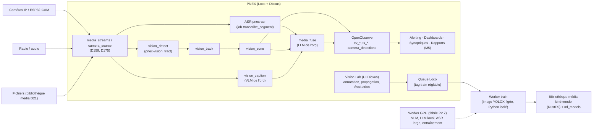

# PRD — PNEX Media & Vision Studio

> **Statut :** Draft v0.2 — 10/10/2026 (v0.1 de Shan, **relue contre la
> doc le 2026-10-10**, corrections au §11). Zéro code avant validation.
> **Auteur :** Shan
> **Périmètre :** pilier « Ingestion média + Vision » de PNEX (audio,
> vidéo, caméras IP, reconnaissance d'objets custom, description vidéo,
> Vision Lab d'entraînement).
> **Version cible :** **après la 0.2.0** (gel des nouveaux piliers pendant
> la 0.2.0, `roadmap.md` P2.14), sauf exception explicite comme celle
> accordée à P2.13 (décision #17). Entrée roadmap : P2.15, décision #18.
> **Numérotation :** les décisions de ce PRD reçoivent leurs numéros D à
> la validation (prochain libre : D192).
> **Renvois :** `camera-video.md` (D73–D86 bus caméra, D81 registre de
> modèles, D82 `pnex-vision`/tract, D83 `vision_detect`, D84 événements
> O2, D100–D104 fiabilité, D105 calques de détection), `media-ingest.md`
> (D159–D175 : flux, capture, ASR, `media_source`, D173/D174 rapports et
> synthèses reportés, D175 caméras IP sur le bus), `media-asr-bench.md`
> (lot 0 ASR), `ml-vision.md` (pilier ML, stack tout-Rust),
> `worker-fabric.md` (P2.7, workers GPU), `media.md` (D21 bibliothèque
> média, versioning), `ontology.md` (D176–D191, provenance D184, rapports
> D187), `secrets.md` (D119 LLM d'org), `surfaces-controls.md` (D128
> frontière d'actionnement), `security.md` (R1–R20), `ai-assistant.md` §9.

---

## 0. Ce qui existe déjà (à ne pas refaire)

Ce PRD **étend** deux chantiers existants, il ne les remplace pas :

| Besoin du PRD | Déjà décidé / livré | Ce que ce PRD ajoute |
|---|---|---|
| Sources média (RTSP, HLS, radio) | `media_streams` (D159), capture ffmpeg derrière fetcher filtré (D160), caméras IP sur le bus caméra (D175) — PRD proposé, lot 1 en cours | Source « fichier uploadé » rejouée depuis la bibliothèque média (D21) |
| Transcription horodatée | `pnex-asr` (sherpa-onnx par défaut, whisper.cpp en option, lot 0 ✅), worker `transcribe_segment` (D166), O2 `tx_<slug>` (D165), nœud `media_source` (D163) | Rien côté ASR |
| Détection d'objets | `ml_models` + `pnex-vision` (tract, YOLOX Apache-2.0), nœud `vision_detect`, test image/live, validation à l'enregistrement (D81–D83, D100–D104) — **livré** | Tracking, zones, modèles custom |
| Événements interrogeables | Nœud `event_log` → O2 `ev_*` (D84), calques `camera_detections` (D105), notifications (D85) | Événements dérivés (zone, présence, comptage) |
| Registre de modèles | Bibliothèque média `kind=model` + versions (D21, D81), check par porteur (D167) | Lien modèle → dataset figé + run d'entraînement |
| Rapports, synthèses IA | **Reportés** (D173, D174) ; D3 : rapports = OpenObserve | Rouvre la question (M5), voir §4.8 |

## 1. Contexte et vision

PNEX glisse d'une plateforme IoT vers une **plateforme data unifiée**
(vision long terme : type Palantir / ArgonOS ; socle = ontologie 0.2.0).
Après le firmware, les devices, l'ETL, le dashboarding, le Studio
Panorama 360, les synoptiques SCADA, la caméra (D73–D105) et l'ingestion
de flux audio (D159–D175), il reste à couvrir **la compréhension des
médias** : ce qui est vu, détecté, et la synthèse de l'ensemble.

L'objectif est de transformer n'importe quel flux média en **événements
horodatés, structurés et interrogeables**, au même rang que la
télémétrie IoT. Les sources de ces événements sont :

- ce qui est dit (transcription, **déjà couvert** par `media-ingest.md`) ;
- ce qui est vu (description visuelle) ;
- ce qui est détecté (objets custom, éventuellement postures).

Ces événements alimentent l'alerting, les dashboards, les synoptiques et,
à terme, un **studio de rapports intégré** (aujourd'hui reporté, §4.8).

L'utilisateur doit aussi pouvoir **créer ses propres modèles de
reconnaissance d'objets** sans compétence ML. C'est le rôle du **Vision
Lab** (le « Model Lab » de l'axe C de la roadmap, volet vision) : il joue
une vidéo ou ouvre des images, entoure l'objet sous plusieurs angles, et
PNEX génère, évalue et déploie le modèle.

### Principes directeurs (réflexions de Shan)

| # | Principe | Implication |
|---|---|---|
| P1 | **Une seule surface, zéro basculement d'outil** | Annotation, entraînement, rapports et visualisation se font dans l'UI PNEX (Dioxus). Pas de CVAT, Label Studio ou Jupyter exposés à l'utilisateur. |
| P2 | **Identité visuelle unifiée** | Tout moteur tiers reste headless derrière l'UI PNEX. |
| P3 | **Écosystème cohérent, pas « 500 dépendances »** | Briques minimales, réutilisation de la stack existante (Loco, Postgres, OpenObserve, Valkey, moteur de flows, queue Loco, `pnex-vision`, `pnex-asr`, bibliothèque média). |
| P4 | **Licences permissives préservées** | Aucune dépendance runtime copyleft (AGPL et autres) ; toute brique MIT/BSD/Apache, LICENSE réel lu. **Détection = YOLOX exclusivement** (Apache-2.0). Ultralytics exclu. |
| P5 | **Tourne sur Raspberry Pi** pour le cœur | Capture, ASR léger et détection nano/tiny possibles à l'edge. VLM, LLM et entraînement sont déportés sur un worker GPU (fabric P2.7) ou une API. |
| P6 | **La plateforme n'actionne jamais d'elle-même** | Le serveur collecte, transforme, alerte et notifie. Les nœuds vision n'émettent aucune commande. Seul un flow **déployé par l'humain** avec `device_write` touche un actionneur (D128) — la vision ne change pas cette frontière. |
| P7 | **Ontologie optionnelle** | Une caméra ou une source média fonctionne seule. L'ontologie (objets, placements, temporalité) enrichit sans être obligatoire (types système dans leurs tables, D177). |
| P8 | **Open source, modèles open weights** | ASR, détection et VLM en open weights, licence de chaque poids vérifiée. Les appels distants passent par le **LLM / endpoint de l'org** (D119), jamais par un fournisseur plateforme. |

---

## 2. Problèmes adressés

1. Les flux vidéo (enregistrements, caméras IP) restent des **données
   peu exploitées** : la détection COCO existe (D83), mais sans suivi
   d'objet, sans zones, sans description.
2. Les modèles de détection génériques (classes COCO) ne reconnaissent
   pas les **objets métier** : pièces, équipements, EPI, outils, produits.
3. Créer un modèle custom demande aujourd'hui une chaîne d'outils ML
   hétérogène (annotation, scripts, GPU, export), **inaccessible aux
   utilisateurs non techniques**. Le registre actuel n'accepte que des
   ONNX produits ailleurs.
4. Produire un **rapport** à partir d'heures de média est manuel.

---

## 3. Personas

| Persona | Besoin |
|---|---|
| **Maker / DIY** | Brancher une caméra IP ou un micro, avoir une transcription, détecter « son » objet. Démarrage en quelques minutes. |
| **Opérateur industriel / superviseur** | Surveiller un poste ou une zone, recevoir des alertes (objet absent, EPI manquant), consulter un résumé horodaté. |
| **Analyste** | Fouiller des heures de média, corréler aux données capteurs, générer des rapports. |
| **Intégrateur / admin** | Déployer sur Pi ou cloud, brancher un worker GPU, gérer modèles et versions. |

---

## 4. Périmètre fonctionnel

### 4.1 Sources média

- **Réseau** : `media_streams` (D159) couvre déjà Icecast/HLS/DASH,
  RTSP/ONVIF et la piste vidéo des caméras IP (D175 : frames JPEG publiées
  au format du bus caméra, `fps` configurable). Capture ffmpeg **sans
  réseau** derrière le fetcher filtré R8 (D160). Rien à redéfinir ici.
- **Fichier uploadé (ajout)** : une vidéo ou un audio déposé dans la
  bibliothèque média (D21) peut être **rejoué** comme source : mêmes
  sorties (frames sur le bus, segments audio vers l'ASR), horloge = temps
  du fichier. Jamais d'URL `file:` ni de chemin local (D160).
- Une source n'a pas besoin de l'ontologie (P7) ; quand L1 existera,
  `media_stream` est un type système (D177).
- Paramètres : fps d'analyse (D175), fenêtre d'agrégation (nœuds), et
  rétention **séparée** médias bruts / événements (D161 pour l'audio,
  D79 pour les segments vidéo, rétention O2 pour les événements, D72).

### 4.2 Branche audio → transcription horodatée

**Entièrement couverte par `media-ingest.md`** (D162–D167) : VAD +
ASR via `pnex-asr` (sherpa-onnx par défaut, whisper.cpp en option de
build ; pas de faster-whisper, qui est une stack Python), segments
`{t0, t1, texte, langue, confiance}` dans O2 `tx_<slug>`, diarisation au
lot 5 (labels locaux, jamais d'identification vocale). Modèle léger sur
Pi, large sur worker : profils D164 + check par porteur D167.

### 4.3 Branche détection d'objets (YOLOX)

- **YOLOX exclusivement** (P4), via le registre existant (`ml_models`,
  famille `yolox`) :
  - pré-entraînés COCO (déjà supportés) ;
  - custom issus du Vision Lab (§ 4.6).
- Inférence : **`pnex-vision` (tract)**, déjà en production (D82),
  dans le nœud existant `vision_detect`. `ort` (bindings ONNX Runtime)
  n'est ajouté que si tract plafonne au bench Pi ; Burn reste le
  challenger documenté (`ml-vision.md` étape 1).
- **Tracking ByteTrack** (algorithme MIT) : réimplémenté en Rust (Kalman
  + association IoU, sans dépendance Python) dans un nouveau nœud
  `vision_track` ; id persistant par objet.
- Agrégation des détections en **événements** :
  ```json
  {"t0": 12.0, "t1": 100.4, "class": "chariot_elevateur", "track_id": 3,
   "conf_avg": 0.91, "zone": "quai_2", "event": "present"}
  ```
- **Zones** : polygones dessinés **sur l'image de la caméra**
  (coordonnées image normalisées 0–1, par source). C'est un concept
  nouveau : le geofencing PNEX n'existe pas encore (simple ouverture
  après G1/G2, `roadmap.md`), et ses zones seraient en WGS84.
- Événements dérivés : apparition, disparition, entrée ou sortie de
  zone, durée de présence, comptage. Écrits via `event_log` (O2 `ev_*`,
  D84) ; les cadres bruts continuent d'aller en calques
  `camera_detections` (D105).

### 4.4 Branche vision descriptive (VLM)

- VLM open weights qui produit une légende factuelle d'une keyframe ou
  d'un mini-clip.
- **Crop puis VLM** : description fine d'un objet détecté (état,
  couleur, texte lisible).
- Exécution sur worker GPU (endpoint OpenAI-compatible, ex. vLLM) ou
  API distante, **configurée au niveau de l'org** (D119 : pas de LLM
  plateforme), appel sortant filtré (R8). Jamais exigé sur le Pi.
- Le VLM est un fournisseur de l'org comme le LLM ; l'envoi d'images à
  une API distante est **explicite par source** (§6 confidentialité).

### 4.5 Fusion → description vidéo

- Par fenêtre temporelle (10 à 30 s, paramétrable), le moteur assemble
  trois entrées :
  1. la transcription (`tx_<slug>`) ;
  2. les événements de détection ;
  3. les légendes VLM.
- Le **LLM de l'org** (D119, aucun modèle par défaut imposé par la
  plateforme) produit une **description unifiée horodatée**, puis un
  **résumé global**.
- Hiérarchie de confiance imposée dans le prompt :
  - **détections** = faits ;
  - **ASR** = fiable pour la parole ;
  - **VLM** = indicatif.
  - Le LLM n'invente aucun objet absent des détections ou des légendes.
- **Texte non fiable** (règle de D168) : transcriptions et légendes sont
  passées comme données délimitées, jamais comme instructions ; aucun
  outil exposé ; plafond d'appels par org et par jour.
- Traçabilité : chaque phrase générée référence ses sources (ids de
  segments ASR, d'événements, de légendes), au format de provenance
  D184 ; une phrase sans source est rejetée, pas affichée.
- Toute sortie est marquée « générée par IA » (règles de D174).
- **Portée de D174** : la description par fenêtre est une synthèse IA ;
  ce PRD rouvre donc D174 **pour l'usage interne** (consultation dans
  PNEX), sans publication. Décision à prendre à la validation.

### 4.6 Vision Lab — génération de modèles de reconnaissance d'objets

**Besoin (Shan) :** l'utilisateur joue une vidéo ou ouvre plusieurs
images, entoure l'objet à détecter sous plusieurs angles et sur
plusieurs images différentes, et PNEX génère un modèle à partir de ça.

C'est la décision explicite attendue par la roadmap (décision #7 :
« besoin réel de fine-tuning détecteurs ») ; le « Model Lab » de
l'axe C démarrait par linfa — ce PRD en ouvre le volet vision.

#### 4.6.1 Parcours utilisateur

1. **Créer un projet Lab** et nommer les classes, par exemple
   « vanne_rouge » ou « casque_chantier ».
2. **Importer des médias** : plusieurs images, une ou plusieurs vidéos
   (bibliothèque média D21), ou un extrait d'une source existante
   (segments `video_segments` d'une caméra déjà branchée, D79).
3. **Annoter dans PNEX** :
   - Images : dessiner des boîtes (bounding boxes) et attribuer une
     classe.
   - Vidéo : lecteur intégré (celui de `/cameras`, D105), pause, boîte
     dessinée sur la frame.
     - **Propagation assistée** : PNEX suit la boîte sur les frames
       suivantes par interpolation entre keyframes (V1) puis par tracking.
       L'utilisateur corrige quand ça dérive.
     - L'utilisateur peut aussi n'annoter qu'une frame sur N et laisser
       l'interpolation faire le reste.
   - **Guidage de diversité** (M4) : le Lab signale les manques, par
     exemple « peu d'angles différents », « peu d'images en faible
     luminosité » ou « classe X sous-représentée ».
   - **Images négatives** : frames sans l'objet, pour réduire les faux
     positifs.
4. **Pré-annotation** (optionnelle, M4) : une fois un premier modèle
   entraîné, il propose des boîtes sur les nouvelles images et
   l'utilisateur valide ou corrige.
5. **Lancer l'entraînement** en un clic, avec des presets :
   - **Edge** : YOLOX-nano / tiny, 416 px, pour le Pi.
   - **Standard** : YOLOX-s.
   - **Précis** : YOLOX-m, pour le worker GPU.
6. **Suivre l'entraînement** : progression, courbes de loss et mAP, ETA,
   annulation possible.
7. **Évaluer** :
   - métriques par classe ;
   - galerie des erreurs (faux positifs, faux négatifs) ;
   - **test sur une vidéo** de validation directement dans le lecteur
     (même modal que le test live D104).
8. **Publier le modèle** dans le registre existant (nouvelle version du
   média `kind=model` + `ml_models`), qui passe la **vérification D100**
   comme tout ONNX importé, puis le **référencer** dans un ou plusieurs
   nœuds `vision_detect`.
9. **Boucle d'amélioration (active learning, M4)** : en production, les
   détections à faible confiance sont collectées dans une file « à
   revoir » du Lab. L'utilisateur les annote, ré-entraîne et publie une
   nouvelle version.

#### 4.6.2 Règles techniques du Lab

- **Split train/val par source** (vidéo ou session d'import), jamais
  par frame, pour éviter la fuite de frames quasi identiques entre train
  et val.
- **Déduplication** des frames extraites (similarité perceptuelle).
- **Fine-tuning** systématique depuis les poids COCO pré-entraînés.
- Augmentations YOLOX par défaut (Mosaic, MixUp, coupure en fin
  d'entraînement).
- **Seuils minimaux** avant de pouvoir lancer l'entraînement (N images
  annotées par classe, M images de validation) : valeurs indicatives,
  avertissement si elles ne sont pas atteintes.
- **Export ONNX** automatique en fin d'entraînement, à taille d'entrée
  fixe (D100 lit les dimensions dans le fichier). Quantification INT8
  optionnelle pour l'edge, **sous réserve que tract l'exécute** (à
  vérifier au M4).
- Format interne compatible **COCO**. Import et export COCO pour
  l'interopérabilité (pas un parcours principal, P1).

#### 4.6.3 Registre et versioning des modèles

On **réutilise** le registre existant au lieu de créer des tables
`model` / `model_version` :

- les octets ONNX sont une **nouvelle version** du média `kind=model`
  (D21 : versioning, stockage fs/S3 **RustFS** — MinIO est banni —,
  purge) ; `ml_models` porte la spec d'inférence (labels, taille,
  seuils) et peut épingler une version (D81) ;
- nouvelles tables append-only (école `flow_versions`, D18) :
  - `lab_datasets` / `lab_dataset_versions` : snapshot figé des
    annotations (référence des médias + boîtes), **versionné** ;
  - `lab_training_runs` : dataset version, preset, hyperparamètres,
    image d'entraînement (digest), métriques, version de média produite,
    checksum (sha256 du média) ;
- **Enregistrer** (nouvelle version du média) reste séparé de
  **référencer** (un nœud ou `ml_models` épingle la version). Le rollback
  consiste à ré-épingler une version antérieure puis redéployer le flow.
- Tout modèle est reproductible depuis `lab_training_runs` (dataset
  figé + hyperparamètres + digest de l'image).

### 4.7 Postures / postes de travail

> **À clarifier (question ouverte Q1)** : « reconnaissance object/poste »
> signifie soit **pose** (estimation de posture humaine), soit **poste de
> travail** (surveillance d'un poste industriel).

- **Si poste de travail** : c'est couvert par les zones (§ 4.3) et les
  classes custom (opérateur, outil, pièce), avec des événements du type
  « opérateur présent au poste », « pièce absente » ou « durée de cycle ».
  Un poste ou un cycle est une **plage** (D169/D182).
- **Si pose humaine** : YOLOX ne fait pas d'estimation de pose. Il
  faudrait un modèle dédié sous licence permissive (candidats à vérifier :
  RTMPose, MoveNet — annoncés Apache-2.0), nouvelle famille dans
  `ml_models`, en parallèle de la contrainte « YOLOX exclusivement », qui
  vaut pour la détection d'objets.

### 4.8 Studio de rapports intégré

- **Conflit avec l'existant** : le studio de rapports est **reporté**
  (D173 : rien ne sort de PNEX ; D174 : pas de synthèse IA en V1 ; D3 :
  les rapports planifiés passent par OpenObserve) et l'ontologie prévoit
  des rapports liés aux objets (D187). M5 exige donc une décision
  explicite qui rouvre D173/D174 et précise D3, avec les garde-fous de
  `media-ingest.md` §15 (échappement, rendu PDF sans réseau, aucune
  publication automatique d'une synthèse IA, relecture humaine).
- L'utilisateur reste dans PNEX (P1).
- Sources du rapport : descriptions et résumés vidéo, transcriptions,
  événements, données IoT corrélées sur la même plage temporelle.
- Fonctions :
  - timeline interactive (média + événements) ;
  - recherche plein texte (endpoint transcripts D165, événements D84) et
    par classe d'objet ;
  - extraits (clip ou frame) intégrés au rapport ;
  - génération assistée par l'agent PNEX (LLM de l'org) ;
  - export (PDF ou Markdown).

### 4.9 Intégration au moteur de flows

Nœuds natifs Rust, schéma config/ports dans `pnex-core`, **kinds en
snake_case** comme l'existant :

| Nœud | État | Entrée → Sortie |
|---|---|---|
| `camera_source` (`source: device \| stream`, D175) | existant, étendu par D175 | device ou flux → frames horodatées (bus caméra) |
| `media_source` (D163) | proposé (P2.13) | flux → segments transcrits (texte) |
| `vision_detect` (D83) | existant | frames + modèle du registre → détections |
| `vision_track` | **nouveau** | détections → tracks (ByteTrack) |
| `vision_zone` | **nouveau** | tracks + polygones → événements de zone |
| `vision_caption` | **nouveau** | frames ou crops → légendes (endpoint VLM de l'org) |
| `media_fuse` | **nouveau** | segments + événements + légendes → description horodatée |

- École D78 : le flow transporte des **références et du texte**, jamais
  de pixels ni d'audio en masse ; le calcul lourd (VLM, fusion LLM) est
  un appel sortant borné ou un job, pas une boucle dans le runtime.
- Les événements vont dans **OpenObserve** via `event_log` (D84), donc
  exploitables par l'alerting existant (anti-spam N3), par exemple
  « personne sans casque en zone X pendant plus de 10 s ».
- **Livrable du même commit pour chaque nouveau nœud** : `NodeDoc` dans
  `pnex-core/src/flow/node_docs.rs` (garde `every_kind_is_documented`),
  fiche `assistant-kb`, clés i18n des statuts (`flow-status-*`) et codes
  d'erreur dans `err_codes::ALL` + les deux `.ftl`.

---

## 5. Architecture



- **Cœur** : Loco (API, orchestration, queue Loco PG/SQLite) et Dioxus
  (UI Lab, lecteur, annotation, studio).
- **Stockage** :
  - Postgres : config, sources, projets Lab, annotations, runs ;
  - OpenObserve : événements, transcriptions, calques de détection ;
  - RustFS / fs (bibliothèque média D21) : médias bruts, frames de
    dataset, artefacts ONNX.
- **Entraînement** :
  - Job `train_detector` dans la **queue Loco**, même mécanique que
    `stitch_panorama` / `transcribe_segment` (claim idempotent dans la
    ligne de domaine, état terminal écrit par le worker, timeout,
    annulation). Tag réglable `PNEX_TRAIN_QUEUE_TAG` (règle D166) ; il
    devient la capability `feature:train` + GPU quand la fabric (P2.7)
    livrera `required_capabilities`.
  - **Exception assumée à « pas de Python côté plateforme »**
    (`ml-vision.md`) : l'entraînement est le **seul** composant Python,
    confiné à une image Docker YOLOX **figée** (PyTorch, onnx,
    pycocotools épinglés, digest consigné dans le run), **hors** de
    l'image serveur (distroless), lancée par le worker sans réseau
    sortant, avec pour seules entrées le snapshot du dataset et pour
    seule sortie l'ONNX + les métriques. Le runtime d'inférence reste en
    Rust.
- **Inférence détection** : `pnex-vision` (tract), dans le process du
  runtime de flows.
- **VLM / LLM** : endpoint OpenAI-compatible **de l'org** (D119) — vLLM
  local sur worker GPU ou API distante —, appel filtré R8.

### Profils de déploiement

| Profil | Capture | ASR | Détection | VLM / LLM | Entraînement |
|---|---|---|---|---|---|
| **Pi seul** | ✅ | léger (sherpa-onnx CPU) | YOLOX nano/tiny, faible fps | API de l'org | ❌ (ou worker distant) |
| **Pi + worker GPU** | ✅ | large | s/m | local (vLLM) | ✅ |
| **SaaS** | ✅ | large | s/m, scalé | local ou API de l'org | ✅ pool scalé |

---

## 6. Exigences non fonctionnelles

- **Licences** : 100 % permissives au runtime (MIT/BSD/Apache, LICENSE
  lu). Licence de chaque modèle et de chaque poids vérifiée, affichée à
  l'import (champ SPDX obligatoire, D167) ; la palette signale les
  licences non commerciales.
- **Performance edge** : détection nano/tiny exploitable sur Pi 5 à
  faible fps ; débit soutenable affiché (D101). Accélérateur optionnel.
- **Ressources** : la stack au repos reste sous la cible actuelle
  (< 1 Go). Modules média et vision **activables à la demande**.
- **Confidentialité** : médias et datasets restent chez l'utilisateur en
  self-hosted. L'usage d'une API distante (VLM, LLM) est explicite et
  configurable par source.
- **Sécurité** (R1–R20) : org depuis le principal (R1), garde de rôle +
  test viewer → 403 sur chaque écriture (R2), datasets et runs isolés
  par org, aucun identifiant de stockage dans les DTO (R4, R16), clés de
  stockage construites côté serveur (R18), appels VLM/LLM filtrés (R8),
  image d'entraînement sans réseau. Revue §6 avant chaque commit.
- **Rétention** : politique séparée pour les médias bruts (lourds) et
  les événements (légers).
- **Reproductibilité** : tout modèle est reconstructible depuis son
  snapshot de dataset, ses hyperparamètres et le digest de l'image.
- **Traçabilité** : chaque phrase de description renvoie à ses sources
  horodatées (D184).
- **Assistant IA** : chaque nouveau nœud, page (`/lab`) et code d'erreur
  livré avec sa `NodeDoc` et sa fiche KB ; si l'assistant gagne des
  outils Lab, règle §9.3 de `ai-assistant.md` (service partagé,
  `expected_version`), et jamais de lancement d'entraînement ni de
  déploiement par l'assistant (D144).

---

## 7. Phasage proposé

Les lots audio sont ceux de `media-ingest.md` ; ce PRD ne les duplique pas.

| Phase | Contenu | Livrable |
|---|---|---|
| **M0 — Socle média** | = P2.13 lots 1 et 6 (`media_streams`, ffmpeg, ASR, O2, D175 caméras IP sur le bus) + source « fichier uploadé » | Transcription horodatée d'une vidéo ou d'une caméra IP |
| **M1 — Détection** | `vision_track` (ByteTrack Rust), `vision_zone` (éditeur de polygones sur l'image), événements dérivés via `event_log` + alerting (`vision_detect` existe déjà) | Événements objets en zone + alertes |
| **M2 — Vision Lab v1** | Projets, import images/vidéos, annotation boîtes, interpolation vidéo, split par source, `lab_datasets` versionnés, job `train_detector` (image YOLOX figée), export ONNX → registre existant + check D100 | Modèle custom créé de bout en bout dans PNEX |
| **M3 — Description** | `vision_caption` (VLM de l'org), `media_fuse`, résumé global, provenance D184 ; décision sur D174 (usage interne) | Description vidéo horodatée |
| **M4 — Lab v2** | Pré-annotation, active learning (file « à revoir »), guidage de diversité, tracking pour la propagation, INT8 | Boucle d'amélioration continue |
| **M5 — Studio rapports** | Décision D173/D174/D3 rouverte, puis rapports intégrés, corrélation IoT, export | Rapport généré sans sortir de PNEX |

Dépendances : fabric de workers P2.7 (GPU distant ; contournable par un
process `--worker=train` joint en mesh, comme D166) ; P2.13 lot 1 pour
M0 ; ontologie L4 (D182 plages, D187 rapports) pour M5.

---

## 8. Indicateurs de succès

- **Temps du premier modèle custom** (import → modèle référencé dans un
  flow) : moins d'une heure pour un utilisateur non technique, hors
  temps de calcul.
- mAP@0.5 sur la validation du Lab, affichée et comparée entre versions.
- Pourcentage de phrases de description avec au moins une source
  traçable : cible 100 %.
- Démarrage du profil Pi seul sans GPU, avec transcription et détection
  fonctionnelles.
- Contenus communautaires du type « projet d'un week-end » (Instructables,
  Medium) bâtis sur le Lab.

---

## 9. Hors périmètre (v1)

- Tout nœud vision qui commande un actionneur (P6). L'alerting et la
  notification restent possibles ; le câblage d'une détection vers
  `device_write` par un flow humain reste régi par D128 (voir Q9).
- Reconnaissance faciale, identification de personnes, identification
  vocale (cohérent avec `media-ingest.md` §2).
- Segmentation d'instances ; entraînement autre que la détection YOLOX ;
  entraînement de modèles ASR.
- Annotation collaborative multi-utilisateur temps réel.
- Publication de rapports hors de PNEX tant que D173 n'est pas rouverte.

---

## 10. Questions ouvertes

| # | Question |
|---|---|
| Q1 | « Reconnaissance poste » : **pose humaine** ou **poste de travail** ? Si pose : quel modèle sous licence permissive (RTMPose, MoveNet à vérifier) ? |
| Q2 | Inférence : tract (en production) suffit-il pour YOLOX-s/m et l'INT8, ou faut-il ajouter `ort` ? Burn reste à benchmarker (`ml-vision.md` étape 1). |
| Q3 | Propagation des boîtes dans le Lab avant tout modèle : interpolation seule (V1) ou suivi visuel dédié (tracker sans détecteur) ? |
| Q4 | Entraînement sans GPU (CPU, Pi) : interdit, ou autorisé en mode « petit dataset / nano » avec avertissement ? |
| Q5 | VLM par défaut : aucun (D119, l'org choisit) — quels modèles recommander dans la doc, licence vérifiée ? ASR : tranché au lot 0 (`media-asr-bench.md`). |
| Q6 | Place des sources, modèles, datasets et zones dans l'ontologie 0.2.0 (types système D177, plages D182). |
| Q7 | Rétention et stockage des médias bruts et datasets en SaaS : coût et quotas par tenant. |
| Q8 | ~~Diarisation dès M0 ?~~ — **déjà planifiée** : lot 5 de P2.13 (D166), labels locaux. |
| Q9 | Une détection peut-elle alimenter `device_write` via un flow humain (D128 le permet aujourd'hui), ou ce PRD l'interdit-il (porte de deploy) ? |
| Q10 | Version cible : après la 0.2.0, ou exception au gel comme P2.13 (décision #17) ? |
| Q11 | D174 : la description par fenêtre (M3) est-elle autorisée en usage interne, et sous quelles règles (marquage IA, relecture) ? |

---

## 11. Journal de relecture (2026-10-10)

Corrections apportées à la v0.1 après lecture de la doc existante :

1. **MinIO → RustFS** : MinIO est banni (licence) ; le stockage passe
   par la bibliothèque média D21 (fs ou S3 RustFS).
2. **`ort` → tract** : l'inférence YOLOX tourne déjà avec tract dans
   `pnex-vision` (D82) ; `ort` n'est qu'un repli (Q2).
3. **Nœuds** : `media.source` / `vision.detect` renommés selon les kinds
   existants (`camera_source`, `media_source`, `vision_detect`,
   snake_case) ; seuls `vision_track`, `vision_zone`, `vision_caption`,
   `media_fuse` sont nouveaux.
4. **Sources média et ASR** : déjà spécifiés par `media-ingest.md`
   (D159–D175) ; faster-whisper (stack Python) remplacé par `pnex-asr`
   (sherpa-onnx / whisper.cpp, lot 0 mesuré).
5. **Registre de modèles** : pas de nouvelles tables `model` /
   `model_version` ; réutilisation du média `kind=model` + `ml_models`
   (D81, D100, D167), ajout de `lab_datasets(_versions)` et
   `lab_training_runs` pour la reproductibilité.
6. **LLM « GLM 5.3 Flash par défaut »** retiré : pas de LLM plateforme
   (D119), le LLM et le VLM sont ceux de l'org.
7. **P6 reformulé** : la frontière d'actionnement existe déjà (D128 :
   seul un flow déployé par l'humain agit) ; « aucune logique d'action »
   était inexact puisque `device_write` existe (Q9).
8. **Geofencing** : il n'existe pas encore ; les zones caméra sont un
   concept nouveau en coordonnées image.
9. **Studio de rapports / description IA** : en conflit avec D173/D174
   (reportés) et D3 ; signalé, décisions Q10–Q11 et préalable de M5.
10. **Python** : l'entraînement contredit « pas de Python côté
    plateforme » (`ml-vision.md`) ; exception confinée et explicite, et
    réponse à la décision #7 de la roadmap.
11. **Version cible** : « 0.2.x » contredit le gel des piliers pendant la
    0.2.0 (P2.14) ; cible après 0.2.0 sauf exception (Q10).
12. **Q8 (diarisation)** : déjà au lot 5 de P2.13.
13. Diagramme ASCII converti en Mermaid (convention des docs).
14. Ajout des exigences sécurité (R1–R20) et assistant IA (NodeDoc, KB),
    obligatoires pour tout nouveau nœud.
